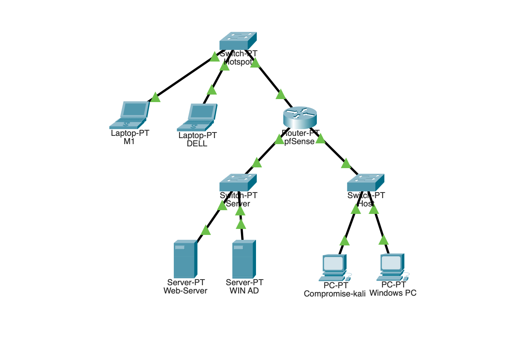

# 🌐 Network Infrastructure - Blue Team SOC Labs

Dokumentasi ini menjelaskan arsitektur jaringan yang kita gunakan untuk lab SOC ini. Desainnya dibuat sederhana menyesuaikan dengan kondisi perangkat saya.

## 🎯 Konsep Dasar

ada beberapa hal yang saya gunakan dalam lab ini:
- **Hotspot WiFi** = Jalan raya utama
- **pfSense Firewall** = Satpam yang jaga pintu masuk ruangan
- **Dell (SIEM) & M1 (AI)** = Pos keamanan yang ada di luar, bisa lihat semua yang keluar-masuk
- **Server & Host** = Ruangan-ruangan di dalam rumah yang dijaga satpam

Yang unik pada lab ini: **SIEM dan AI kita gak lewat satpam (firewall)**. Mereka posisinya di "luar", langsung connect ke hotspot, jadi bisa monitor semua traffic tanpa terhalang. Sementara server dan host ada di "dalam", dipisahin sama firewall biar lebih aman dan terkontrol.

## 🏗️ Arsitektur Jaringan
                       [Switch-Hotspot]
               /           |          |          \
              /             |          |           \
       [Laptop]        [Laptop]    [Kali]     [pfSense Firewall]
        M1(AI)         DELL(SIEM)  (Attacker)        │
                                               ┌──────┴──────┐
                                               │             │
                                         [Switch]       [Switch]
                                          Server           Host
                                           /   \        /   |   \
                                     Ubuntu  WinAD   Win7  WinXP  Ubuntu
                                     (DVWA)  (AD)  (Victim)(Victim)(Victim)

## 📍 Detail Perangkat & IP Address

### **Perangkat di Jaringan Hotspot (Management)**
Perangkat ini connect langsung ke hotspot, **tidak melewati firewall**. Mereka bebas komunikasi dan bisa akses semua device.

| Device | IP Address | Fungsi |
|--------|------------|--------|
| **Switch-Hotspot** | - | Simulasi jaringan WiFi/Hotspot |
| **Laptop M1** | `192.168.43.x` | Jalankan Ollama AI untuk analisis alert |
| **Laptop DELL** | `192.168.43.x` | Jalankan Wazuh SIEM untuk monitoring |
| **Kali Linux** | `192.168.43.x` | External attacker — menyerang via WAN pfSense |
| **pfSense (WAN)** | `192.168.43.x` | Interface luar firewall |
| **Gateway Hotspot** | `192.168.43.1` | Router WiFi asli |

### **Perangkat di Belakang Firewall (Server)**
Server-server ini ada di balik firewall. Semua traffic mereka dipantau dan dikontrol.

| Device | IP Address | Gateway | Fungsi |
|--------|------------|---------|--------|
| **pfSense (LAN 1)** | `10.10.10.1` | - | Pintu masuk zona server |
| **Web-Server** | `10.10.10.10` | `10.10.10.1` | Ubuntu + DVWA (target web attack) |
| **WIN AD** | `10.10.10.20` | `10.10.10.1` | Windows Server (Domain Controller) |

### **Perangkat di Belakang Firewall (Host)**
Host-host ini juga di balik firewall, tapi di network berbeda dari server. Ini simulasi workstation user.

| Device | IP Address | Gateway | Fungsi |
|--------|------------|---------|--------|
| **pfSense (LAN 2)** | `10.10.20.1` | - | Pintu masuk zona host |
| **Windows 7** | `10.10.20.10` | `10.10.20.1` | Victim workstation |
| **Windows XP** | `10.10.20.20` | `10.10.20.1` | Victim workstation (legacy) |
| **Ubuntu Host** | `10.10.20.30` | `10.10.20.1` | Victim workstation (Linux) |

## 🔥 Kenapa Arsitektur Ini Saya Gunakan?

### **1. SIEM & AI Bebas Monitoring**
Karena Dell (Wazuh) dan M1 (Ollama) **tidak berada di belakang firewall**, mereka bisa:
- Menerima log dari semua device tanpa terhalang rule firewall
- Melakukan analisis real-time tanpa bottleneck
- Tetap aman meskipun firewall di belakangnya di-attack

### **2. Firewall Fokus Proteksi Server & Host**
pfSense di sini tugasnya jelas:
- **Pisahkan network Server dan Host** (beda subnet = beda broadcast domain)
- **Kontrol traffic** antara Host → Server (boleh) dan Server → Host (dibatasi)
- **Logging semua koneksi** yang lewat untuk dikirim ke Wazuh
- **NAT** biar VM-VM bisa update & download via internet

### **3. Simulasi Realistis**
Ini mirip banget sama kondisi enterprise nyata (dengan sedikit penyesuain):
- SOC team (Dell & M1) ada di network management terpisah
- Server production (Web & AD) di network sendiri
- User workstation (Windows PC) di network berbeda
- Attacker (Kali) posisi di luar firewall, menyerang dari hotspot seperti external attacker nyata

## 📂 File Packet Tracer

File topologi disimpan secara lokal di: `Infrastructure-Labs-SOC.pkt`

> **Catatan:** File `.pkt` tidak di-include di repo ini karena format biner Cisco Packet Tracer. Untuk visualisasi topologi, gunakan diagram ASCII di atas atau screenshot `./asset/arch.png`.

Untuk membuka file secara lokal, buka di **Cisco Packet Tracer** versi 8.x ke atas.