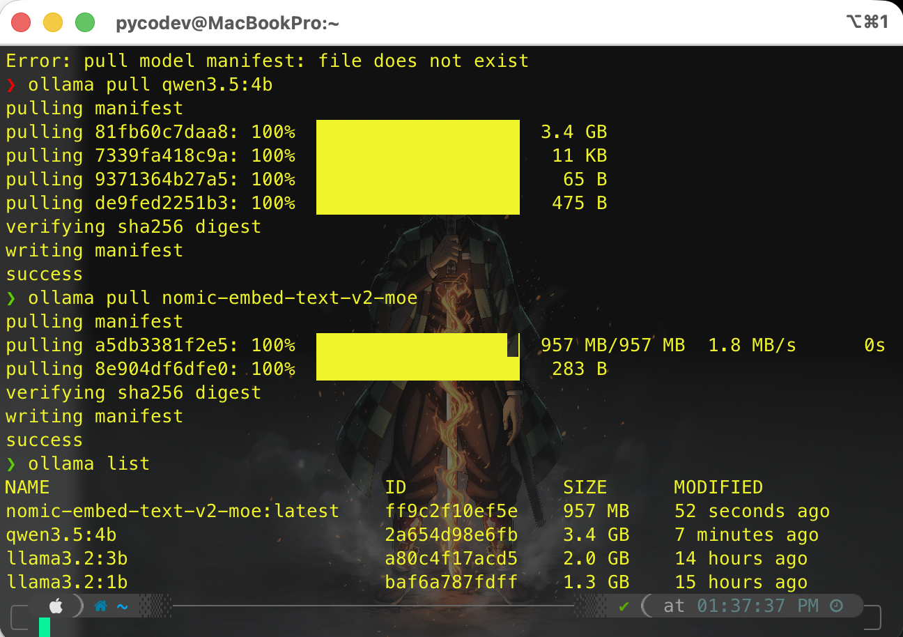

# 🤖 Ollama Installation & Setup

Dokumen ini menjelaskan proses instalasi dan konfigurasi Ollama di Mac M1 sebagai **AI Brain** untuk Blue Team SOC Labs. Ollama akan berperan sebagai backend untuk analisis alert, RAG (Retrieval-Augmented Generation), dan threat intelligence processing.

## 🎯 Tujuan Setup

Ollama di Mac M1 akan digunakan untuk:
- **Alert Triage**: Analisis otomatis alert dari Wazuh SIEM
- **RAG Pipeline**: Retrieval-Augmented Generation untuk konteks threat intelligence
- **Log Analysis**: Penjelasan log dalam bahasa manusia
- **Recommendation Engine**: Saran tindakan berdasarkan pattern serangan

---

## 📋 Prerequisites

### Hardware Requirements
- **Device**: Mac M1 (atau Apple Silicon lainnya)
- **RAM**: Minimal 8GB (Recommended 16GB+)
- **Storage**: Minimal 10GB free space (untuk models)

### Software Requirements
- macOS 11.0 atau lebih baru
- Terminal access
- Internet connection (untuk download models)

---

## 🚀 Step 1: Install Ollama

### Quick Installation

**Option A — via Homebrew (Recommended):**
```bash
brew install ollama
```

**Option B — Download manual:**
Download installer `.pkg` dari https://ollama.com/download, lalu install seperti biasa.

### Verifikasi Instalasi
Setelah instalasi selesai, cek apakah Ollama sudah terinstall:

```bash
ollama --version
```

**Expected output:**
```
ollama version is 0.x.x
```

### Start Ollama Service
Ollama biasanya otomatis jalan sebagai service setelah install. Kalau belum, start manual:

```bash
ollama serve
```

**Expected output:**
```
time=2024-01-XX level=INFO source=images.go:XXX msg="total blobs: X"
time=2024-01-XX level=INFO source=server.go:XXX msg="Listening on 127.0.0.1:11434"
```

> **Catatan untuk cross-device access:** Agar Dell (Wazuh) bisa kirim alert ke M1 (Ollama), Ollama harus listen di semua interface, bukan hanya `127.0.0.1`. Jalankan dengan:
> ```bash
> OLLAMA_HOST=0.0.0.0 ollama serve
> ```
> Atau set permanent via Homebrew services:
> ```bash
> launchctl setenv OLLAMA_HOST "0.0.0.0"
> brew services restart ollama
> ```

---

## 🧠 Step 2: Download Model Stack

Kita akan download 4 model dengan fungsi berbeda untuk SOC Lab:

### Model Overview

| Model | Size | Fungsi | Use Case |
|-------|------|--------|----------|
| **llama3.2:1b** | ~1.3 GB | Fast LLM | Alert triage cepat, summary sederhana |
| **llama3.2:3b** | ~2.0 GB | Medium LLM | Analisis log kompleks, pattern recognition |
| **qwen2.5:4b** | ~3.4 GB | Advanced LLM | RAG pipeline, threat intel analysis |
| **nomic-embed-text-v2-moe** | ~957 MB | Embedding | Vector search untuk RAG retrieval |

### Download Commands

Jalankan command berikut satu per satu:

```bash
# 1. Llama 3.2 1B - Fast alert triage
ollama pull llama3.2:1b

# 2. Llama 3.2 3B - Complex analysis
ollama pull llama3.2:3b

# 3. Qwen 2.5 4B - RAG & threat intelligence
ollama pull qwen2.5:4b

# 4. Nomic Embed Text v2 MoE - Vector embedding
ollama pull nomic-embed-text-v2-moe
```

### Verifikasi Models
Cek semua model yang sudah terinstall:

```bash
ollama list
```

**Expected output:**
```
NAME                          ID              SIZE     MODIFIED
llama3.2:1b                   baf6a787fdff    1.3 GB   15 hours ago
llama3.2:3b                   a80c4f17acd5    2.0 GB   14 hours ago
qwen2.5:4b                    2a654d98e6fb    3.4 GB   7 minutes ago
nomic-embed-text-v2-moe       ff9c2f10ef5e    957 MB   52 seconds ago
```


---

## 🧪 Step 3: Test Models

### Test LLM Models

**Test Llama 3.2 1B (Fast Triage):**
```bash
ollama run llama3.2:1b "Jelaskan apa itu brute force attack dalam 1 kalimat"
```

**Test Llama 3.2 3B (Complex Analysis):**
```bash
ollama run llama3.2:3b "Analisis log ini: 'Multiple failed login attempts from IP 192.168.1.100 to user admin. What type of attack is this and what should be done?'"
```

**Test Qwen 2.5 4B (Threat Intel):**
```bash
ollama run qwen2.5:4b "Apa IOC (Indicators of Compromise) yang biasa ditemukan pada ransomware attack?"
```

### Test Embedding Model

**Test Generate Embedding:**
```bash
curl http://localhost:11434/api/embed -d '{
  "model": "nomic-embed-text-v2-moe",
  "input": "Brute force attack detected from IP 192.168.1.100"
}'
```

**Expected output:**
```json
{
  "model": "nomic-embed-text-v2-moe",
  "embeddings": [[0.123, -0.456, 0.789, ...]],
  "total_duration": 12345678,
  "load_duration": 1234567
}
```

---

## 📊 Step 4: RAG Data Sources

Untuk RAG (Retrieval-Augmented Generation) pipeline, kita akan menggunakan data dari berbagai sumber untuk memberikan konteks ke AI:

### Data Sources Overview

| Source | Type | Purpose | Format |
|--------|------|---------|--------|
| **TryHackMe Write-ups** | Personal Knowledge | Lab documentation & learnings | Markdown |
| **SigmaHQ/sigma** | Detection Rules | SIEM rule patterns | YAML |
| **Yara-Rules/rules** | Malware Detection | File signature patterns | YARA |
| **CVEProject/cvelistV5** | Vulnerability DB | CVE database & details | JSON |
| **MITRE/cti** | Threat Intelligence | Attack patterns & TTPs | STIX/JSON |

### Data Source Details

#### 1. TryHackMe Write-ups (Personal)
- **Path**: `labs/tryhackme/` (di repo ini)
- **Content**: Write-up pribadi dari room yang sudah dikerjakan
- **Format**: Markdown files
- **Purpose**: Reference untuk solusi dan teknik yang sudah dipelajari
- **Usage**: Ketika ada alert yang mirip dengan attack pattern di THM, AI bisa reference write-up untuk rekomendasi

#### 2. SigmaHQ/sigma
- **Repository**: https://github.com/SigmaHQ/sigma
- **Content**: Generic signature format for SIEM systems
- **Format**: YAML files
- **Purpose**: Database detection rules dari komunitas
- **Usage**: 
  - Match alert dengan existing Sigma rules
  - Generate rekomendasi rule baru berdasarkan pattern
  - Explain detection logic dalam bahasa manusia

#### 3. Yara-Rules/rules
- **Repository**: https://github.com/Yara-Rules/rules
- **Content**: YARA rules for malware detection
- **Format**: YARA files
- **Purpose**: Signature-based malware detection
- **Usage**:
  - Identify malware family dari file hash
  - Recommend YARA rules untuk scan
  - Explain malware behavior

#### 4. CVEProject/cvelistV5
- **Repository**: https://github.com/CVEProject/cvelistV5
- **Content**: CVE (Common Vulnerabilities and Exposures) database
- **Format**: JSON files
- **Purpose**: Vulnerability intelligence
- **Usage**:
  - Match alert dengan known CVE
  - Provide CVSS score & severity
  - Recommend patching actions

#### 5. MITRE/cti
- **Repository**: https://github.com/mitre/cti
- **Content**: MITRE ATT&CK framework data
- **Format**: STIX/JSON files
- **Purpose**: Threat intelligence & attack patterns
- **Usage**:
  - Map alert ke MITRE TTPs (Tactics, Techniques, Procedures)
  - Identify attack stage & next steps
  - Provide context untuk incident response
