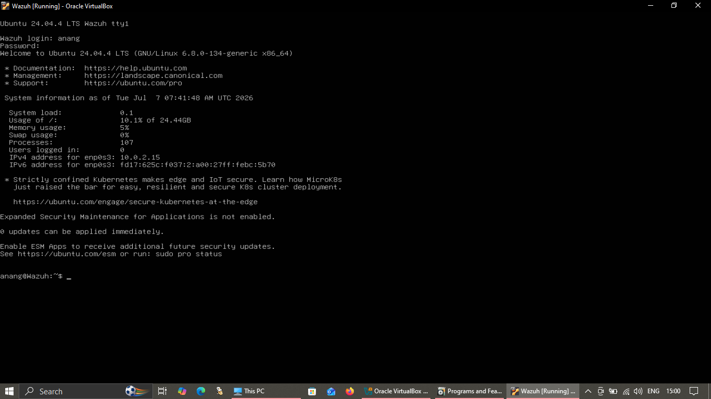
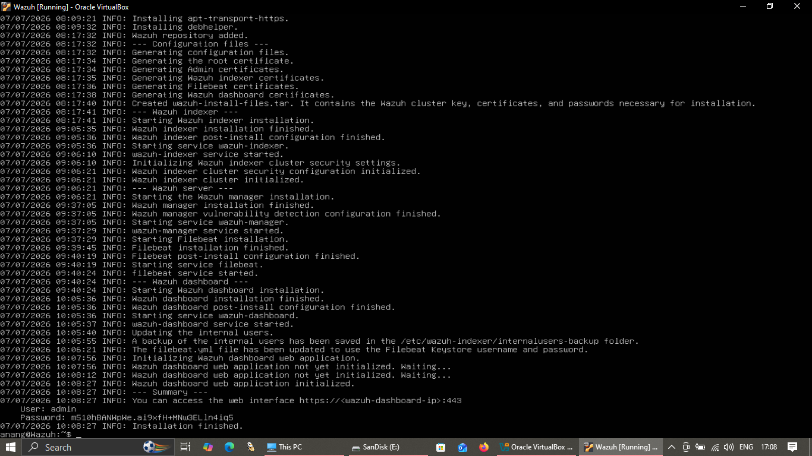

# 🖥️ Dell SIEM Setup: Ubuntu Server 24.04.4 + Wazuh All-in-One

Log instalasi Wazuh SIEM (Manager, Indexer, Dashboard) di Laptop DELL menggunakan Ubuntu Server 24.04.4 dan skrip instalasi All-in-One resmi dari Wazuh.

**Network Configuration:** DHCP (Otomatis dari Hotspot/Router)

---

## 💿 Part 1: Instalasi Ubuntu Server 24.04.4

Boot ISO Ubuntu Server 24.04.4, lalu ikuti flow instalasi:

- **Network Connections:** Pilih interface jaringan yang terdeteksi (biasanya `eth0` atau `enp3s0`), set ke **DHCP**
- **Storage:** `Use an entire disk` → `Done`
- **Profile Setup:**
  - Name: `Wazuh`
  - Server name: `Wazuh`
  - Username: `anang`
- **Featured Server Snaps:** Skip, langsung `Done`
- Tunggu instalasi selesai, lalu `Reboot Now`

---

## 🚀 Part 2: System Update

Login ke Ubuntu Server dengan user `anang`, lalu jalankan:

```bash
sudo apt update
sudo apt upgrade -y
sudo reboot
```

Tunggu server restart, lalu login kembali.



---

## 🛡️ Part 3: Wazuh All-in-One Installation

Gunakan skrip resmi Wazuh untuk install Manager, Indexer, dan Dashboard sekaligus.

### Download & Eksekusi Script

```bash
# Install curl
sudo apt install curl -y

# Download Wazuh Installation Script
curl -sO https://packages.wazuh.com/4.13/wazuh-install.sh

# Berikan hak akses eksekusi
chmod +x wazuh-install.sh

# Jalankan instalasi All-in-One
sudo ./wazuh-install.sh -a
```

Proses ini memakan waktu beberapa menit karena mendownload dan mengonfigurasi Wazuh Manager, OpenSearch (Indexer), dan Dashboard sekaligus.

---

## 🔑 Save Credentials

Di akhir proses instalasi, skrip akan mencetak URL, Username, dan **Password Admin** di terminal.

**Contoh output:**
```text
URL: https://<IP-DELL>
User: admin
Password: xY9#bL2pQ8zW1!
```

**Wajib save password ini.** Kalau terminal ke-clear atau ke-scroll, password bisa di-restore dengan:



```bash
sudo tar -O -xvf wazuh-install-files.tar wazuh-passwords.txt | grep -A 1 "admin"
```

---

## 🌐 Akses Wazuh Dashboard

Buka browser dari device manapun yang satu jaringan (M1, Dell, atau PC lainnya):

1. Akses: `https://<IP-UBUNTU-SERVER>`
2. Abaikan warning "Not Secure" → klik **Advanced** → **Proceed**
3. Login:
   - **User:** `admin`
   - **Password:** `[Password-yang-disave]`

