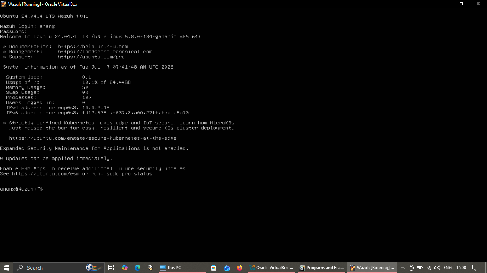
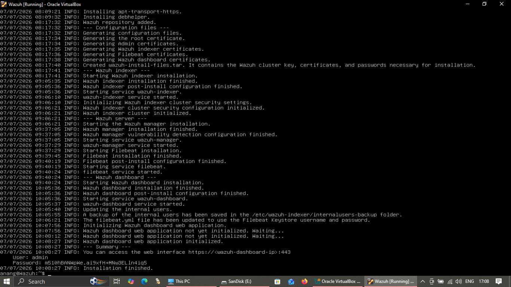
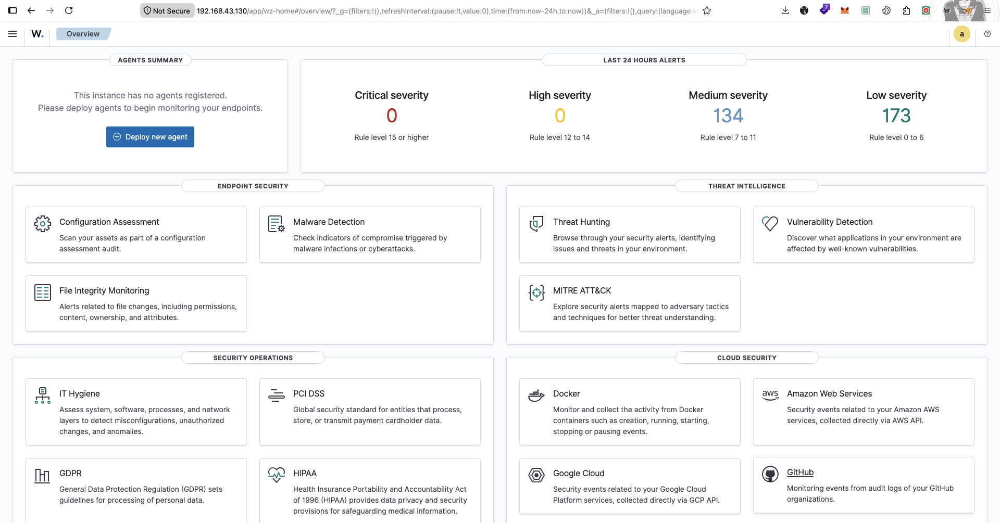

# 🖥️ Dell SIEM Setup: Ubuntu Server 24.04.4 + Wazuh All-in-One

Log instalasi Wazuh SIEM (Manager, Indexer, Dashboard) di Laptop DELL menggunakan Ubuntu Server 24.04.4 dan skrip instalasi All-in-One resmi dari Wazuh.

**Network Configuration:** DHCP (Otomatis dari Hotspot/Router)

---

## 💿 Part 1: Instalasi Ubuntu Server 24.04.4

Boot ISO Ubuntu Server 24.04.4, lalu ikuti flow instalasi:

- **Network Connections:** Pilih interface jaringan yang terdeteksi (biasanya `eth0` atau `enp3s0`), set ke **DHCP**
- **Storage:** `Use an entire disk` → `Done`
- **Profile Setup:**
  - Name: `Wazuh`
  - Server name: `Wazuh`
  - Username: `anang`
- **Featured Server Snaps:** Skip, langsung `Done`
- Tunggu instalasi selesai, lalu `Reboot Now`

---

## 🚀 Part 2: System Update

Login ke Ubuntu Server dengan user `anang`, lalu jalankan:

```bash
sudo apt update
sudo apt upgrade -y
sudo reboot
```

Tunggu server restart, lalu login kembali.



---

## 🛡️ Part 3: Wazuh All-in-One Installation

Gunakan skrip resmi Wazuh untuk install Manager, Indexer, dan Dashboard sekaligus.

### Download & Eksekusi Script

```bash
# Install curl
sudo apt install curl -y

# Download Wazuh Installation Script
curl -sO https://packages.wazuh.com/4.13/wazuh-install.sh

# Berikan hak akses eksekusi
chmod +x wazuh-install.sh

# Jalankan instalasi All-in-One
sudo ./wazuh-install.sh -a
```

Proses ini memakan waktu beberapa menit karena mendownload dan mengonfigurasi Wazuh Manager, OpenSearch (Indexer), dan Dashboard sekaligus.

---

## 🔑 Save Credentials

Di akhir proses instalasi, skrip akan mencetak URL, Username, dan **Password Admin** di terminal.

**Contoh output:**
```text
URL: https://<IP-DELL>
User: admin
Password: xY9#bL2pQ8zW1!
```

**Wajib save password ini.** Kalau terminal ke-clear atau ke-scroll, password bisa di-restore dengan:



```bash
sudo tar -O -xvf wazuh-install-files.tar wazuh-passwords.txt | grep -A 1 "admin"
```

---

## 🌐 Akses Wazuh Dashboard

Buka browser dari device manapun yang satu jaringan (M1, Dell, atau PC lainnya):

1. Akses: `https://<IP-UBUNTU-SERVER>`
2. Abaikan warning "Not Secure" → klik **Advanced** → **Proceed**
3. Login:
   - **User:** `admin`
   - **Password:** `[Password-yang-disave]`


---

## 🗄️ Part 4: Archives ke Dashboard (Index `wazuh-archives-*`)

### Tujuan

Secara default, Wazuh cuma ngirim **alert** (event yang match rule dengan level ≥ 3) ke Indexer. Semua event lain berhenti di Manager. Kalau `logall` aktif, event itu cuma tersimpan sebagai file `archives.log` di Dell, dan cuma bisa dicari pakai `grep`.

Part ini ngirim **semua event** (archives) ke Indexer, jadi raw event bisa dicari di Dashboard lewat Discover. Ini berguna buat investigasi, threat hunting, dan debugging rule. Contohnya waktu event gak jadi alert padahal jelas masuk ke Manager.

```
Agent ──► Manager ── decode + rule matching
              ├─► archives.json ──► Filebeat ──► wazuh-archives-*   (SEMUA event)
              └─► alerts.json   ──► Filebeat ──► wazuh-alerts-*     (level ≥ 3)
```

Rule tetap dipakai buat **deteksi** (alert). Archives adalah lapisan **penyimpanan** log mentah.

### Prerequisites

- Wazuh All-in-One 4.13 sudah jalan (Part 3).
- Password `admin` Indexer (dari `wazuh-passwords.txt`).
- Cukup ruang disk. Archives bisa jauh lebih besar dari alerts, jadi **retention di Step 4 wajib**.

### Step 1 — Manager nulis archives dalam format JSON

Edit `/var/ossec/etc/ossec.conf`, bagian `<global>`:

```xml
<logall>yes</logall>
<logall_json>yes</logall_json>
```

Filebeat baca `archives.json`, bukan `archives.log`, jadi `logall_json` yang wajib.

```bash
sudo /var/ossec/bin/wazuh-analysisd -t
sudo systemctl restart wazuh-manager
```

### Step 2 — Filebeat ngirim archives ke Indexer

Edit `/etc/filebeat/filebeat.yml`:

```yaml
filebeat.modules:
  - module: wazuh
    alerts:
      enabled: true
    archives:
      enabled: true      # default: false
```

```bash
sudo systemctl restart filebeat
sudo filebeat test output
```

### Step 3 — Index pattern di Dashboard

☰ → **Dashboard Management** → **Dashboards Management** → **Index patterns** → **Create index pattern**:

- Index pattern name: `wazuh-archives-*`
- Time field: `timestamp`

Di **Discover**, pilih `wazuh-archives-*` dari dropdown index pattern.

### Step 4 — Retention (ISM policy)

☰ → **Index Management** → **State management policies** → **Create policy** → JSON editor:

```json
{
  "policy": {
    "description": "Hapus wazuh-archives setelah 7 hari",
    "default_state": "hot",
    "states": [
      { "name": "hot", "actions": [],
        "transitions": [ { "state_name": "delete", "conditions": { "min_index_age": "7d" } } ] },
      { "name": "delete", "actions": [ { "delete": {} } ], "transitions": [] }
    ],
    "ism_template": { "index_patterns": ["wazuh-archives-*"], "priority": 100 }
  }
}
```

`ism_template` cuma berlaku ke index **baru**. Index archives yang sudah terlanjur ada: **Index Management** → **Indices**, centang index-nya → **Apply policy**.

### Verifikasi

Index archives terbentuk:

```bash
curl -sk -u admin "https://localhost:9200/_cat/indices/wazuh-archives-*?v"
```

Harus muncul `wazuh-archives-4.x-YYYY.MM.DD`.

Event yang **gak** jadi alert bisa dicari di Discover (`wazuh-archives-*`). Contoh: Sysmon event 3 dari PowerShell, yang berhenti di rule bawaan level 0 (`92101`):

```
agent.name:"WIN7-VICTIM" and data.win.system.eventID:3 and data.win.eventdata.image:*powershell*
```

Pantau pemakaian disk Indexer:

```bash
df -h /var/lib/wazuh-indexer
```

> **Catatan field:** di rule Wazuh field ditulis `win.eventdata.*`, tapi di Dashboard/Indexer ada awalan `data.` → `data.win.eventdata.*`.
