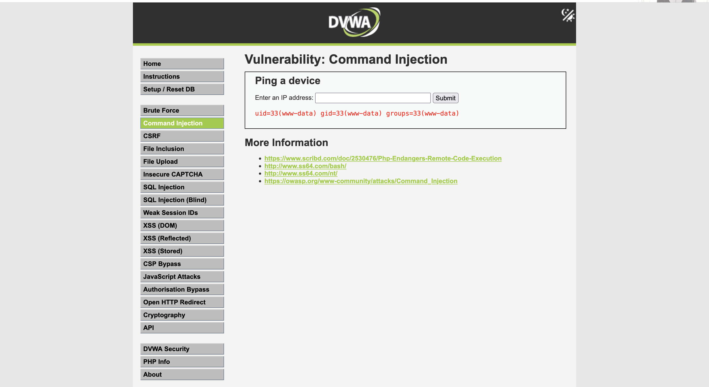
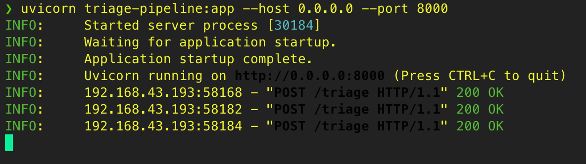
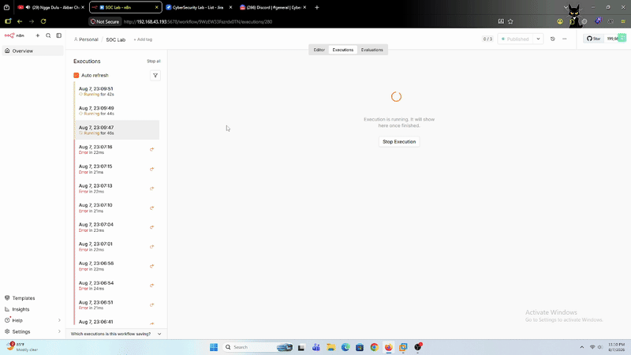
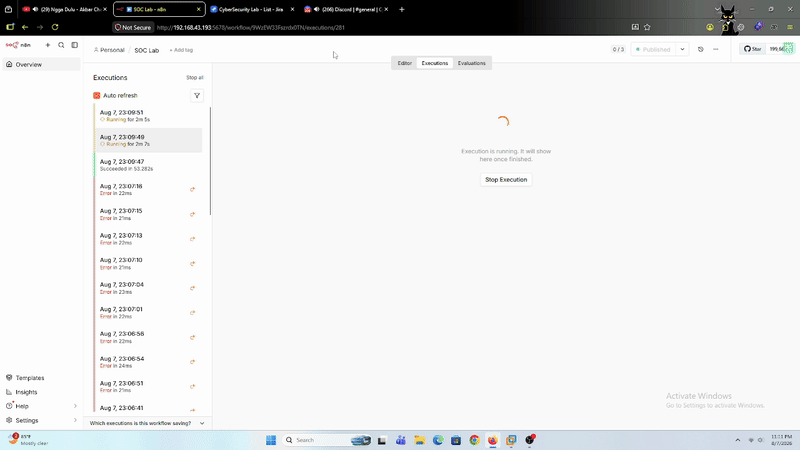
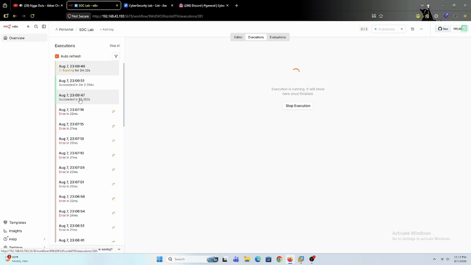

# SOC Automation — Fase 1: Ticketing + Notification with AI+RAG Triage

> **Status: Fase 1 baseline selesai.** Lab ini mendokumentasikan pengujian end-to-end pipeline automation SOC (Wazuh → n8n → Jira + Discord, dengan AI+RAG triage sebelum ticket dibuat) yang dibangun di [`Infrastructure/n8n-alerting-pipeline-setup.md`](../../../Infrastructure/n8n-alerting-pipeline-setup.md). Fokus lab ini bukan attack baru, melainkan validasi bahwa response automation-nya bekerja benar terhadap alert dari lab-lab attack sebelumnya. Automation (priority mapping, notifikasi) confirmed reliable; akurasi kaitan MITRE ATT&CK dari AI+RAG masih jadi item pengembangan lanjutan (lihat bagian Verifikasi).

---

# Tujuan

Menguji Fase 1 dari roadmap AI+RAG (lihat [`AI-Rag-Integration/README.md`](../../../AI-Rag-Integration/README.md)): triage dasar + investigasi arah serangan berbasis RAG, terintegrasi ke alur ticketing dan notifikasi otomatis.

Yang divalidasi:
- Alert Wazuh dari attack nyata (bukan curl manual) berhasil trigger seluruh chain node n8n: `Webhook → Logic Enrichment Summary → Set Priority → AI + RAG Triage → Ticketing Jira`, plus `Set Priority → Push Notification Discord` secara paralel.
- Mapping `rule.level` → Jira Priority akurat di berbagai tier (Highest/High/Medium/Low).
- Hasil triage AI (ringkasan, kaitan MITRE, arah serangan, catatan konfidensi) masuk akal dan relevan dengan alert yang trigger.
- Performa/latency tiap node, terutama node AI + RAG Triage yang paling berat (generate via Ollama `llama3.2:3b`).

---

# Prerequisites

* n8n workflow "SOC Lab" — status **Active**
* `AI-Rag-Integration/triage-pipeline.py` running (`uvicorn`), `GET /health` OK dengan `collection_count` > 0
* Ollama running di M1, model `llama3.2:3b` tersedia
* Wazuh Integrator (Dell) aktif mengirim ke webhook n8n
* Kredensial Jira & Discord webhook sudah dikonfigurasi di node masing-masing
* Target attack: DVWA (Web-Server `10.10.10.10`), reuse skenario dari lab attack sebelumnya (`Labs/web-server-attack/`)

---

# Step-by-Step

## 1. Trigger — Command Injection di DVWA

Attack yang dipakai sengaja simpel: fitur **Command Injection** DVWA ("Ping a device") disuntik payload `;id`, jadi command yang dieksekusi server jadi `ping <ip>; id`.

Output `uid=33(www-data) gid=33(www-data) groups=33(www-data)` di respons konfirmasi command `id` berhasil dieksekusi lewat celah command injection — cukup buat memicu chain deteksi tanpa perlu skenario serangan yang rumit.

## 2. Proses yang Tercatat

Satu payload ini menghasilkan **3 proses baru** yang masing-masing kena rule Wazuh terpisah (server-side, ke-capture proses execution-nya):

| Proses | Peran | Rule ID | Level | Keterangan |
|--------|-------|---------|-------|------------|
| `ping` | Command asli fitur DVWA | `100300` | 7 | Proses "legit" fitur, tapi tetep diikutin `;` |
| `sh` (`/usr/bin/dash`) | Shell interpreter yang mengeksekusi payload injeksi | `100301` | 12 | Level jauh lebih tinggi — shell interpreter dianggap indikasi command injection tingkat tinggi (LOLBin) |
| `id` | Command yang diinjeksikan attacker | `100300` | 7 | Command aktual yang dieksekusi attacker |

Ketiganya masing-masing trigger alert Wazuh terpisah → webhook n8n terpisah → jadi 3 kali full run pipeline (`Webhook → Logic Enrichment Summary → Set Priority → [AI + RAG Triage → Ticketing Jira]` + `Set Priority → Push Notification Discord`).

Bukti sisi server (`triage-pipeline.py`) nerima dan berhasil proses ketiganya:

## 3. Full Chain — Proses `sh` (Level 12, Highest)

GIF di atas nunjukin satu full run pipeline di n8n Executions tab — dari webhook masuk, `Set Priority` jalan, node `AI + RAG Triage` manggil endpoint `/triage`, sampai notifikasi Discord muncul dan ticket Jira ke-create. Ini proses `sh` yang level-nya paling tinggi (12), jadi priority Jira-nya ke-mapping ke **Highest**.

## 4. Log Popup — Proses `ping` (Level 7, Medium)

## 5. Log Popup — Proses `id` (Level 7, Medium)

---

# Verifikasi

Ketiga proses berhasil menghasilkan ticket Jira dengan priority ter-mapping otomatis dari `rule.level` (lihat [`Set Priority` node](../../../Infrastructure/n8n-alerting-pipeline-setup.md)) dan Description berisi hasil AI+RAG:

| Ticket | Proses | Rule | Priority | Ringkasan AI+RAG |
|--------|--------|------|----------|-------------------|
| [`ticket-1.png`](asset/ticket-1.png) — KAN-219 | `sh` | `100301`, level 12 | **Highest** | Ringkasan kejadian akurat (shell dijalankan UID 33). Kaitan MITRE **kurang tepat** — keluar `TA0001-TA0043, Txxx.xxx (Command Line Execution through SQL Injection)`, padahal kasus ini command injection, bukan SQLi. |
| [`ticket-2.png`](asset/ticket-2.png) — KAN-220 | `ping` | `100300`, level 7 | **Medium** | Ringkasan akurat. Kaitan MITRE relevan (**Living off the Land**). Arah serangan selanjutnya & catatan konfidensi masuk akal. |
| [`ticket-3.png`](asset/ticket-3.png) — KAN-221 | `id` | `100300`, level 7 | **Medium** | Ringkasan akurat. Kaitan MITRE **menyebut rule ID Wazuh (`100300`) sebagai kalau itu Technique ID MITRE** — salah kaprah, bukan technique ID asli. |

## Catatan Hasil Testing

Mapping **Priority** (`rule.level` → tier Jira) dan **notifikasi Discord** jalan 100% akurat dan konsisten di ketiga proses — bagian automation murni (non-AI) dari pipeline ini reliable.

Bagian **AI + RAG**-nya sendiri, realistisnya untuk Fase 1 ini lebih tepat disebut **summary**, bukan triage penuh — poin "Ringkasan kejadian" konsisten akurat, tapi poin **"Kaitan MITRE ATT&CK" masih ambigu**: 2 dari 3 hasil salah (nyampur Technique ID generik/placeholder, atau ketuker sama rule ID Wazuh sendiri). Ini kemungkinan karena retrieval RAG khusus `type: mitre_attack` di `triage-pipeline.py` belum cukup presisi buat nyocokin proses spesifik (`sh`/`ping`/`id`) ke technique ID yang benar — masih ada ruang buat memperkaya data source dan memaksimalkan retrieval-nya di iterasi berikutnya.

Meski begitu, untuk Fase 1 ini **cukup memadai sebagai baseline**: hasilnya tetap dianggap "oke" karena sifatnya sebagai *summary pembuka*, bukan keputusan final. Justru karena AI **tidak** mencoba maksa kesimpulan penuh (poin "Catatan konfidensi" di tiap ticket secara eksplisit ngaku konteksnya masih lemah/perlu investigasi lanjut), analyst L1 tetap punya **ruang terbuka buat analisis lanjutan** alih-alih ketutup asumsi yang salah dari AI — ini lebih aman dibanding AI yang overconfident kasih kesimpulan MITRE yang keliru tanpa disclaimer.

Referensi arsitektur node lengkap (`Set Priority`, `AI + RAG Triage`, dst): [`Infrastructure/n8n-alerting-pipeline-setup.md`](../../../Infrastructure/n8n-alerting-pipeline-setup.md) dan [`Infrastructure/n8n/README.md`](../../../Infrastructure/n8n/README.md). Export workflow n8n saat testing ini ada di [`asset/soc-lab-n8n-workflow.json`](asset/soc-lab-n8n-workflow.json).
