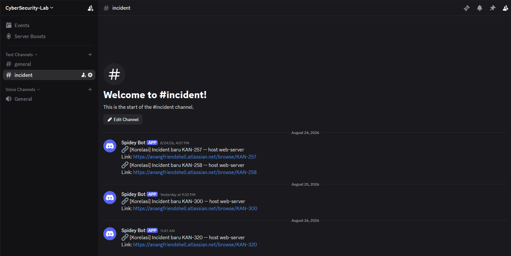
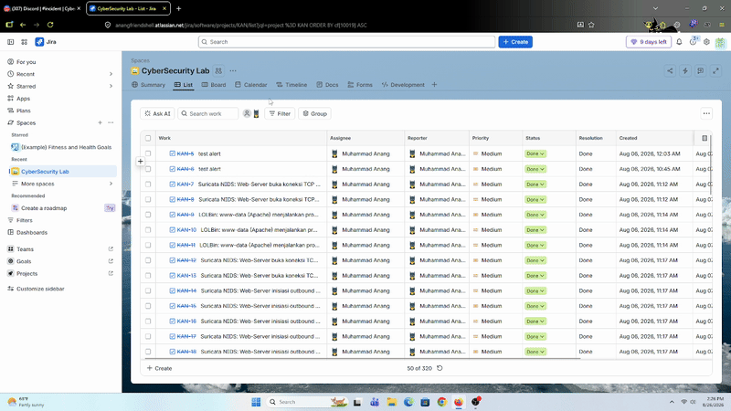
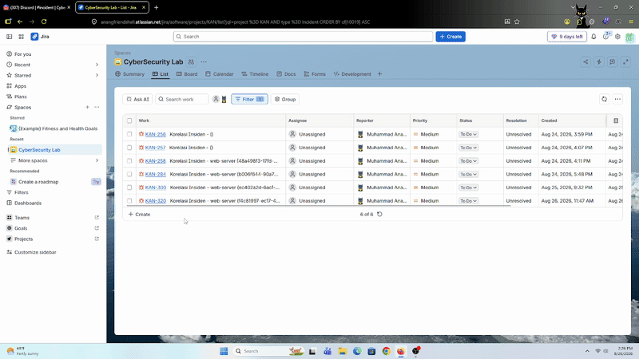
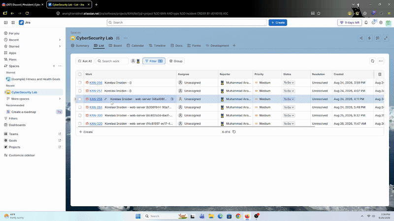
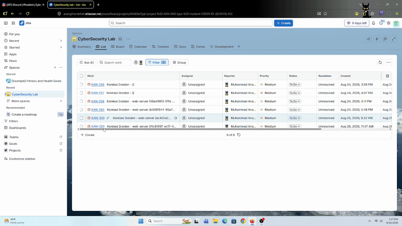
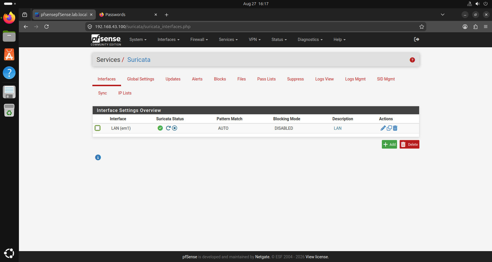
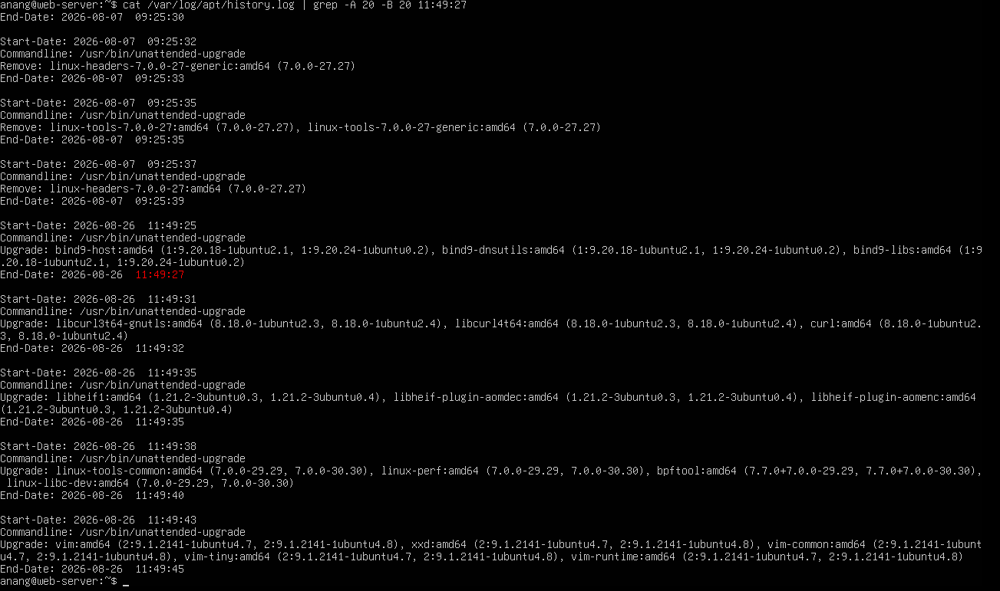

# SOC Automation — Fase 2: Full Chain Detection (Correlation) — AI Lokal vs Claude Code CLI

> **Status: Cross-check manual ke Wazuh SIEM selesai (2026-08-27).** Klaim Percobaan 3 soal AI bisa bedain alert "normal" vs "true positive" **CONFIRMED** lewat rekonstruksi manual raw audit log (lihat bagian 5). Yang masih belum final: perbandingan sisi-ke-sisi tertulis Ollama vs Claude Code CLI dengan input identik, dan rule tuning buat 2 false positive yang ketemu pas cross-check.

---

# Tujuan

Fase 2 dari roadmap AI+RAG ([`AI-Rag-Integration/README.md`](../../../AI-Rag-Integration/README.md)) — beda dari Fase 1 yang triage 1 alert per 1 alert, Fase 2 mengkorelasikan alert-alert lintas-waktu dan lintas-sensor jadi 1 **"full chain detection"**: satu narrative yang menceritakan rangkaian serangan, bukan potongan alert lepas-lepas.

Fokus writeup ini: mendokumentasikan proses iteratif nyari kombinasi model+prompt+RAG yang hasilnya masuk akal — mulai dari model lokal (`llama3.2:3b` via Ollama) sampai akhirnya pindah ke **Claude Code CLI** (bukan Anthropic API berbayar, tapi manfaatin subscription Claude yang login di mesin, dipanggil headless lewat `subprocess`).

---

# Prerequisites

* n8n workflow korelasi (terpisah dari workflow Fase 1) — Schedule Trigger tiap **15 menit**, manggil `POST /correlate/tick`
* `AI-Rag-Integration/api-service.py` running (`uvicorn`), route `/correlate/tick` aktif
* Ollama di M1 — model `llama3.2:3b` (narrative lokal) + `nomic-embed-text` (embedding retrieval RAG, dipakai terus walau narrative-nya pindah backend)
* Claude Code CLI ter-install & login (subscription) di M1, buat backend narrative alternatif (`NARRATIVE_BACKEND=claude_cli`)
* Wazuh Indexer (OpenSearch, Dell) reachable dari M1
* Discord channel baru **`#incident`** di server yang sama (`CyberSecurity-Lab`) — terpisah dari channel notifikasi Fase 1
* Jira project `KAN`, issue type **"Incident"** (custom, khusus ticketing hasil correlation — beda dari issue type Fase 1 per-alert)
* Target attack: DVWA Command Injection (Web-Server `10.10.10.10`), reuse skenario dari [`Labs/web-server-attack/command-injection/`](../../web-server-attack/command-injection/) dan [`Labs/web-server-attack/full-attack-chain/`](../../web-server-attack/full-attack-chain/)

---

# Step-by-Step

## 1. Notifikasi — Channel Discord Baru



Beda dari Fase 1 (notifikasi per-alert ke channel umum), Fase 2 pakai channel baru **`#incident`** — biar ticket hasil korelasi (tipe **"Incident"**, isinya narrative gabungan banyak alert) gak nyampur sama notifikasi triage per-alert Fase 1. Tiap pesan dari bot berisi link langsung ke ticket Jira "Incident" yang baru dibuat.

## 2. Filter Ticket by Type "Incident"



Jira dashboard difilter ke issue type **Incident** — type baru yang dibuat khusus buat ticketing hasil korelasi Fase 2, terpisah dari ticket per-alert Fase 1 (yang issue type-nya beda). Tiap ticket Incident nge-link ("Relates") ke semua ticket Fase 1 anggota chain-nya.

## 3. Alur Sistem Korelasi

Ringkas gimana `/correlate/tick` kerja tiap kali dipanggil:

1. **Crawl alert** — tarik alert baru dari Wazuh Indexer (OpenSearch, Dell), filter `rule.level >= 7`, dari rentang waktu checkpoint terakhir sampai sekarang (plus buffer 2 menit buat nutup lag indexing Wazuh Manager → Indexer).
2. **Catat & checkpoint** — tiap alert yang ketarik dicatat ke SQLite (`correlation_state.db`). Timestamp alert paling baru yang berhasil diproses dicatat sebagai checkpoint — cycle berikutnya query mulai dari situ, bukan re-scan dari awal.
3. **Kelompokkan jadi Event (tier-1)** — alert-alert di host yang sama dengan gap waktu sangat rapat (< 10 detik) otomatis digabung jadi 1 "event": biasanya representasi 1 aksi nyata yang kena banyak sensor sekaligus (misal Suricata + auditd nangkep hal yang sama).
4. **Kelompokkan jadi Incident (tier-2)** — event-event di host yang sama terus dikumpulin jadi 1 "incident" selama gap antar-event **< 30 menit** (silence threshold). Selama masih ada alert baru masuk dalam 30 menit, incident dianggap masih "hidup", belum diproses ke summary.
5. **Finalize & generate narrative** — begitu 1 incident "diem" (gak ada alert baru) **≥ 30 menit**, seluruh event & alert anggotanya di-build jadi 1 prompt korelasi, dikirim ke LLM (Ollama lokal atau Claude Code CLI, tergantung `NARRATIVE_BACKEND`) buat generate narrative.
6. **Ticketing** — hasil narrative + daftar alert anggota dikembalikan ke n8n → bikin ticket Jira "Incident" baru, issue link ke semua ticket Fase 1 anggotanya, dan notifikasi ke Discord `#incident`.

Seluruh proses ini di-cek ulang tiap **15 menit** (Schedule Trigger n8n) — cukup sering buat nutup incident yang udah "diem" tanpa nunggu kelamaan, tapi gak terlalu sering sampai bikin Dell (8GB RAM) overload query.

### Kelebihan & kekurangan pendekatan silence-threshold 30 menit

**Kelebihan**: attack chain yang "berjeda" (attacker sengaja kasih delay/thinking time antar langkah) tetep ketangkep utuh selama gap-nya di bawah 30 menit — gak keputus di tengah jalan jadi beberapa incident lepas-lepas.

**Kekurangan**, dua sisi:
- Kalau attacker sengaja spread aksinya dengan gap **di atas 30 menit** (evasion via pacing lambat), tiap "potongan" bakal dianggap incident terpisah — chain-nya keputus, sulit dikorelasikan otomatis jadi 1 cerita serangan utuh.
- Clustering cuma diliat dari **host yang sama**, bukan attacker/source yang sama (`auditd` gak bawa `src_ip` sama sekali). Jadi kalau 2 serangan BEDA yang gak berhubungan sama-sama kena ke host yang sama dalam window 30 menit yang sama, alert-nya bisa ke-gabung jadi 1 incident yang ceritanya campur aduk.

## 4. Perbandingan 4 Percobaan: Local AI vs Claude Code CLI

### Percobaan 1 — Local (`llama3.2:3b`), Prompt Belum Dioptimasi



Percobaan full chain pertama. Hasilnya jauh dari memuaskan: **setiap event dapet klasifikasi MITRE ATT&CK yang sama persis**, gak peduli command apa yang sebenernya dieksekusi. Key event juga gak dijabarkan spesifik — narrative cuma nyebut `id`, `whoami`, `cat`, `ls` sebagai nama command doang, tanpa nyebut apa yang sebenernya diakses/dilihat (misal `cat` — dibaca file apa).

### Percobaan 2 — Local (`llama3.2:3b`), Prompt Dioptimasi



Masih model lokal yang sama, tapi prompt disempurnakan: instruksi eksplisit buat gak maksain Technique ID (`Txxxx`) kalau gak yakin, cukup sebut nama tactic (`Credential Access`, `Discovery`, dst). Sedikit membaik, tapi **masih sering salah persepsi** — model kecil (3B parameter) gampang salah infer relasi antar alert tanpa dituntun lebih eksplisit.

### Percobaan 3 — Transisi ke Claude Code CLI


Titik balik: pindah backend narrative ke **Claude Code CLI** (`claude -p`, model Sonnet) — bukan Anthropic API berbayar-per-token, tapi manfaatin subscription Claude yang udah login di mesin, dipanggil headless lewat `subprocess` (tools didisable total, murni text generation).

Hasilnya jauh lebih detail: narrative sekarang bisa menjabarkan key event secara spesifik (`ls` ngecek apa, `cat` ngebuka file apa — bukan cuma nama command doang), dan melakukan komparasi/korelasi antar event dalam chain. Model ini juga sempet kelihatan bisa **bedain alert yang sifatnya "normal" vs "true positive"** — tapi ini **belum divalidasi langsung ke log Wazuh SIEM** (baru observasi dari narrative-nya doang), jadi belum bisa diklaim akurat. Rencana validasi: besok, cross-check manual ke Wazuh Dashboard.

MITRE Technique ID (`Txxxx`) masih belum muncul di titik ini — root cause: data RAG yang match saat itu jenisnya `x-mitre-analytic`, tipe STIX yang gak nyimpen `technique_id` langsung di objeknya (beda dari `attack-pattern`). Ini yang mendorong penyesuaian ulang proses ingest MITRE ATT&CK ke RAG.

### Percobaan 4 — Claude Code CLI, Prompt & RAG Data Final



Setelah data MITRE ATT&CK di RAG disesuaikan ulang (technique_id ke-resolve buat tipe `x-mitre-analytic`/`x-mitre-detection-strategy`) dan prompt-nya diotomasi lebih jauh, hasilnya paling memuaskan dari 4 percobaan: narrative sekarang menyertakan **MITRE ATT&CK analysis** (tactic + technique ID kalau match), **rekomendasi Sigma Rules** buat kemungkinan arah serangan selanjutnya, **rekomendasi YARA Rules** buat deteksi tambahan, dan **CVE** yang berpotensi relevan dieksploitasi.

## 5. Validasi Manual — Cross-Check ke Log Wazuh SIEM (2026-08-27)

Klaim di Percobaan 3 soal AI bisa bedain alert "normal" vs "true positive" dicek manual satu-satu ke raw log Wazuh Indexer, buat skenario command injection yang sama — bukan cuma diliat dari observasi narrative doang.

### Rekonstruksi Timeline dari Raw Audit Log

| Waktu (UTC+7) | PID (ppid) | Process | Klasifikasi |
|---|---|---|---|
| 11:04:23.142 | 2970 | `sh` | Normal — proses induk fitur ping DVWA |
| 11:04:23.144 | 2971 (2970) | `ping -c 4` | Normal — fitur ping DVWA (rule `100300`) |
| 11:04:23.146 | 2972 (2970) | `id` | **Suspicious** — ppid sama persis dengan `ping` (2970), tereksekusi hitungan milidetik sesudahnya (rule `100301`) → indikasi command injection |
| 11:08:49.261 | 3003+ | `sh` → `ping` → `whoami` | `sh`/`ping` normal, `whoami` suspicious |
| 11:11:13.250 | 3080 / 3082 (3080) | `ls -la /etc` | Suspicious |
| 11:13:45.348 | 3085 / 3087 (3085) | `cat /etc/shadow` | Suspicious — credential access |
| 11:15:17.338 | 3098 / 3100 (3098) | `cat /etc/passwd` | Suspicious — credential access |

Catatan: log `ping` pertama (`comm="ping"`, `a0="ping" a1="-c" a2="4"`) gak nyantumin target IP di argv — kemungkinan payload injeksi yang dikirim gak nyertain IP tujuan sebelum separator command chaining.

**Hasil**: klasifikasi manual di atas — `sh`/`ping` normal (proses induk & fitur legit DVWA), `id`/`whoami`/`ls -la /etc`/`cat /etc/shadow`/`cat /etc/passwd` suspicious (hasil command injection, ppid sama dengan proses `ping`/`sh` yang jadi induknya) — **persis sama** dengan yang dibedain AI narrative di Percobaan 3. Klaim "AI bisa bedain alert normal vs true positive" **CONFIRMED**, bukan overconfident.

### False Positive Ditemukan Saat Cross-Check

Dua pola alert lain ikut ketarik AI+RAG selama window investigasi, tapi setelah dicek manual keduanya **false positive**, gak terkait attack chain:

1. **Wazuh rootcheck (agent `000`/manager)** — alert nge-list sekumpulan binary (`/bin/ls`, `/usr/bin/env`, `/bin/passwd`, `/bin/chfn`, dst.) yang dicek integritasnya (trojaned binary check). Pattern false positive yang udah dikenal & banyak dibahas di GitHub issue Wazuh — bukan indikasi kompromi nyata di lab ini. Potensi improvement ke depan: normalisasi/tuning rule level biar gak numpuk noise di korelasi.
2. **Rule `5104` "Interface entered in promiscuous(sniffing) mode"** dari pfsense (`location: 192.168.43.100`, level 8, MITRE `T1040` Network Sniffing) — false positive karena NIC `em1` di pfsense emang dipakai Suricata buat monitoring traffic (mode sniffing legit, bukan indikasi sniffing yang mencurigakan). Konfirmasi: .
3. **Rule `2904`** (bind9-host update) jam **11:49:27** — muncul setelah window "senyap" attack chain, tapi bukan lanjutan serangan. Konfirmasi: automatic system update terjadwal di Web-Server. .

### Ground Truth Attack Chain & IOC

Berdasarkan rekonstruksi manual di atas:

- **Initial Access** — `T1190` (Exploit Public-Facing Application), memanfaatkan celah command injection di fitur "Ping a device" DVWA.
- **Execution** — `T1059.004` (Command and Scripting Interpreter: Unix Shell), command injection via shell (`sh`) yang jadi induk semua proses hasil injeksi.
- Sepanjang sesi, attacker cuma sampai fase **Discovery** (`id`, `whoami`, `ls -la /etc`, `cat /etc/shadow`, `cat /etc/passwd`) — belum ada indikasi Privilege Escalation atau Exfiltration nyata, walau `cat /etc/shadow` mengarah ke situ.

**IOC**

Network-based:
- URL: `http://192.168.43.100/vulnerabilities/exec/` (POST)
- IP Attacker: `192.168.43.63`
- IP Host (korban): `10.10.10.10`

Host-based:
- User: `www-data`
- PID: `2970, 3003, 3080, 3085, 3098` (proses `sh` induk)
- Process normal: `sh`, `ping`
- Process suspicious: `id`, `whoami`, `ls -la /etc`, `cat /etc/shadow`, `cat /etc/passwd`

Timestamp:
- `Aug 26, 2026 11:04:23.142` s/d `Aug 26, 2026 11:15:17.338 UTC+7`

## 6. Ringkasan Perbandingan

Dari 4 percobaan, hasil **Claude Code CLI jauh lebih efektif** dibanding model lokal — meskipun sama-sama pakai retrieval RAG yang sama (`nomic-embed-text` via Ollama tetap dipakai buat embedding di kedua mode, cuma narrative generation-nya yang beda backend).

Keterbatasan hardware jadi faktor: device (M1) idealnya bisa jalanin model lokal sampai ~8B parameter, tapi di lab ini dipakai `llama3.2:3b` — sempet coba `qwen2.5:4b` di awal, tapi response time-nya kelamaan buat dipakai real-time di pipeline korelasi, jadi turun ke `3b`.

## 7. Attack Chain yang Dipakai

```
id -> whoami -> ls -la /etc -> cat /etc/shadow -> cat /etc/passwd
```

Chain ini sengaja dibatasi di fase **Discovery** — mengarah ke Credential Access (baca `/etc/shadow`) tapi belum benar-benar masuk ke Privilege Escalation atau Exfiltration. Tujuannya nunjukin arah serangan yang *bisa* berkembang ke sana, bukan mensimulasikan sampai tuntas.

## 8. Keterbatasan yang Ditemukan

**MITRE Technique ID masih sulit didapat konsisten** — kalau konteks RAG yang ketarik gak sempurna/gak match persis, model cenderung "mengada-ngada" (hallucinate) technique ID daripada bilang gak yakin.

**False-positive-ish dari fitur normal DVWA (`ping`)** — command injection yang dipakai di lab ini nyuntik lewat form field "Ping a device": value form yang seharusnya cuma IP, disuntik jadi `<ip>; <payload>`. Command `ping`-nya sendiri **tetap tereksekusi** sebagai bagian dari command chain itu (dijalankan user `www-data`), dan karena rule auditd yang dipakai men-flag **SEMUA proses yang dijalankan user `www-data`** (bukan cuma command hasil injeksi), `ping` yang harusnya fitur normal DVWA ikut ke-trigger sebagai alert.

Dua opsi mitigasi dipertimbangkan biar `ping` diabaikan di summary AI:
1. Kasih context eksplisit ke AI bahwa `ping` dari fitur ini itu normal.
2. Normalisasi alert `ping` di level rule (jangan di-flag sama sekali).

**Keduanya sengaja TIDAK dipilih** — karena attacker bisa aja manfaatin `ping` buat nge-reach ke IP/DNS C2 (connectivity check sebelum exfiltration/callback), jadi tetap worth diflag walau kadang jadi noise dari fitur legit.

---

# Verifikasi

**Udah confirmed:**
- Pipeline korelasi (crawl → checkpoint → micro-cluster → silence threshold → finalize → ticketing) jalan end-to-end tanpa error.
- Kualitas narrative meningkat signifikan dari Percobaan 1 → 4, terutama setelah pindah ke Claude Code CLI + perbaikan data RAG MITRE.
- **Klaim Percobaan 3** — AI bisa bedain alert "normal" vs "true positive" — **CONFIRMED** via cross-check manual ke raw log Wazuh SIEM (2026-08-27, lihat bagian 5). Klasifikasi manual (`sh`/`ping` normal, `id`/`whoami`/`ls -la /etc`/`cat /etc/shadow`/`cat /etc/passwd` suspicious) match persis dengan yang dibedain AI.
- **Ground truth attack chain** confirmed: `T1190` (Initial Access) → `T1059.004` (Execution) → Discovery-only (belum ada indikasi privesc/exfiltration nyata).
- **2 false positive** ikut ketarik AI+RAG tapi confirmed benign lewat cross-check: Wazuh rootcheck binary-check (pattern dikenal, dibahas di GitHub issue Wazuh) dan rule `5104` promiscuous mode pfsense (Suricata sniffing legit di NIC `em1`).

**Belum final:**
- Belum ada perbandingan sisi-ke-sisi tertulis (Ollama vs Claude CLI) dengan input yang identik persis — kesimpulan "Claude jauh lebih baik" masih berbasis observasi kualitatif dari 4 percobaan berurutan (bukan A/B test terkontrol).
- Rule tuning buat 2 false positive yang ditemukan (normalisasi rootcheck, turunin level rule `5104`) belum diterapkan — masih rencana ke depan.
