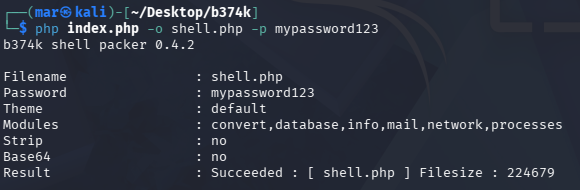
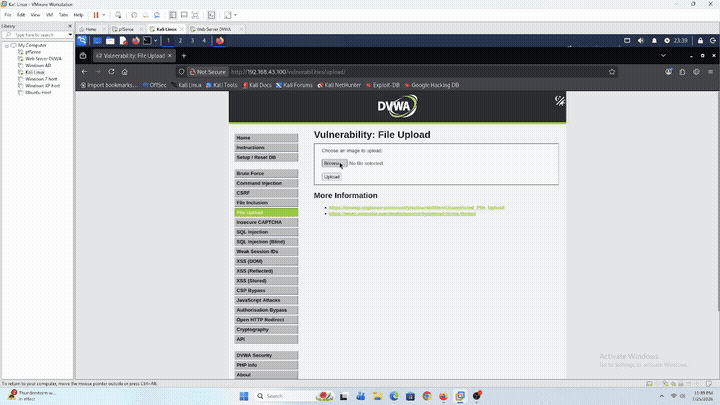
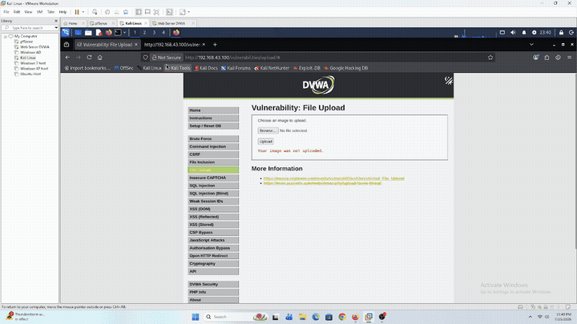
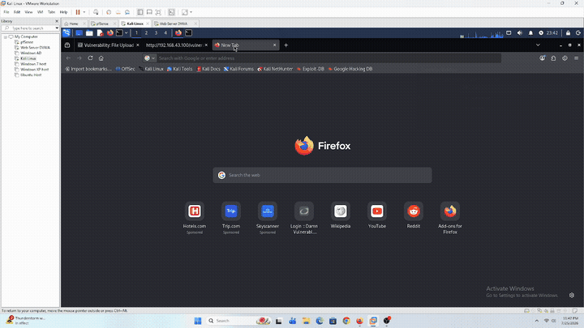

# File Upload — DVWA (Web-Server)

## Tujuan

Simulasi manual **File Upload** ke modul **File Upload** DVWA (`10.10.10.10`) dari Kali Linux — upload webshell **b374k** buat dapetin RCE, sekaligus validasi deteksi di beberapa layer sekaligus.

Beda dari lab-lab sebelumnya, File Upload nge-buka permukaan deteksi baru yang belum pernah dites: **File Integrity Monitoring (FIM/syscheck)**. Kalau Command Injection ngajarin kita butuh data source proses (auditd) dan network (Suricata), lab ini nguji apakah kita butuh data source ketiga — **filesystem** — karena inti dari serangan ini adalah munculnya **file baru** (`shell.php`) di direktori yang bisa diakses lewat web, bukan cuma command yang dieksekusi.

Tiga hipotesis yang mau divalidasi:
1. **`access.log`** — request upload (`POST`, multipart/form-data) kemungkinan gak ninggalin jejak isi file (mirip Command Injection POST body), tapi request **akses shell-nya** (`GET /hackable/uploads/shell.php`) seharusnya tetep ke-log normal sebagai request ke file `.php` biasa — pertanyaannya apakah ini cukup buat jadi sinyal, atau keliatan gak beda dari traffic normal.
2. **FIM/syscheck** — apakah Wazuh (kalau di-konfig buat monitor direktori upload) bisa ngedeteksi **file baru muncul** di `hackable/uploads/` sebagai sinyal independen, terlepas dari isi request maupun proses yang jalan.
3. **auditd** — begitu shell-nya diakses dan dipake buat eksekusi command (lewat UI b374k), apakah rule `100300` (dari lab [Command Injection](../command-injection/README.md)) **generalisasi** ke vektor baru ini, sama kayak yang udah confirmed generalisasi tapi Suricata `1000003` enggak di lab [File Inclusion](../file-inclusion/README.md).

Sesuai filosofi lab: deteksi dulu, bukan eksploitasi.

---

## Prerequisites

- DVWA sudah bisa diakses dari Kali — lihat [`dvwa-external-access.md`](../../../Infrastructure/dvwa-external-access.md) (akses lewat WAN pfSense, `192.168.43.100`, bukan langsung IP internal `10.10.10.10`)
- Wazuh Agent di Web-Server sudah running, baca `access.log` — lihat [`web-server-wazuh-agent.md`](../../../Infrastructure/web-server-wazuh-agent.md)
- auditd + custom rule `100300` sudah aktif (dari lab Command Injection) — lihat [`web-server-auditd-setup.md`](../../../Infrastructure/web-server-auditd-setup.md)
- FIM/syscheck monitor direktori upload DVWA — sudah di-setup, lihat [`web-server-fim-setup.md`](../../../Infrastructure/web-server-fim-setup.md) (`<directories check_all="yes" realtime="yes" whodata="yes">/var/www/html/hackable/uploads</directories>`)
- File **b374k shell** (`.php`) siap di Kali, siap diupload
- DVWA **Security Level** di-set ke `Low` (belum ada validasi ekstensi/MIME sama sekali di level ini)

---

## Step-by-Step

Modul **File Upload** DVWA nerima file apa aja di Security Level `Low` — gak ada validasi ekstensi maupun `Content-Type`, langsung disimpen ke `hackable/uploads/` dengan nama file asli.

### 1. Baseline

Upload file gambar biasa (`.jpg`/`.png`) — konfirmasi behavior normal, cek juga di mana persis file ke-simpen (`hackable/uploads/<filename>`).

### 2. Siapin Webshell — `b374k`

Clone source resmi dari GitHub ([`b374k/b374k`](https://github.com/b374k/b374k)) di Kali:

```bash
git clone https://github.com/b374k/b374k.git
cd b374k
```

`index.php` di repo ini sekaligus jadi **packer** — compile semua source jadi satu file PHP tunggal, dilindungi password:

```bash
php index.php -o shell.php -p mypassword123
```



Hasil packer (`shell.php`) **224,679 bytes (~219KB)**.

Upload `shell.php` langsung lewat form DVWA tanpa modifikasi apapun (Security Level `Low` gak ada validasi ekstensi/`Content-Type` sama sekali) — **gagal**:



> **Gotcha ukuran file**: form upload DVWA punya hidden field `<input type="hidden" name="MAX_FILE_SIZE" value="100000" />` (~97KB) yang di-enforce PHP di server (bukan cuma hint browser) — file `b374k` yang ~219KB kena reject `move_uploaded_file()` gagal tanpa error jelas ke user. Field ini **dikontrol penuh client**, gampang dibypass lewat `curl` dengan override value hidden field-nya jadi jauh lebih gede dari file asli:
>
> ```bash
> curl -b "PHPSESSID=<session>; security=low" \
>   -F "MAX_FILE_SIZE=10000000" \
>   -F "uploaded=@shell.php" \
>   -F "Upload=Upload" \
>   "http://192.168.43.100/vulnerabilities/upload/"
> ```
>
> Berhasil — `shell.php` ke-upload ke `hackable/uploads/shell.php`:
>
> 
>
> Ini insight tambahan yang sejalan sama tema besar seri lab ini: client-side value gak bisa dipercaya — kali ini soal *upload limit*, bukan token (lab JS Attacks) atau validasi ekstensi.

### 3. Akses & Eksekusi Shell

Buka `http://192.168.43.100/hackable/uploads/shell.php` — masuk pake password yang di-set pas packer (`mypassword123`), navigasi ke Explorer (konfirmasi `shell.php` ada di direktori, ukuran `219.41 KB`, owner `www-data:www-data`), lalu masuk tab Terminal buat eksekusi command dasar (`pwd`, `ls`, `whoami`, `id`) lewat fitur terminal bawaan shell-nya:



**Yang dicatat di tiap step:**
- `access.log` — bandingin request upload (`POST /vulnerabilities/upload/`) vs request akses shell (`GET /hackable/uploads/shell.php`)
- Wazuh Dashboard — FIM alert (rule `554`) buat momen file `shell.php` pertama kali muncul di `hackable/uploads/`
- Wazuh Dashboard — auditd rule `100300`, apakah fire pas command dieksekusi lewat UI b374k
- Suricata — cek juga barangkali ada signature yang related, walau hipotesis awal (belajar dari lab File Inclusion) kemungkinan gak generalisasi karena vektornya beda

---

## Verifikasi

### Hipotesis #1 — `access.log`

Test pertama gagal divalidasi — Wazuh Manager (Dell) mati sebelum raw log line sempet ditarik, evidence-nya gak survive. Attack-nya reproducible, jadi di-retest tanggal 26 Juli dan berhasil ke-capture tiga baris relevan.

**Confirmed sebagai sinyal, tapi kekuatannya beda-beda tergantung apa yang dilihat — header vs method+path.**

**1. Request upload (`POST /vulnerabilities/upload/`, curl bypass `MAX_FILE_SIZE`):**

```
192.168.43.111 - - [26/Jul/2026:15:50:23 +0700] "POST /vulnerabilities/upload/ HTTP/1.1" 200 4851 "-" "curl/8.20.0"
```

Anomali di header: `User-Agent: curl/8.20.0` (browser normal gak pernah kirim ini) dan `Referer: "-"` (kosong — upload lewat form DVWA asli harusnya ngirim Referer ke halaman form-nya). Ini **sinyal yang rapuh**: attacker yang lebih hati-hati tinggal tambahin `-H "User-Agent: Mozilla/5.0..." -H "Referer: ..."` di curl buat mimicking browser, dan sinyal ini langsung hilang.

**2. Akses awal shell (`GET /hackable/uploads/shell.php`, login + navigasi UI b374k):**

UA dan Referer normal (browser Firefox asli) — request ini keliatan identik sama request ke file `.php` biasa manapun, gak ada yang bisa dibedain cuma dari baris log ini.

**3. Interaksi dashboard/explorer shell (`POST /hackable/uploads/shell.php`, command lewat UI b374k):**

```
192.168.43.111 - - [26/Jul/2026:15:57:29 +0700] "POST /hackable/uploads/shell.php HTTP/1.1" 200 1352 "http://192.168.43.100/hackable/uploads/shell.php" "Mozilla/5.0 (X11; Linux x86_64; rv:140.0) Gecko/20100101 Firefox/140.0"
```

UA dan Referer dua-duanya normal (Firefox asli, self-referer dari `shell.php` ke `shell.php` sendiri) — **gak bisa dibedain dari header doang**, sama kayak poin #2. Tapi ada sinyal lain yang lebih kuat di sini: ini `POST` request ke path **di dalam `hackable/uploads/`** — direktori itu secara desain cuma nyimpen file upload statis (gambar, dokumen), jadi traffic normalnya seharusnya `GET`-only. Method `POST` yang nyasar ke path di direktori upload adalah anomali **method + path**, independen total dari UA/Referer/isi body — attacker gak bisa nge-spoof ini tanpa ubah cara shell-nya sendiri ngirim command (butuh `POST` biar bisa kirim parameter).

Insight tambahan yang sejalan sama tema besar seri lab ini: sinyal yang nempel di **header request** (UA, Referer) gampang dipalsuin attacker yang aware, tapi sinyal yang nempel di **struktur request** (method + path yang gak sesuai fungsi direktori) jauh lebih susah dihindarin selama shell-nya masih butuh kirim command lewat `POST`.

### Hipotesis #2 — FIM/syscheck (`hackable/uploads/`)

**Confirmed.** File `shell.php` yang barusan diupload lewat `curl` (step 2) langsung ke-detect oleh FIM `realtime` — gak nunggu scheduled scan:

```json
{
  "syscheck": {
    "path": "/var/www/html/hackable/uploads/shell.php",
    "event": "added",
    "mode": "realtime",
    "mtime_after": "2026-07-25T16:41:20",
    "size_after": "224679",
    "uid_after": "33",
    "gid_after": "33",
    "uname_after": "www-data",
    "gname_after": "www-data",
    "perm_after": "rw-r--r--",
    "md5_after": "a2115033fc5612bc9a7a3e63ecdd1465",
    "sha1_after": "51c4275fbc60b74076796b303be291157c8d8c67",
    "sha256_after": "9dc938d9c0fda2a0d7a46ab9206d24eb32ee5ea03123cf5cdb5c8c54d9f861a2"
  },
  "rule": {
    "id": "554",
    "level": 5,
    "description": "File added to the system.",
    "groups": ["ossec", "syscheck", "syscheck_entry_added", "syscheck_file"]
  },
  "decoder": { "name": "syscheck_new_entry" }
}
```

Ini rule **default** Wazuh (`554`), bukan custom — konfirmasi hipotesis #2: FIM ngasih sinyal independen ("file baru muncul di `hackable/uploads/`") terlepas total dari isi request upload maupun proses yang jalan belakangan. `size_after` (224,679 bytes) match persis sama hasil packer di step 2, dan `uname_after: www-data` (dari `whodata`) konfirmasi file ini dibuat sama proses Apache, bukan manual lewat SSH — detail yang gak bakal ketangkep kalau cuma pake `check_all` tanpa `whodata`.

**Catatan tuning**: [`web-server-fim-setup.md`](../../../Infrastructure/web-server-fim-setup.md) awalnya nebak default rule FIM ada di range level 7 — ternyata alert asli yang fire level **5**. `554` juga cuma generic "File added to the system", gak bedain sama sekali antara file gambar biasa vs `.php` webshell — dari sudut pandang FIM, upload gambar dan upload webshell keliatan **identik** (sama-sama "file added", level 5). Ini gap yang jadi kandidat custom rule ke depan: escalate severity kalau ekstensi yang nongol di `hackable/uploads/` itu `.php`/`.phtml`/`.phar` dkk.

### Hipotesis #3 — Generalisasi auditd (`100300`)

**Confirmed.** Command `id` yang dieksekusi lewat UI terminal b374k (bukan lewat request HTTP langsung kayak Command Injection) tetap fire rule `100300`:

```json
{
  "audit": {
    "execve": { "a0": "id" },
    "command": "id",
    "exe": "/usr/lib/cargo/bin/coreutils/id",
    "euid": "33",
    "uid": "33",
    "comm": "id",
    "cwd": "/var/www/html",
    "success": "yes",
    "key": "www_data_exec"
  },
  "rule": {
    "id": "100300",
    "level": 12,
    "firedtimes": 63,
    "description": "LOLBin: www-data (Apache) menjalankan proses baru \"id\" - indikasi command injection",
    "groups": ["auditd", "lolbin", "command_injection"],
    "mitre": { "id": ["T1059"], "tactic": ["Execution"], "technique": ["Command and Scripting Interpreter"] }
  },
  "decoder": { "parent": "auditd", "name": "auditd" },
  "timestamp": "2026-07-25T16:42:59.990+0000"
}
```

`euid`/`uid` `33` = `www-data`, `cwd: /var/www/html` — proses ini anak dari Apache, bukan proses interaktif SSH. Rule `100300` didesain match berdasar `audit.key == www_data_exec` (lihat [`auditd_lolbin_rules.xml`](../../../Detection-Engineer/wazuh/rule/auditd_lolbin_rules.xml)), bukan hardcode nama command tertentu — deskripsinya inject nama command secara dinamis (`$(audit.command)`). Artinya rule ini **generalisasi penuh** ke command apapun yang dijalanin www-data lewat vektor apapun: `ls`, `pwd`, `whoami` yang juga dieksekusi di step 3 seharusnya sama-sama fire rule yang sama (cuma beda isi `$(audit.command)`), gak perlu rule terpisah per command maupun per vektor serangan (Command Injection vs File Upload). Ini konsisten sama temuan lab File Inclusion: begitu sinyalnya ada di layer proses OS (bukan payload di request), rule-nya generalisasi ke vektor baru secara otomatis.

`firedtimes: 63` nunjukkin rule ini udah fire puluhan kali kumulatif sejak lab Command Injection — bukan cuma 1x buat `id` doang, konsisten kalau `ls`/`pwd`/`whoami` di step 3 juga ikut ke-hitung di angka itu.

### Suricata

**Confirmed kosong** — gak ada alert Suricata sama sekali selama upload (`curl` bypass) maupun eksekusi command lewat shell (`pwd`, `ls`, `whoami`, `id`). Sesuai hipotesis awal: rule custom `1000003` (dari lab Command Injection) scope-nya spesifik ke pola payload command injection di POST body — vektor File Upload gak match sama sekali, baik pas upload (`multipart/form-data`, bukan payload command) maupun pas eksekusi (command dijalanin dari dalam UI b374k lewat PHP, bukan lewat request HTTP baru yang bisa di-inspect NIDS). Sama kayak temuan lab File Inclusion, tapi kali ini lebih ekstrem: LFI setidaknya masih HTTP request per percobaan, File Upload + webshell interaktif bikin **command execution sepenuhnya gak kelihatan di layer network** sama sekali setelah shell ke-upload.

---

## Kesimpulan

Tiga hipotesis, tiga hasil beda:

**Hipotesis #1 (`access.log`) — confirmed jadi sinyal, tapi bertingkat kekuatannya.** Test pertama gagal (evidence hilang bareng matinya Wazuh Manager), tapi retest berhasil nangkep tiga baris log. Anomali `User-Agent`/`Referer` di request upload (`curl` vs browser) itu sinyal nyata tapi rapuh — gampang di-spoof attacker yang aware. Sinyal yang lebih robust justru ketemu pas eksekusi command lewat UI shell: `POST` request ke path di dalam `hackable/uploads/` adalah anomali method+path (direktori itu harusnya `GET`-only buat file statis), independen dari header apapun yang bisa dipalsuin.

**Hipotesis #2 (FIM/syscheck) — confirmed jadi sinyal independen.** Rule default `554` ("File added to the system", level 5) fire begitu `shell.php` nongol di `hackable/uploads/`, terlepas total dari isi request upload (yang lolos gak ke-log lengkap, sama kayak POST body Command Injection) maupun proses yang jalan belakangan. `whodata` (`uname_after: www-data`) kasih bonus atribusi proses pembuat file tanpa perlu korelasi manual ke log lain. Tapi ketemu blind spot: level 5 itu generic — FIM gak bedain upload gambar biasa vs upload webshell `.php`, dua-duanya keliatan identik dari sudut pandang syscheck. Assumption awal di [`web-server-fim-setup.md`](../../../Infrastructure/web-server-fim-setup.md) (nebak default level 7) juga meleset dari alert asli (level 5) — pengingat buat selalu validasi asumsi severity lewat eksekusi asli, bukan cuma baca dokumentasi Wazuh.

**Hipotesis #3 (auditd `100300`) — confirmed generalisasi penuh**, konsisten sama temuan lab File Inclusion. Rule `100300` match berdasar `audit.key == www_data_exec` (proses apapun yang di-spawn www-data), bukan hardcode command atau vektor tertentu — begitu command dieksekusi lewat UI b374k (`id`, dan seharusnya `ls`/`pwd`/`whoami` juga), tetap fire persis kayak pas Command Injection langsung lewat parameter HTTP. **Suricata sebaliknya confirmed gak generalisasi** — rule `1000003` spesifik ke pola network/payload command injection, gak nyentuh vektor file upload sama sekali baik pas upload maupun eksekusi (command dijalanin dari dalam shell, bukan request HTTP baru).

**Insight utama lab ini**: dari 3 calon data source, yang jadi sinyal paling reliable buat vektor File Upload tetep **FIM** (independen total dari isi maupun bentuk request) dan **auditd** (generalisasi otomatis dari lab sebelumnya) — bukan `access.log` yang jadi andalan di lab-lab awal (SQLi, XSS). `access.log` sendiri gak sepenuhnya buta di sini (beda dari dugaan awal): anomali header (`curl` UA, Referer kosong) dan anomali method+path (`POST` ke direktori upload) tetep ke-capture, cuma sinyalnya butuh analisis lebih dalam dari sekadar "ada request atau enggak", dan sebagian (header) gampang di-spoof attacker yang lebih siap. Pola yang mulai konsisten sejak Command Injection: makin "senyap" suatu vektor serangan di layer HTTP (isi POST body gak ke-log, command dieksekusi di dalam shell interaktif tanpa request baru per command), makin penting data source di layer **proses** (auditd) dan **filesystem** (FIM) — access.log masih kasih sinyal tambahan, tapi bukan lagi jadi primary signal kayak di lab-lab awal. File Upload jadi kasus paling jelas soal ini: begitu webshell ke-plant, seluruh command execution berikutnya **100% invisible** di layer network (Suricata kosong total), dan sinyal paling solid cuma ke-tangkep di dua layer host-based itu.
