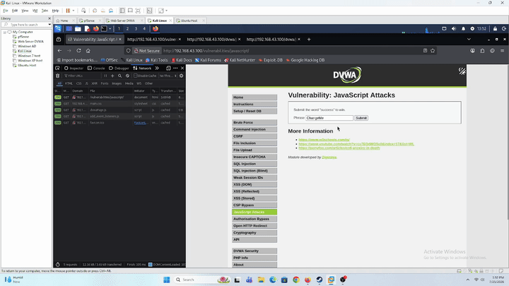
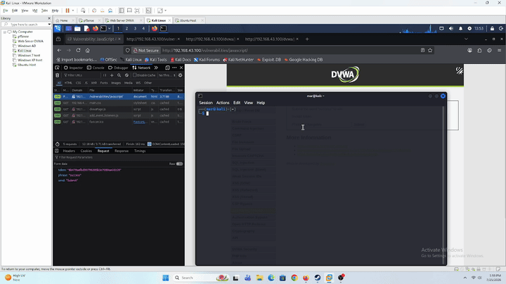

# JavaScript Attacks — DVWA (Web-Server)

## Tujuan

Simulasi manual **JavaScript token bypass** ke modul **JavaScript Attacks** DVWA (`10.10.10.10`) dari Kali Linux. Beda total dari seri lab XSS (yang tentang *injection*), lab ini soal **client-side trust**: server nerima submission form cuma kalau disertain token yang seharusnya di-generate lewat JS yang jalan di browser korban.

Modul ini nge-tes apakah developer bisa ngandelin JS obfuscation sebagai security boundary. Attacker gak butuh XSS atau eksploitasi server sama sekali — cukup baca `view-source`, reverse-engineer logic token-nya (udah ketemu salah satu step-nya: **ROT13**, yang sifatnya *self-inverse*), terus replikasi logic itu di luar browser (script Python/curl) buat ngitung token yang valid tanpa pernah ngejalanin JS-nya di browser sama sekali.

Pertanyaan utama buat blue team: kalau exploitasi ini **gak ninggalin payload apapun** (gak ada `<script>`, gak ada SQL syntax, request-nya keliatan "bersih" secara sintaksis), sinyal apa yang masih bisa dipakai buat bedain submission dari browser asli vs submission dari script otomatis? Hipotesis: bedanya ada di **behavior/metadata request**, bukan di isi payload — misal `User-Agent`, ada/enggaknya `Referer`, timing antara page-load dan submit, atau pola request yang gak wajar (terlalu cepat, terlalu banyak percobaan berturut-turut).

Sesuai filosofi lab: deteksi dulu, bukan eksploitasi.

---

## Prerequisites

- DVWA sudah bisa diakses dari Kali — lihat [`dvwa-external-access.md`](../../../Infrastructure/dvwa-external-access.md)
- Wazuh Agent di Web-Server sudah running, baca `access.log` — lihat [`web-server-wazuh-agent.md`](../../../Infrastructure/web-server-wazuh-agent.md)
- DVWA **Security Level** di-set ke `Low`

---

## Step-by-Step

### 1. Baca Source JS

Buka `view-source` di modul **JavaScript Attacks** — trace lengkap logic yang nge-generate token, dari input `phrase` (`success`) sampai jadi token final yang dikirim ke server. Yang udah ketemu sejauh ini: salah satu langkahnya pake **ROT13**.

### 2. Replikasi Logic di Luar Browser

Tulis ulang seluruh chain transformasi token itu di Python (atau bahasa lain) — tujuannya ngitung token yang valid **tanpa pernah buka browser/ngejalanin JS aslinya sama sekali**.

### 3. Submit Langsung via Script

Kirim request `POST` ke endpoint modul ini pakai token hasil kalkulasi manual (`curl`/Python `requests`), bandingin sama submission normal lewat browser:

- Apakah server nerima token hasil kalkulasi manual ini? (konfirmasi bypass berhasil)
- Bandingin `access.log` dua-duanya — ada beda header (`User-Agent`, `Referer`) antara request browser vs script?
- Cek Wazuh Dashboard — apakah ada rule yang fire buat salah satu/kedua kasus?

### 4. Bangun Detection Rule (Wazuh)

Design 3 tier severity berdasarkan metadata request, bukan isi payload (lihat [Verifikasi](#verifikasi) buat alasan kenapa payload-based detection gak relevan di kasus ini):

| Kondisi | Rule ID | Level | Alasan |
|---|---|---|---|
| Referer ada | `100501` | 2 (informational) | Pola normal browser — baseline |
| Referer gak ada (`-`) | `100502` | 5 (medium) | Anomali lemah — bisa false positive dari browser dengan referrer-policy strict, bukan cuma script |
| User-Agent match known automation tool (`python-requests`, `curl`, `Go-http-client`, dll — blocklist) | `100503` | 10 (high) | Sinyal eksplisit & kuat, konsisten sama severity blocklist CSP (`100406`/`100407`) di lab XSS |

File: [`Detection-Engineer/wazuh-rules/javascript-attack-rules.xml`](../../../Detection-Engineer/wazuh-rules/javascript-attack-rules.xml), [`Detection-Engineer/wazuh-rules/web-accesslog-combined-decoder.xml`](../../../Detection-Engineer/wazuh-rules/web-accesslog-combined-decoder.xml).

**Blind spot yang ketemu duluan sebelum rule-nya bisa jalan**: dua field paling penting buat hipotesis kita (`Referer`, `User-Agent`) ternyata **gak pernah di-decode** oleh decoder bawaan Wazuh (`web-accesslog`) — decoder itu cuma extract `srcip`/`protocol`/`url`/`id` dari Combined Log Format Apache, berhenti persis di status code, gak nyentuh 2 field terakhir sama sekali. Confirmed lewat `wazuh-logtest` (`Phase 2` gak pernah nunjukkin `referer`/`user_agent` walau ada di raw log-nya).

Fix-nya butuh nambah **sibling decoder** (`web-accesslog-custom-js-attack`) yang nempel ke `<parent>web-accesslog</parent>` — kuncinya sibling itu harus **match mandiri** (prematch + regex lengkap dari awal baris log), bukan nyambung dari sisa match parent lewat `offset="after_parent"` (percobaan pertama gagal total karena asumsi ini keliru — root `web-accesslog` gak punya `<regex>` sendiri, cuma gerbang). Built-in tetap 100% utuh, gak ada yang di-exclude/direplace — genuinely additive.

Ketemu blind spot kedua di level **rule matching**: rule `100500` (anchor kita) gak pernah menang kalau di-desain independen (`<decoded_as>web-accesslog</decoded_as>`) — Wazuh selalu jatuhin match ke rule bawaan `31108` ("Ignored URLs — simple queries") buat **semua** URL, gak peduli level rule kita dinaikin berapa pun. Fix-nya: `100500` numpang jadi child (`<if_sid>31108</if_sid>`) dari `31108`, dengan filter `<url>` yang nyempitin cuma ke path modul JS Attacks — jadi `31108` tetap jadi "pintu masuk" buat semua traffic simple query, tapi cuma yang beneran nuju modul ini yang ke-escalate ke rantai custom kita.

---

## Verifikasi

### A. Unit test tiap tier (`wazuh-logtest`, Wazuh Manager/Dell)

**1. Field extraction** — request ke modul JS Attacks (`GET /vulnerabilities/javascript/ ... "referer" "user-agent"`), Phase 2 nunjukkin semua field ke-decode lengkap: `srcip`, `protocol`, `url`, `id`, `size`, `referer`, `user_agent`.

**2. `100501` — Referer ada (pola normal browser)**:
```
id: '100501', level: '2'
description: 'JS Attacks: submission dengan Referer ada - pola normal browser di /vulnerabilities/javascript/'
```

**3. `100502` — Referer gak ada (`-`)**:
```
id: '100502', level: '5'
description: 'JS Attacks: submission TANPA Referer di /vulnerabilities/javascript/ - anomali, indikasi request gak lewat navigasi normal (kemungkinan script langsung POST)'
mitre.id: ['T1190']
```

**4. `100503` — User-Agent match automation tool**:
```
id: '100503', level: '10'
description: 'JS Attacks: User-Agent match known automation tool (python-requests/2.31.0) di /vulnerabilities/javascript/ - indikasi submission via script, bukan browser'
mitre.id: ['T1190']
```

**5. Regression check — URL lain (`/vulnerabilities/xss_d/`)** tetap balik ke rule bawaan, gak ke-escalate ke rule custom kita:
```
id: '31108', level: '0'
description: 'Ignored URLs (simple queries).'
```

Ini konfirmasi dua hal sekaligus: rule custom kita cuma nyala buat modul JS Attacks (bukan blanket ke semua traffic), dan built-in Wazuh (`31108`, plus rule lab lain yang gantung di decoder yang sama — `100203` SQLi, `31105`/`31106` XSS) gak kena regresi dari perubahan decoder.

### B. Eksekusi asli (Kali → Web-Server, replay evidence)

**Percobaan 1 — submission manual via browser** (`view-source` → isi form → submit langsung tanpa modifikasi):



UI nunjukkin **"Invalid token"**. Ini bukan gagal eksekusi, tapi nemuin bug tambahan di client-side-nya sendiri: default value `input#phrase` itu `"ChangeMe"`, dan `generate_token()` cuma dipanggil **sekali otomatis pas page load** (baris terakhir script: `generate_token();`), gak ada `onkeyup`/`onchange` yang re-trigger. Ketik ganti manual jadi `"success"` terus langsung klik **Submit** → yang ke-submit itu `phrase="success"` (baru) tapi `token` masih hasil hitungan dari `"ChangeMe"` (stale) → mismatch → invalid. Ironisnya, cara "wajar" manusia berinteraksi (ketik, submit) itu sendiri gagal karena bug developer lupa re-generate token — sementara bypass kita (hitung `phrase`+`token` yang emang cocok bareng, kirim sekaligus) malah lebih reliable daripada alur yang dimaksudkan. `access.log`-nya:

```
192.168.43.111 - - [25/Jul/2026:14:06:07 +0700] "POST /vulnerabilities/javascript/ HTTP/1.1" 200 3705 "http://192.168.43.100/vulnerabilities/javascript/" "Mozilla/5.0 (X11; Linux x86_64; rv:140.0) Gecko/20100101 Firefox/140.0"
```

**Tidak ada Wazuh alert yang muncul** buat request ini — sesuai desain: `Referer` ada (`http://.../vulnerabilities/javascript/`) dan `User-Agent` browser asli (Firefox), jadi cuma masuk kategori `100501` (level 2, baseline normal), bukan sesuatu yang perlu di-eskalasi. Log-nya "bersih" dari perspektif rule yang udah kita bangun — poin inti hipotesis awal: kalau attacker niru browser asli persis (header wajar), gak ada sinyal metadata yang bisa dipakai buat bedain.

**Percobaan 2 — attack via script Python** (`rot13` + `md5` replikasi, submit langsung `requests.post` tanpa buka browser sama sekali):



Bypass **berhasil** (`"Well done!"` muncul di response, `phrase` = `"success"`, sesuai value readonly di HTML). `full_log` dari Wazuh:

```
192.168.43.111 - - [25/Jul/2026:13:53:45 +0700] "POST /vulnerabilities/javascript/ HTTP/1.1" 200 3716 "-" "python-requests/2.32.5"
```

Alert yang fire di Wazuh Dashboard:

```json
{
  "data": {
    "referer": "-",
    "protocol": "POST",
    "srcip": "192.168.43.111",
    "size": "3716",
    "id": "200",
    "url": "/vulnerabilities/javascript/",
    "user_agent": "python-requests/2.32.5"
  },
  "rule": {
    "level": 10,
    "description": "JS Attacks: User-Agent match known automation tool (python-requests/2.32.5) di /vulnerabilities/javascript/ - indikasi submission via script, bukan browser",
    "groups": ["javascript_attacks", "client_side_trust", "web", "attack"],
    "mitre": { "id": ["T1190"], "tactic": ["Initial Access"], "technique": ["Exploit Public-Facing Application"] },
    "id": "100503"
  },
  "decoder": { "parent": "web-accesslog", "name": "web-accesslog" }
}
```

`referer: "-"` dan `user_agent: "python-requests/2.32.5"` — dua sinyal yang kita desain dari awal buat bedain script vs browser, ke-trigger persis sesuai rencana, naik ke level 10 (`100503`) tanpa perlu payload/signature apapun di body request.

---

## Kesimpulan

Lab ini nunjukkin dua lapis blind spot yang beda dari seri XSS/SQLi/Command Injection sebelumnya:

**Lapis serangan**: client-side "security" itu kontradiksi — begitu logic validasi (token generation) jalan di device yang gak dikontrol server (browser korban), logic itu otomatis bocor lewat `view-source`. Gak butuh injection/eksploitasi server sama sekali, cukup baca dan replikasi.

**Lapis deteksi**: karena request-nya bersih secara sintaksis (gak ada payload buat di-pattern-match), satu-satunya sinyal yang tersisa (`User-Agent`, `Referer`) itu **metadata yang dikontrol penuh sama client** — heuristic low-confidence, bukan proof, gampang dispoof attacker yang niat naruh header palsu.

**Konteks dunia nyata** — pola "client menghitung sesuatu terus server percaya begitu aja" ini bukan cuma di lab, muncul di beberapa tempat nyata:

- **Mobile app API signing**: app mobile sering nge-hash/sign request pake algoritma yang ketanam di APK. Reverse-engineer (decompile) app-nya, ketemu formula, attacker bisa forge request langsung ke API tanpa app resminya sama sekali — persis pola yang sama kayak lab ini, cuma medianya APK bukan `view-source`.
- **Hidden form validation** (harga/diskon e-commerce, license keygen desktop app lawas): logic kalkulasi "valid atau enggak" ada di client, attacker baca dan reproduksi di luar aplikasi resminya.
- Pembanding yang LEGIT biar gak ketuker: **WebAuthn/FIDO2** juga "ngitung sesuatu di client" (sign challenge pake private key), tapi aman karena private key-nya beneran gak pernah keluar device — beda sama lab ini yang "secret"-nya (`rot13`+`md5`) emang publik dari awal, gak ada yang dirahasiain.

**Lapis engineering (paling gak terduga)**: sebelum rule deteksinya sendiri bisa dites, ketemu dua blind spot di level **tooling SIEM itu sendiri** yang gak ada hubungannya sama attack-nya — decoder bawaan Wazuh gak nyimpen field yang dibutuhin (butuh sibling decoder tambahan, dan caranya nyambung ke parent itu gak intuitif), dan rule custom gak bisa menang ngelawan rule bawaan kalau didesain independen (butuh numpang lewat `if_sid`). Insight buat detection engineering: nulis rule yang "benar secara logika" gak cukup — perlu ngerti juga gimana mesin SIEM-nya sendiri nge-resolve konflik antar decoder/rule, karena itu bisa bikin rule yang keliatan udah benar tetap gak pernah fire di produksi.
