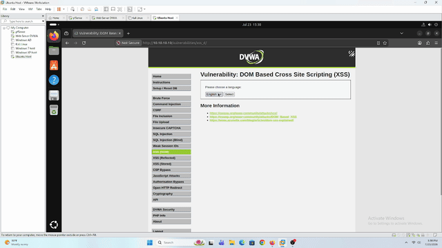
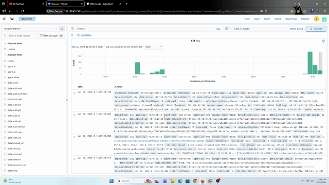
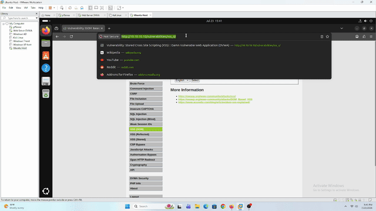
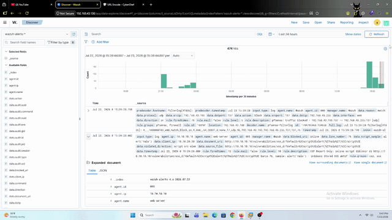

# DOM XSS — DVWA (Web-Server)

## Tujuan

Simulasi manual **DOM-based Cross-Site Scripting** ke modul **XSS (DOM)** DVWA (`10.10.10.10`) dari Kali Linux — bagian ketiga/terakhir dari seri lab XSS (Reflected → Stored → **DOM**).

Beda fundamental dari 2 lab sebelumnya: DOM XSS **gak butuh server buat "ngerender ulang" payload-nya**. Parameter `default` di modul ini diproses murni di sisi **client** lewat JavaScript (`document.write`/manipulasi DOM) yang emang udah ada di halaman — server cuma ngirim HTML+JS statis apa adanya, terus browser yang nge-*parse* parameter dari URL dan nyuntikin ke DOM sendiri. Ini beda total dari Reflected (server yang echo balik) dan Stored (server yang nyimpen+serve dari DB).

Konsekuensinya, lab ini nguji **2 varian delivery** yang punya karakteristik deteksi beda:

1. **Query string** — `?default=<payload>`. Parameter ini tetep bagian dari HTTP request line, jadi **hipotesis**: kemungkinan besar tetep ke-log `access.log` dan ke-detect rule `31105`/`31106` yang sama kayak lab Reflected XSS (generalisasi kayak yang udah kebukti di lab pertama), walaupun mekanisme exploitasi-nya beda (client-side vs server-side).
2. **URL fragment** — `#default=<payload>`. Fragment (`#...`) itu **secara spesifikasi HTTP gak pernah dikirim browser ke server** — cuma dipakai lokal di browser. Kalau kode JS DVWA baca dari `location.href`/`location.hash` (bukan cuma dari response server), payload ini bisa "nyampe" ke DOM dan ke-eksekusi **tanpa pernah sekalipun nyentuh network**. Hipotesis: ini blind spot **paling ekstrem** yang pernah ketemu di seri lab ini — bukan cuma `access.log` yang gak kebagian data (kayak Command Injection POST body), tapi **secara struktural gak ada request apapun yang bisa dianalisa Suricata sekalipun** (NIDS masih butuh traffic yang lewat network, fragment gak pernah lewat situ).

Satu pertanyaan tambahan yang dites juga: apakah **CSP Report-Only** (yang udah kebukti nutup blind spot replay di lab [Stored XSS](../stored/README.md#remediasi--csp-report-only-menutup-blind-spot-replay)) masih bisa jadi jalan keluar di sini? Secara teori CSP violation itu ke-trigger di titik **eksekusi script** (browser ngecek origin/inline-ness script pas mau dieksekusi), independen dari gimana payload-nya nyampe ke DOM — jadi walaupun fragment gak pernah nyentuh server/network, begitu payload itu nyuntik jadi inline `<script>`/attribute handler di DOM, CSP seharusnya tetep bisa lihat momen eksekusinya. Ini yang mau divalidasi.

Sesuai filosofi lab: deteksi dulu, bukan eksploitasi.

---

## Prerequisites

- DVWA sudah bisa diakses dari Kali — lihat [`dvwa-external-access.md`](../../../../Infrastructure/dvwa-external-access.md)
- Wazuh Agent di Web-Server sudah running, baca `access.log` — lihat [`web-server-wazuh-agent.md`](../../../../Infrastructure/web-server-wazuh-agent.md)
- Suricata custom rule `1000004` aktif — lihat [`pfsense-suricata-setup.md`](../../../../Infrastructure/pfsense-suricata-setup.md)
- **CSP Report-Only sudah di-scope juga ke path `xss_d`** — `<LocationMatch>` di Apache config Web-Server (lihat [`web-server-csp-setup.md`](../../../../Infrastructure/web-server-csp-setup.md)) udah nyakup `/vulnerabilities/xss_d/`, bukan cuma `/vulnerabilities/xss_s/` doang
- DVWA **Security Level** di-set ke `Low`

---

## Step-by-Step

Modul **XSS (DOM)** DVWA nampilin dropdown pilihan bahasa (`English`/`French`/`German`/`Spanish`). Parameter `default` di URL nentuin opsi mana yang keselect — diproses lewat JavaScript inline yang udah ada di halaman (`document.write` atau sejenisnya), **bukan** lewat PHP di server.

### 1. Baseline

```
?default=English
```

Cek behavior normal — dropdown ke-select ke `English`, gak ada yang aneh. Cek juga DevTools (tab **Sources**/**view-source**) buat liat persis gimana JS-nya baca parameter `default` — apakah dari `location.search` doang atau ikut baca `location.href`/`location.hash` juga (ini nentuin apakah varian fragment di Step 3 bakal jalan).

### 2. DOM XSS — Query String

```
?default=<script>alert(document.cookie)</script>
```

**Yang perlu dicatat:**
- Apakah payload ke-eksekusi (alert muncul)
- Cek `access.log` — parameter GET ini seharusnya tetep ke-log lengkap (beda dari Command Injection yang POST)
- Cek Wazuh Dashboard — apakah rule `31105`/`31106` fire (hipotesis: ya, sama kayak Reflected XSS)
- Cek Wazuh Dashboard buat alert CSP (`100404`/`100406`) — apakah dua-duanya (access.log rule DAN CSP) sama-sama fire buat kasus ini, atau cuma salah satu

### 3. DOM XSS — URL Fragment (Hipotesis Utama)

```
#default=<script>alert(document.cookie)</script>
```

**Yang perlu dicatat:**
- Cek DevTools **Network tab** — pastiin request yang beneran dikirim browser **gak** include fragment sama sekali (`GET /vulnerabilities/xss_d/` polos, tanpa `#...` apapun) — ini konfirmasi langsung fragment gak pernah lewat network, bukan cuma asumsi dari teori HTTP
- Apakah payload tetep ke-eksekusi (alert muncul) walau gak ada request baru yang kekirim
- Cek `access.log` — hipotesis: **gak ada jejak sama sekali**, bahkan gak ada versi "request-nya keliatan tapi payload-nya kepotong" kayak kasus lain, karena literally gak ada request baru yang dikirim buat trigger ini (browser cuma re-run JS lokal begitu fragment di URL berubah)
- Cek Wazuh Dashboard buat alert Suricata (`1000004`) — hipotesis: gak ada, karena gak ada traffic baru buat diinspeksi
- Cek Wazuh Dashboard buat alert CSP (`100404`/`100406`) — **ini pertanyaan intinya**: apakah CSP tetep ke-trigger walau delivery-nya gak pernah lewat network sama sekali?

---

## Verifikasi

### 1. Baseline



Buka modul `xss_d` tanpa parameter apapun — UI normal, dropdown ke-select ke `English`, gak ada yang aneh dari sisi tampilan.

### 2. DOM XSS — Query String


Input diubah dari `?default=French` jadi:

```
?default=<script>alert('Halo')</script>
```

**Tereksekusi** — alert `Halo` muncul, konfirmasi DOM XSS lewat query string berhasil.



- **`access.log`**: request ke-log lengkap dengan payload-nya (URL-encoded oleh browser) — sesuai hipotesis, parameter GET gak pernah hilang kayak kasus POST body di Command Injection
- **CSP (`100404`, level 10)** fire — ini alert **true positive**, evidence-nya:

  ```
  document_uri: http://10.10.10.10/vulnerabilities/xss_d/?default=%3Cscript%3Ealert(%27Halo%27)%3C/script%3E
  violated_directive: script-src-elem
  line_number: 76
  script_sample: alert('Halo')
  ```

- **CSP (`100405`, level 3)** juga fire — dari inline event handler lain (`script-src-attr`) di halaman yang sama, sesuai desain (noise level rendah, bukan indikasi attack)
- **Suricata `1000004`**: sempat dikira ikut fire, tapi setelah dicek ulang di Wazuh Dashboard, alert yang muncul itu CSP (`100404`/`100405`), bukan Suricata — Suricata gak pernah beneran ke-trigger sepanjang lab ini karena gak ada payload yang cocok pattern-nya di traffic HTTP biasa

### 3. DOM XSS — URL Fragment



**Percobaan pertama — fragment murni, gak ada `default=` sama sekali:**

```
#<script>alert(1)</script>
```

**Gagal.** Gak ada reaksi apapun — dropdown tetap di baseline. Alasannya ke-konfirmasi dari behavior DVWA: script bawaan modul ini nge-cek dulu apakah string `default=` ada di `document.location.href` sebelum masuk ke branch yang nulis opsi dinamis ke DOM. Kalau `default=` gak ketemu sama sekali di href (baik di query string maupun fragment), DVWA cuma nulis opsi `English` default — payload di fragment gak pernah kesentuh logic-nya.

**Percobaan kedua — pilih opsi dari dropdown (form submit via GET) setelah fragment di atas masih nempel di address bar:**

URL berubah jadi:

```
?default=English#<script>alert(1)</script>
```

**Berhasil tereksekusi.** Form submit nambahin query string `?default=English` (yang ngandung string `default=`), sementara fragment lama tetap kebawa di address bar. Begitu href ini diproses ulang, DVWA nemuin `default=` di query string dan generalisasi implementasinya ternyata gak berhenti di situ — nulis ke DOM apapun yang ngikutin, termasuk seluruh fragment yang nempel di belakangnya.

Sebelum lanjut ke exploitasinya, dicek dulu di **DevTools Network tab** — dan dikonfirmasi request yang beneran dikirim ke server cuma:

```
GET /vulnerabilities/xss_d/?default=English HTTP/1.1
```

Fragment **gak pernah ikut terkirim** — sesuai spesifikasi HTTP (`#...` murni lokal di browser, gak pernah jadi bagian request).



Sesuai dugaan:

- **`access.log`**: cuma nyatet `GET /vulnerabilities/xss_d/?default=English` — bersih total, gak ada jejak `<script>` apapun
- **Suricata `1000004`**: gak fire — gak ada apapun buat di-inspect karena request yang beneran nyampe ke server memang bersih
- **CSP (`100404`)**: fire — **momen inilah yang jadi temuan utama lab ini** (lihat Kesimpulan)

---

## Kesimpulan

1. **Query string generalisasi confirmed** — deteksi DOM XSS lewat query string berperilaku identik dengan Reflected XSS (`access.log` + CSP `100404` true positive), termasuk saat payload-nya di-URL-encode otomatis oleh browser.
2. **Fragment murni gak otomatis jadi exploitable** — payload di fragment doang, tanpa ada string `default=` di mana pun di URL, gagal total karena logic DVWA sendiri gak masuk ke branch yang vulnerable. Baru jalan lewat kombinasi gak sengaja: fragment lama + form submit dropdown yang nambahin query string `default=` baru. Begitu itu terjadi, request ke server tetap 100% bersih (`?default=English` doang) — blind spot fragment-nya tetap kebukti nyata, cuma jalan masuknya beda dari hipotesis awal.
3. **Temuan detection engineering utama — false positive di rule `100404`:** rule ini (level `10`, harusnya high-confidence) ternyata fire di **setiap** page load modul `xss_d`, attack atau bukan sama sekali. Evidence langsung dari dua alert Wazuh yang dibandingkan:

   | | Legit (baseline, gak ada payload) | Attack (query string) |
   |---|---|---|
   | `document_uri` | `.../xss_d/` (polos) | `.../xss_d/?default=%3Cscript%3E...` |
   | `line_number` | `73` | `76` |
   | `script_sample` | `if (document.location.href.indexOf…` (kode asli DVWA) | `alert('Halo')` (payload attacker) |
   | Rule fire | `100404`, level 10 | `100404`, level 10 |

   Rule-nya **sama persis** buat dua kasus yang beda total secara intent. Root cause: `100404` cuma ngecek `violated_directive == script-src-elem` tanpa liat isi `script_sample` — asumsi "`script-src-elem` = selalu high-confidence" ini valid di lab Stored XSS (guestbook gak punya inline `<script>` legit apapun buat dibandingin), tapi runtuh begitu ketemu modul yang source code aslinya sendiri pake inline `<script>` tag buat fungsi legit.
4. Satu-satunya pembeda yang masih valid dari data ini adalah isi `script_sample` (dan kadang `line_number`) — persis pola yang udah dipakai `100406` buat eskalasi `100405` berdasarkan konten mencurigakan. `100404` belum punya mekanisme serupa.

> **Kesimpulan seri XSS (Reflected → Stored → DOM):** tiap lab nutup satu lapis blind spot yang beda — Reflected ngajarin baseline signature detection, Stored ngajarin blind spot **replay** (butuh CSP buat nutup, karena server gak pernah tau ada payload aktif), dan DOM ngajarin dua hal sekaligus: (a) fragment tetap bisa jadi blind spot nyata walau jalan masuknya gak selurus hipotesis awal, dan (b) detection layer yang dibangun buat kasus spesifik (CSP `100404` buat Stored XSS) bisa bawa asumsi yang gak generalisasi ke modul lain — butuh divalidasi ulang tiap kali dipakai di konteks baru.
