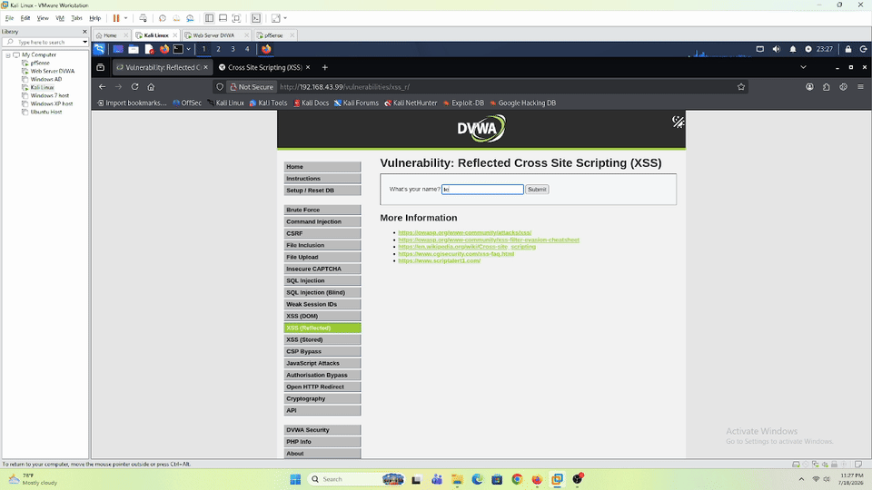
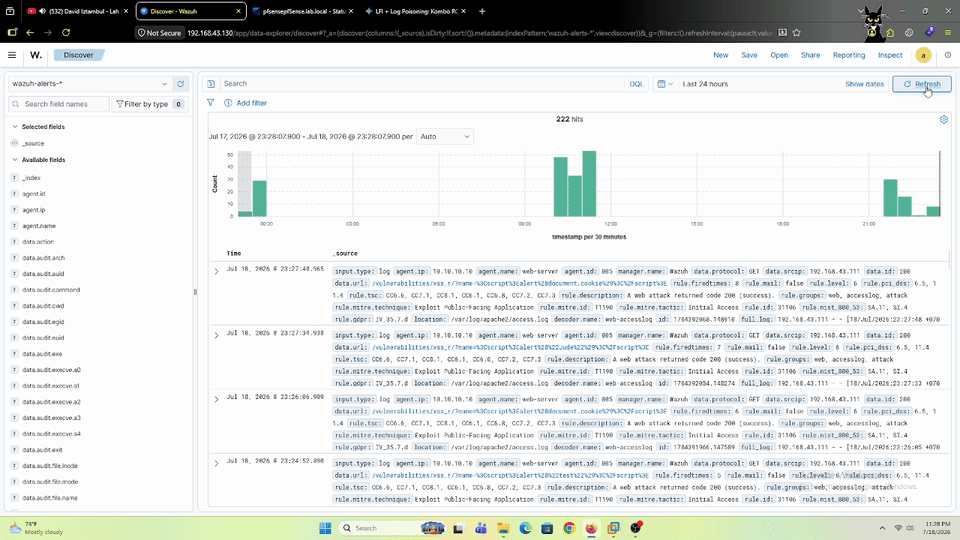
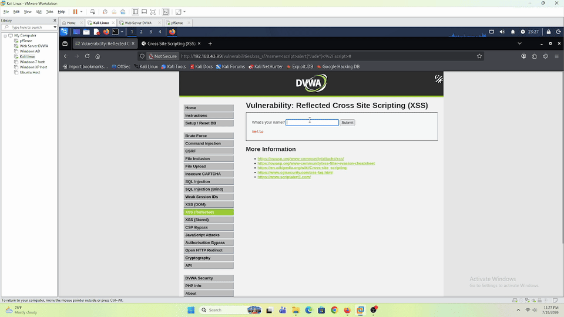
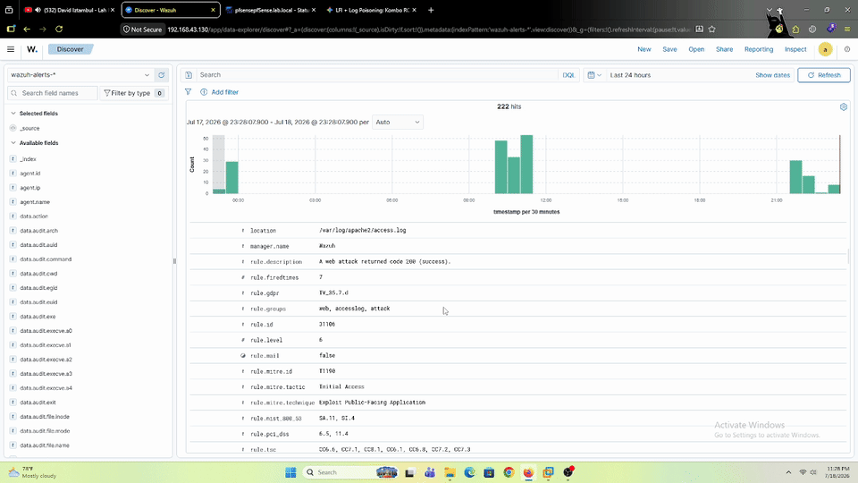

# Reflected XSS — DVWA (Web-Server)

## Tujuan

Simulasi manual **Reflected Cross-Site Scripting (XSS)** ke modul **XSS (Reflected)** DVWA (`10.10.10.10`) dari Kali Linux — validasi apakah payload XSS lewat parameter GET ke-log normal di `access.log` dan bisa ke-detect pakai desain rule Wazuh yang sekarang (rule `31106` dkk, yang udah kebukti nangkep LFI di lab sebelumnya).

Lab ini bagian pertama dari seri **XSS (Reflected → Stored → DOM)** yang tujuannya ngebandingin sejauh mana desain deteksi berbasis `access.log` bisa generalisasi ke tiap varian XSS — dan di mana titik blind spot-nya (paling kentara nanti di lab DOM, kalau payload dikirim lewat URL fragment `#` yang gak pernah nyampe server).

Sesuai filosofi lab: deteksi dulu, bukan eksploitasi.

---

## Prerequisites

- DVWA sudah bisa diakses dari Kali — lihat [`dvwa-external-access.md`](../../../../Infrastructure/dvwa-external-access.md)
- Wazuh Agent di Web-Server sudah running, baca `access.log` — lihat [`web-server-wazuh-agent.md`](../../../../Infrastructure/web-server-wazuh-agent.md)
- DVWA **Security Level** di-set ke `Low`

---

## Step-by-Step

Modul **XSS (Reflected)** DVWA nerima parameter `name` lewat GET, lalu nampilin `Hello <name>` di response. Di security level Low, parameter ini gak disanitasi/di-*escape* sama sekali — string apapun yang dikirim langsung ditulis balik apa adanya ke HTML response.

Akses via NAT port forward pfSense — lihat [`dvwa-external-access.md`](../../../../Infrastructure/dvwa-external-access.md). Contoh URL pakai `<PFSENSE_WAN_IP>` sebagai placeholder.

### 1. Baseline

```
?name=test
```

Cek behavior normal — response nampilin `Hello test`, gak ada yang aneh.

### 2. Reflected XSS — Injeksi Script

```
?name=<script>alert(document.cookie)</script>
```

Payload nempel di parameter GET, langsung di-*echo* balik ke response tanpa disaring — browser ngejalanin `<script>` itu begitu halaman selesai di-*render*, munculin `alert()` isi cookie session korban.

Karakter penting lab ini: payload dan response-nya satu siklus request-response aja (mirip pola LFI di lab sebelumnya), dan payload-nya nempel di **URL** (bukan cuma diproses di sisi client kayak DOM XSS nanti) — jadi seharusnya request ini nyampe **utuh** ke `access.log` Apache, termasuk string `<script>...</script>` di dalam query string-nya.

**Berhasil** — payload dieksekusi browser (alert muncul) dan ke-log utuh + ke-detect Wazuh, rule `31106` yang sama kayak yang nangkep LFI kemarin. Lihat [Verifikasi](#verifikasi).

---

## Verifikasi

### Baseline — Input Normal



Input `jude` biasa di field `name` — response cuma nampilin `Hello jude`, gak ada yang aneh. Request ini **gak** memicu alert Wazuh sama sekali (dicek di Wazuh Dashboard, gak ada entry buat request ini).

### Percobaan 1 — `alert("Jude")`

```
?name=<script>alert("Jude")</script>
```


Payload berhasil dieksekusi browser — popup `alert("Jude")` muncul begitu halaman selesai render.



Wazuh Dashboard mendeteksi request ini sebagai alert:

```json
{
  "agent": { "ip": "10.10.10.10", "name": "web-server" },
  "data": {
    "protocol": "GET",
    "srcip": "192.168.43.111",
    "id": "200",
    "url": "/vulnerabilities/xss_r/?name=%3Cscript%3Ealert%28%22Jude%22%29%3C%2Fscript%3E"
  },
  "rule": {
    "firedtimes": 7,
    "level": 6,
    "description": "A web attack returned code 200 (success).",
    "id": "31106",
    "mitre": {
      "technique": ["Exploit Public-Facing Application"],
      "id": ["T1190"],
      "tactic": ["Initial Access"]
    }
  },
  "full_log": "192.168.43.111 - - [18/Jul/2026:23:27:33 +0700] \"GET /vulnerabilities/xss_r/?name=%3Cscript%3Ealert%28%22Jude%22%29%3C%2Fscript%3E HTTP/1.1\" 200 1866 \"http://192.168.43.99/vulnerabilities/xss_r/?name=jude\" \"Mozilla/5.0 (X11; Linux x86_64; rv:140.0) Gecko/20100101 Firefox/140.0\"",
  "timestamp": "2026-07-18T16:27:34.938+0000"
}
```

### Percobaan 2 — `alert(document.cookie)`

```
?name=<script>alert(document.cookie)</script>
```



Payload sama-sama berhasil dieksekusi, bedanya cuma isi yang di-*print* — kalau percobaan 1 nampilin string statis `"Jude"`, percobaan 2 ini nge-*read* `document.cookie` beneran (isi session cookie DVWA korban), yang lebih representatif buat dampak nyata XSS: bukan cuma "bisa nge-pop alert", tapi bisa **baca data sensitif milik korban** dari browser-nya.



```json
{
  "agent": { "ip": "10.10.10.10", "name": "web-server" },
  "data": {
    "protocol": "GET",
    "srcip": "192.168.43.111",
    "id": "200",
    "url": "/vulnerabilities/xss_r/?name=%3Cscript%3Ealert%28document.cookie%29%3C%2Fscript%3E"
  },
  "rule": {
    "firedtimes": 8,
    "level": 6,
    "description": "A web attack returned code 200 (success).",
    "id": "31106",
    "mitre": {
      "technique": ["Exploit Public-Facing Application"],
      "id": ["T1190"],
      "tactic": ["Initial Access"]
    }
  },
  "full_log": "192.168.43.111 - - [18/Jul/2026:23:27:48 +0700] \"GET /vulnerabilities/xss_r/?name=%3Cscript%3Ealert%28document.cookie%29%3C%2Fscript%3E HTTP/1.1\" 200 1872 \"http://192.168.43.99/vulnerabilities/xss_r/?name=%3Cscript%3Ealert%28%22Jude%22%29%3C%2Fscript%3E\" \"Mozilla/5.0 (X11; Linux x86_64; rv:140.0) Gecko/20100101 Firefox/140.0\"",
  "timestamp": "2026-07-18T16:27:48.965+0000"
}
```

### Kenapa Rule `31106` Bisa Fire, Sedangkan Baseline Gak

Pola yang konsisten dari 3 request ini:

| Request | Payload | Alert Wazuh? |
|---|---|---|
| Baseline | `?name=jude` | Tidak |
| Percobaan 1 | `?name=<script>alert("Jude")</script>` | Ya (rule `31106`) |
| Percobaan 2 | `?name=<script>alert(document.cookie)</script>` | Ya (rule `31106`) |

Rule `31106` bukan custom rule project ini (gak ada file-nya di `Detection-Engineer/wazuh-rules/`) — ini rule bawaan Wazuh, ada di default ruleset `/var/ossec/ruleset/rules/0245-web_rules.xml` di Dell. Konfirmasi langsung dari isi file-nya:

```xml
<rule id="31105" level="6">
  <if_sid>31100</if_sid>
  <url>%3Cscript|%3C%2Fscript|script>|script%3E|SRC=javascript|IMG%20|</url>
  <url>%20ONLOAD=|INPUT%20|iframe%20</url>
  <description>XSS (Cross Site Scripting) attempt.</description>
  <mitre>
    <id>T1059.007</id>
  </mitre>
  <group>attack,pci_dss_6.5,pci_dss_11.4,...</group>
</rule>

<rule id="31106" level="6">
  <if_sid>31103, 31104, 31105</if_sid>
  <id>^200</id>
  <description>A web attack returned code 200 (success).</description>
  <mitre>
    <id>T1190</id>
  </mitre>
</rule>
```

Jadi rantai deteksinya:

1. **Rule `31105`** ("XSS (Cross Site Scripting) attempt") — rule yang beneran nge-*match* payload-nya, nyari string spesifik di `url`: `%3Cscript`, `%3C%2Fscript`, `script>`, `script%3E`, `SRC=javascript`, `IMG%20`, `%20ONLOAD=`, `INPUT%20`, `iframe%20`. Payload kita (`%3Cscript%3Ealert(...)%3C%2Fscript%3E`) match ke `%3Cscript` dan `%3C%2Fscript` di list ini.
2. **Rule `31106`** — *child rule*, `if_sid` nunjuk ke `31103, 31104, 31105` (fire kalau salah satu dari 3 rule itu match — masing-masing kemungkinan besar buat kategori attack beda, `31105` khusus XSS) **ditambah** syarat response code `^200`. Ini rule yang muncul di alert JSON kita (bukan `31105` langsung), karena Wazuh nampilin rule paling spesifik yang ke-*match* di rantai `if_sid`.

Ini konfirmasi eksplisit ke pola tabel di atas — `jude` gak punya string yang match ke signature list `31105` (makanya gak fire sama sekali, bukan cuma gak fire `31106`), sedangkan `<script>...</script>` match persis ke pattern `%3Cscript`/`%3C%2Fscript`. Jadi bukan generic "ada karakter aneh di URL" — ini eksplisit **signature list khusus XSS**, terpisah dari signature SQLi/LFI yang dipakai rule `31100`-an lain di file yang sama.

### Kesimpulan Reflected XSS

Hipotesis awal lab ini **terbukti**: karena payload Reflected XSS nempel di parameter GET dan diproses dalam satu siklus request-response (server ngirim balik apa yang diterima), request-nya nyampe utuh ke `access.log` — sama persis polanya kayak LFI. Desain deteksi yang sekarang (rule `31106`, berbasis signature pattern di `access.log`) **generalisasi** ke Reflected XSS tanpa perlu rule tambahan, karena akar deteksinya cuma butuh string payload nemplok di request line yang dikirim ke server — bukan soal jenis attack-nya (LFI vs XSS), tapi soal *di mana* payload-nya lewat.
