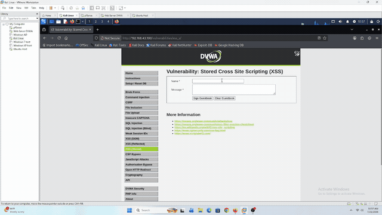
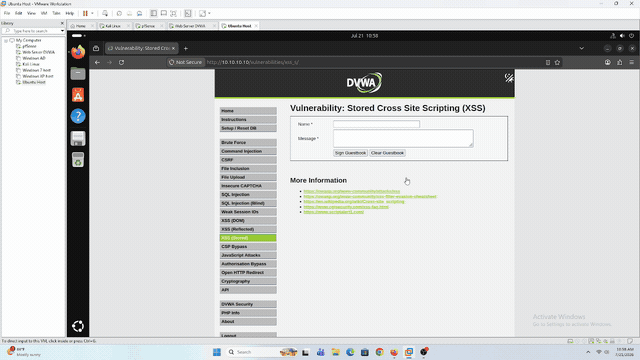
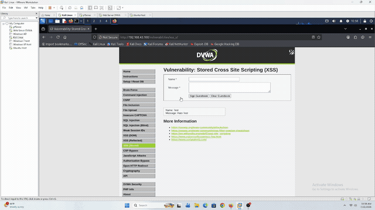
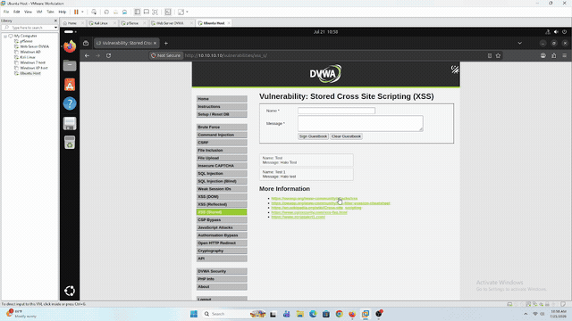
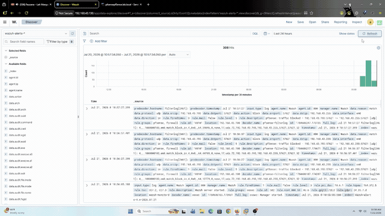
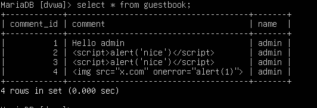
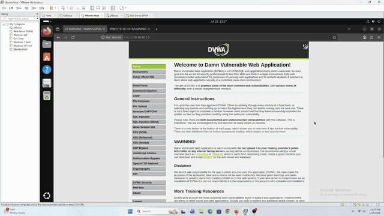
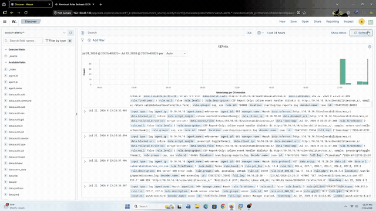

# Stored XSS — DVWA (Web-Server)

## Tujuan

Simulasi manual **Stored Cross-Site Scripting (XSS)** ke modul **XSS (Stored)** DVWA (`10.10.10.10`) dari Kali Linux — bagian kedua dari seri lab XSS (Reflected → **Stored** → DOM).

Beda sama Reflected (lihat [`../reflected/README.md`](../reflected/README.md)), Stored XSS punya 2 hal yang perlu divalidasi terpisah:

1. **Momen injeksi** — apakah request submit payload ke guestbook DVWA ke-log dan ke-detect sama kayak Reflected (rule `31105`/`31106`)? Ini gak bisa diasumsikan otomatis "ya" — kalau form guestbook submit-nya lewat **POST** (bukan GET kayak Reflected), ada kemungkinan payload-nya **gak** kebaca sama Wazuh, persis kayak temuan kritis di lab [Command Injection](../../command-injection/README.md): Apache `access.log` format `combined` cuma nyatet *request line* (method + path + query string), **bukan** isi POST body. Kalau guestbook submit via POST dan payload-nya di field `mtxMessage`, string `<script>` itu gak akan pernah nongol di `access.log` sama sekali.
2. **Momen replay** — begitu payload ke-simpen di database, setiap visitor lain yang buka halaman guestbook otomatis ngejalanin payload itu tanpa ngirim string mencurigakan apapun di request mereka sendiri (payload-nya nempel di response body dari DB, bukan di request). Hipotesis: ini **gak pernah** ke-detect, titik — gak ada versi "POST-nya keliatan" buat kasus ini, karena secara desain gak ada payload di request korban selanjutnya.

Sesuai filosofi lab: deteksi dulu, bukan eksploitasi.

---

## Prerequisites

- DVWA sudah bisa diakses dari Kali — lihat [`dvwa-external-access.md`](../../../../Infrastructure/dvwa-external-access.md)
- Wazuh Agent di Web-Server sudah running, baca `access.log` — lihat [`web-server-wazuh-agent.md`](../../../../Infrastructure/web-server-wazuh-agent.md)
- DVWA **Security Level** di-set ke `Low`
- (Opsional, buat validasi replay ke "korban lain") Browser session terpisah / private window / VM lain (misal Ubuntu Host `10.10.20.30`) buat simulasiin visitor lain yang buka halaman guestbook tanpa ikut ngirim payload

---

## Step-by-Step

Modul **XSS (Stored)** DVWA nampilin form guestbook (`Name` + `Message`), submit-nya kesimpen ke database dan ditampilin balik ke **semua** visitor yang buka halaman itu — beda sama Reflected yang cuma balik ke pengirim request itu sendiri.

### 1. Baseline

Isi form normal — `Name: test`, `Message: halo`, submit.

Cek juga **method HTTP** yang dipake form ini (lewat DevTools Network tab pas submit) — ini penentu penting buat hipotesis di atas: kalau **GET**, payload bakal nempel di URL kayak Reflected; kalau **POST**, payload di body dan berpotensi jadi blind spot.

### 2. Injeksi Payload ke Guestbook

Isi field `Message` (atau `Name`, tergantung mana yang gak disaring di Low) dengan:

```html
<script>alert(document.cookie)</script>
```

Submit. Payload seharusnya langsung ke-*trigger* begitu halaman reload nampilin entry guestbook yang baru disubmit (karena attacker sendiri yang pertama kali "korban").

**Yang perlu dicatat pas eksekusi:**
- Method request submit-nya GET atau POST (lihat DevTools)
- Kalau POST: cek `access.log` — apakah ada entry buat request submit ini, dan kalau ada, apakah string `<script>` ikut kebawa di situ atau cuma keliatan sebagai `POST /vulnerabilities/xss_s/ HTTP/1.1 200` polos
- Cek Wazuh Dashboard: apakah alert `31105`/`31106` fire buat momen submit ini

### 3. Replay — Buka Halaman Guestbook dari Sesi/Browser Lain

Tanpa ngirim payload apapun, buka ulang halaman `vulnerabilities/xss_s/` dari sesi browser lain (atau tab baru dengan cookie session beda) — payload yang udah kesimpen di DB seharusnya ikut jalan lagi ke visitor "baru" ini.

**Yang perlu dicatat:**
- Request yang dikirim visitor ini cuma `GET /vulnerabilities/xss_s/` polos, gak ada payload apapun di request-nya
- Cek Wazuh Dashboard: apakah ada alert baru yang fire buat request ini (hipotesis: **tidak ada**, karena gak ada string mencurigakan di request line-nya sama sekali — payload-nya udah "menyatu" jadi bagian normal dari response body)

---

## Verifikasi

### Baseline



Kali input data legit — behavior normal, gak ada yang aneh.



Ubuntu Host refresh halaman guestbook yang sama, ikut input data legit juga — jadi baseline buat momen replay di section bawah.

### Momen Injeksi (Kali) — Terdeteksi



Kali refresh halaman lalu submit payload `<script>alert("Hallo Test 1")</script>` — alert pop-up otomatis begitu halaman selesai *render*, karena browser attacker sendiri jadi korban pertama yang nge-load JavaScript dari inputan yang barusan disubmit.

```json
{
  "predecoder": {
    "hostname": "suricata[25562]:",
    "timestamp": "Jul 21 10:58:47"
  },
  "data": {
    "protocol": "TCP",
    "srcip": "192.168.43.111",
    "dstport": "80",
    "srcport": "50946",
    "suricata": {
      "message": "Detect XSS Injection in POST Body",
      "classification": "Web Application Attack",
      "priority": "1",
      "sid": "1:1000004:1"
    },
    "dstip": "10.10.10.10"
  },
  "rule": {
    "firedtimes": 2,
    "level": 3,
    "description": "Suricata NIDS: SID 1:1000004:1 [TCP] 192.168.43.111:50946 -> 10.10.10.10:80",
    "groups": ["suricata", "ids"],
    "id": "100400"
  },
  "full_log": "Jul 21 10:58:47 suricata[25562]: [1:1000004:1] Detect XSS Injection in POST Body [Classification: Web Application Attack] [Priority: 1] {TCP} 192.168.43.111:50946 -> 10.10.10.10:80",
  "timestamp": "2026-07-21T03:58:47.921+0000"
}
```

Pada 21 Juli 2026 jam 10:58 (waktu lokal), Wazuh Dashboard menerima alert dari Suricata dengan message **"Detect XSS Injection in POST Body"** — hasil dari custom rule `SID 1000004` ([`Detection-Engineer/suricata-trigger-rule/custom.rules`](../../../../Detection-Engineer/suricata-trigger-rule/custom.rules)) yang dibangun khusus buat lab ini, karena ET Open ruleset default gak match payload spesifik `txtName`/`mtxMessage` guestbook DVWA. Alert ini di-generate lewat rule dasar `100400` (decoder `suricata-alert`), sama pipeline-nya kayak yang udah dipakai di lab Command Injection.

Sumber inisiasi request ini adalah `192.168.43.111` (field `data.srcip`) — konsisten dengan IP Kali Linux di lab-lab sebelumnya (Reflected XSS, Command Injection). Field `location: "192.168.43.100"` di raw alert **bukan** IP attacker — itu representasi Wazuh untuk asal masuknya log (di sini, alamat yang nerima forward syslog dari pfSense), jadi jangan disamain sama `data.srcip` pas baca alert Suricata.

Karena payload ini masuk lewat network layer (Suricata), Wazuh **cuma tau ada percobaan XSS terjadi** — isi payload persisnya (`<script>alert("Hallo Test 1")</script>`) gak ikut ke-bawa di alert (beda sama rule `31106` di lab Reflected XSS yang nangkep full URL dari `access.log`). Ini konsekuensi dari deteksi berbasis pattern-matching di level network: cukup buat tau "ini serangan", tapi buat tau **detail persis apa yang di-inject**, analis tetap wajib nelusur manual ke database guestbook DVWA — apalagi karena belum ada IPS yang nolak/block payload-nya, jadi payload beneran ke-stored dan aktif di aplikasi.

### Momen Replay (Ubuntu Host) — Blind Spot Confirmed



Ubuntu Host refresh halaman guestbook yang sama — alert yang sama ikut muncul di browsernya, padahal request yang dikirim cuma `GET /vulnerabilities/xss_s/` polos, gak ada satupun payload di request itu sendiri. Payload-nya udah "menyatu" jadi bagian response yang di-generate server dari data guestbook.



Dicek di Wazuh Dashboard pada rentang waktu yang sama: **tidak ada alert baru yang muncul** buat momen replay ini, baik dari custom rule Suricata (`1000004`) maupun default Wazuh ruleset manapun — cuma alert dari momen submit Kali yang kelihatan.

Ini **membuktikan hipotesis** yang udah ditulis di awal lab ini: gak ada versi "requestnya keliatan" untuk momen replay, karena secara desain XSS Stored, request korban selanjutnya emang gak pernah bawa payload apapun. Rule berbasis pattern-matching (baik di request line `access.log` maupun POST body Suricata) butuh string mencurigakan ada di *request* — sedangkan di momen ini, satu-satunya tempat payload-nya "ada" adalah di *response* yang datang dari database, bukan dari apapun yang dikirim korban.

### Ringkasan

| Momen | Siapa | Payload ada di request? | Ke-detect? |
|---|---|---|---|
| Baseline (Kali & Ubuntu Host input data legit) | Kali + Ubuntu Host | Tidak relevan | Tidak (memang gak ada yang perlu dideteksi) |
| Injeksi — submit `<script>alert("Hallo Test 1")</script>` | Kali | ✅ Ya (POST body) | ✅ Ya — Suricata `SID 1000004` → Wazuh rule `100400` |
| Replay — buka ulang halaman guestbook | Ubuntu Host | ❌ Tidak (payload di response, bukan request) | ❌ **Tidak — blind spot confirmed** |

### Kesimpulan Stored XSS

Beda sama Reflected XSS (satu siklus request-response, desain deteksi `access.log` generalisasi tanpa masalah) dan beda juga sama Command Injection (blind spot-nya soal method POST yang gak ke-log, tapi tetap bisa ketutup begitu ada data source baru kayak NIDS), Stored XSS ngasih tau ada **jenis blind spot ketiga yang lebih fundamental**: momen replay itu **secara struktural gak punya bahan mentah buat dideteksi** oleh layer manapun yang berbasis analisa *request* — baik log aplikasi (`access.log`), maupun NIDS (Suricata). Nambah data source baru (kayak yang berhasil nutup gap Command Injection) gak otomatis nutup gap ini, karena masalahnya bukan "datanya gak sampai ke SIEM", tapi "datanya emang gak pernah ada di jalur request sama sekali".

Satu-satunya jalur yang punya potensi nutup blind spot ini adalah sinyal dari **sisi browser korban sendiri** (misalnya CSP violation report) — bukan dari analisa traffic/log di sisi server. Rencana selanjutnya: coba setup **CSP `Report-Only`** di Web-Server ([`web-server-csp-setup.md`](../../../../Infrastructure/web-server-csp-setup.md)) dan lihat apakah report violation-nya beneran bisa ke-forward sampai jadi alert di Wazuh.

---

## Remediasi — CSP Report-Only Menutup Blind Spot Replay

Setelah **CSP `Report-Only`** ([`web-server-csp-setup.md`](../../../../Infrastructure/web-server-csp-setup.md)) dan custom Wazuh rule ([`csp-report-rules.xml`](../../../../Detection-Engineer/wazuh-rules/csp-report-rules.xml)) selesai diimplementasi, momen **replay** yang sebelumnya confirmed blind spot di-replay ulang buat mastiin blind spot itu beneran ketutup.

### Data Guestbook Saat Test



4 entry di guestbook, 3 di antaranya mengandung XSS:

| `comment_id` | `comment` | Kategori |
|---|---|---|
| 1 | `Hello admin` | Benign |
| 2 | `<script>alert('nice')</script>` | XSS (`<script>` tag) |
| 3 | `<script>alert('nice')</script>` (duplikat) | XSS (`<script>` tag) |
| 4 | `` | XSS (attribute-based, `onerror`) |

### Ubuntu Host Buka Halaman Guestbook (Replay)



Ubuntu Host (`10.10.20.30`) buka `vulnerabilities/xss_s/` — persis skenario replay di awal lab ini: **gak ngirim payload apapun**, cuma `GET` polos ke halaman yang guestbook-nya udah ke-tempelin 3 entry XSS di atas.



Beberapa detik kemudian, alert mulai muncul di Wazuh Dashboard — **momen yang sebelumnya total silent** (lihat [Momen Replay](#momen-replay-ubuntu-host--blind-spot-confirmed) di atas).

### Alert yang Muncul (Urut Waktu)

| Waktu | Rule | Level | `violated_directive` | Detail | Kategori |
|---|---|---|---|---|---|
| `16:27:19` | `100404` | 10 | `script-src-elem` | `line_number: 95`, sample `alert('nice')` | ✅ XSS — entry `comment_id 2/3` |
| `16:27:21` | `100406` | 10 | `script-src-attr` | sample `alert(1)` | ✅ XSS — entry `comment_id 4` (`onerror`) |
| `16:27:21` | `31101` (default Wazuh) | 5 | — | `access.log`: `GET /vulnerabilities/xss_s/x.com` → `404` | ✅ XSS — efek samping ``, ke-detect lewat jalur **beda total** (access.log, bukan CSP) |
| `16:27:47` | `100405` | 3 | `script-src-attr` | sample `javascript:toggleTheme();` | ⚪ Noise — fungsi DVWA legit |
| `16:27:47` | `100404` | 10 | `script-src-elem` | `line_number: 94`, sample `alert('nice')` | ✅ XSS — entry `comment_id 2/3` (baris satunya) |
| `16:27:47` | `100405` | 3 | `script-src-attr` | sample `return confirmClearGuestbook();` | ⚪ Noise — fungsi DVWA legit |

`client_ip` di **semua** alert `100404`/`100405`/`100406` di atas adalah `10.10.20.30` — Ubuntu Host, aktor yang sama yang di section [Momen Replay](#momen-replay-ubuntu-host--blind-spot-confirmed) requestnya **sama sekali gak ninggalin jejak**. Sekarang browser-nya sendiri yang jadi sumber sinyal, independen dari isi request yang dia kirim.

### Signal vs Noise

Confirmed 3 entry XSS di guestbook (2x `<script>`, 1x `onerror`) menghasilkan **3 sinyal XSS yang tervalidasi** (`100404` x2 buat 2 baris `<script>` yang identik tapi beda posisi, `100406` buat entry `onerror`), plus **1 bonus detection** dari mekanisme yang sama sekali independen (`31101`, default Wazuh rule buat `access.log`, ke-trigger karena browser nyoba nge-*load* `` sebagai resource beneran dan gagal 404). Dua baris `<script>` yang identik (`comment_id 2` dan `3`) masing-masing ke-report terpisah dengan `line_number` beda (`94` dan `95`), match sama posisi masing-masing di HTML yang di-*render*.

Di sela itu, 2x alert `100405` (level 3) adalah **noise yang disengaja** — fungsi bawaan DVWA (`toggleTheme`, `confirmClearGuestbook`) yang emang selalu ke-flag CSP karena sama-sama inline handler, gak ada hubungannya sama payload attacker. Ini trade-off yang diambil sadar: tujuan alerting-nya adalah **jangan sampai ada yang kelewat** (recall tinggi), walaupun konsekuensinya nambah noise kalau makin banyak inline handler legit di halaman — makanya level-nya sengaja dibedain jauh (`3` buat generic attr, `10` buat yang match pattern mencurigakan di `script_sample`), biar analis bisa filter tanpa kehilangan visibility.

### Kesimpulan Remediasi

**Blind spot replay yang confirmed di awal lab ini sekarang ketutup.** Bukan lewat nambah rule di layer yang sama (request-based), tapi lewat nambah **data source dari layer yang sepenuhnya baru**: sinyal dari sisi browser korban sendiri (CSP violation report), yang secara desain independen dari ada/gaknya payload di request. Ini konsisten sama pola yang udah kebukti dua kali sebelumnya (Command Injection ketutup pakai auditd + Suricata) — begitu satu layer analisa (request-based) kehabisan bahan mentah, solusinya bukan nambah rule lagi di layer yang sama, tapi nyari **titik observasi baru** yang punya akses ke informasi yang sebelumnya emang gak pernah lewat jalur manapun yang kepantau.

### Perbandingan: Sebelum vs Sesudah

| Cek | Sebelum (lab awal) | Sesudah (remediasi) |
|---|---|---|
| Momen injeksi (Kali submit payload) ke-detect? | ✅ Ya — Suricata `SID 1000004` → Wazuh `100400` | ✅ Tetap (gak berubah, remediasi ini fokus ke momen replay) |
| Momen replay (Ubuntu Host buka halaman) ke-detect? | ❌ **Tidak sama sekali** — gak ada string mencurigakan di request | ✅ Ya — CSP Report-Only `100404`/`100406`, independen dari isi request |
| Bisa tau *entry mana* yang jadi sumber XSS? | ❌ Tidak — cuma tau "ada percobaan XSS" | ✅ Ya — `script_sample` + `line_number` nunjuk balik ke entry spesifik |
| Attacker pake vektor `<script>` tag maupun attribute (`onerror`)? | Sama-sama gak ke-detect pas replay | ✅ Dua-duanya ke-detect (`script-src-elem` dan `script-src-attr` dua-duanya di-cover) |
