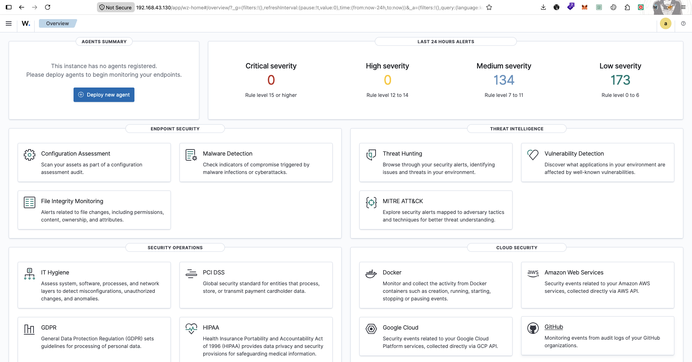
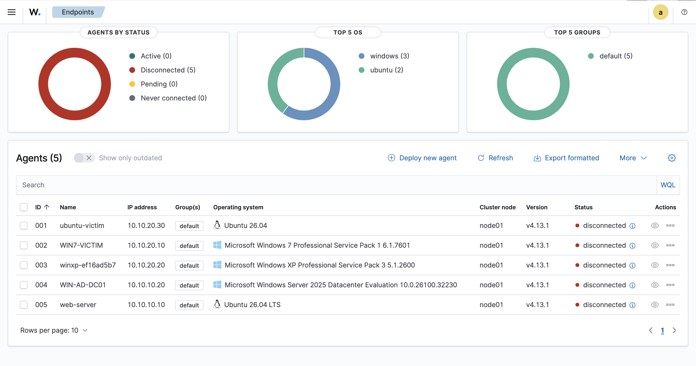

# 🛡️ Blue Team SOC Labs

Selamat datang di **Blue Team SOC Labs**! 🚀

Repo ini adalah dokumentasi, *blueprint*, dan *knowledge base* dari home lab khusus **Blue Team (Detection & Response)** yang aku bangun. Fokus utama dari lab ini bukan cuma buat nge-hack, tapi lebih ke **gimana cara nge-detect, nge-analisis, dan nge-response** terhadap sistem yang udah ter-kompromi.

Lab ini dirancang untuk mensimulasikan lingkungan enterprise nyata, lengkap dengan SIEM, Firewall, Active Directory, dan integrasi AI untuk membantu analisis alert.

---

## 🖥️ Hardware & Device Architecture

Lab ini dijalankan menggunakan 3 device utama dengan pembagian tugas yang spesifik:

### 1. PC Utama (The VM Host)
*   **Spesifikasi:** AMD Ryzen 7 5700G | RAM 32 GB | SSD 512 GB | PSU Helio M1
*   **Peran:** Bertindak sebagai *hypervisor* (menggunakan VirtualBox/VMware/Proxmox) untuk menjalankan seluruh infrastruktur virtual (VM) dari lab ini.

### 2. Laptop Windows (Dell)
*   **Peran:** Dedicated **SIEM Server**.
*   **Fungsi:** Menjalankan **Wazuh Manager** (dan dashboard Wazuh/Kibana). Device ini akan menerima, memproses, dan memvisualisasikan seluruh log dan alert dari VM-VM yang ada di PC Utama.

### 3. Laptop Mac (M1)
*   **Peran:** **AI & Automation Brain**.
*   **Fungsi:** Menjalankan **Ollama** dan pipeline **RAG (Retrieval-Augmented Generation)**. Device ini akan menerima alert dari SIEM (Wazuh) dan menggunakan AI untuk melakukan triage otomatis, merangkum insiden, atau memberikan rekomendasi respons dalam bahasa manusia.

---

## 🌐 Virtual Infrastructure (The Lab Network)

Infrastruktur virtual di bawah ini adalah **baseline (standar)** yang berjalan di PC Utama. 

> **Catatan:** VM-VM ini bisa saja berubah, ditambah, atau dikurangi tergantung pada skenario lab spesifik yang sedang dijalankan. Setiap perubahan atau spesifikasi khusus untuk skenario tertentu akan didokumentasikan di dalam folder `labs/`.

| VM Name | OS / Role | Deskripsi & Fungsi |
| :--- | :--- | :--- |
| **pfSense** | pfSense / Firewall | Bertindak sebagai *Gateway*, *Router*, dan *Firewall* untuk memisahkan zona jaringan LAN1 (Server) dan LAN2 (Host). |
| **Ubuntu Server** | Ubuntu Server + DVWA | Target server. Di-install **DVWA** (Damn Vulnerable Web App) untuk simulasi kerentanan web. IP: `10.10.10.10` |
| **Windows Server** | Windows Server (AD DC) | Bertindak sebagai **Domain Controller** (Active Directory). Mengelola user, group policy, dan autentikasi terpusat. IP: `10.10.10.20` |
| **Windows 7** | Windows 7 | *Victim Workstation*. Target utama simulasi phishing, ransomware, dan lateral movement. IP: `10.10.20.10` |
| **Windows XP** | Windows XP | *Victim Workstation* legacy. Simulasi endpoint lama tanpa patch. IP: `10.10.20.20` |
| **Ubuntu Host** | Ubuntu Desktop | *Victim Workstation* Linux. Simulasi serangan di lingkungan Linux. IP: `10.10.20.30` |
| **Kali Linux** | Kali Linux (External Attacker) | Mesin penyerang. Posisi **di luar firewall** (hotspot `192.168.43.x`) — mensimulasikan external attacker yang menyerang via internet/WAN pfSense. |

---

## 🧠 Lab Philosophy & Rules

1.  **Detection First:** Kita tidak cuma fokus pada "gimana cara nge-exploit", tapi "gimana cara SIEM nge-detect exploit tersebut" dan "gimana cara AI nge-rangkum alert-nya".
2.  **External Attacker Simulation:** Kali Linux diposisikan di luar firewall (hotspot) sebagai external attacker — menyerang via WAN pfSense untuk mensimulasikan serangan dari internet. Ini memaksa traffic melewati pfSense sehingga bisa dilog dan dideteksi.
3.  **Dynamic Environments:** Daftar VM di atas adalah *base environment*. Jika ada lab yang butuh VM tambahan (misal: database server, mail server), detailnya akan ditulis di `Labs/[nama-lab]/README.md`.
4.  **AI-Assisted SOC:** Memanfaatkan Mac M1 untuk mengubah log mentah yang membingungkan menjadi insight yang bisa dibaca oleh analis L1.

---

## ✅ Status Progress

### AI & SIEM Core (M1 + Dell)

| Komponen | Status | Keterangan |
| :--- | :---: | :--- |
| Dell — Ubuntu Server + Wazuh All-in-One | ✅ Done | Manager + Indexer + Dashboard running |
| M1 — Ollama + model stack | ✅ Done | `llama3.2:1b`, `3b`, `qwen2.5:4b`, `nomic-embed-text` ter-pull |
| M1 — RAG pipeline (ingest scripts) | ✅ Done | 5 script ingest: Sigma, YARA, MITRE, CVE, THM |
| M1 — ChromaDB vector database | ✅ Done | Data Sigma + YARA + MITRE + CVE 2022–2026 ter-ingest |



### Infrastructure — VM & Network (PC)

PC udah datang dan seluruh VM infrastructure di baseline table (bagian [Virtual Infrastructure](#-virtual-infrastructure-the-lab-network) di atas) **sudah dibangun dan running**: pfSense (firewall + segmentasi LAN1/LAN2), Web-Server + DVWA, WIN AD (Domain Controller), Windows 7, Windows XP, Ubuntu Host, dan Kali Linux sebagai external attacker di hotspot. Detail step-by-step tiap komponen ada di `Infrastructure/*.md`.

### Wazuh Agent — Semua Endpoint Ter-monitor

Seluruh 5 endpoint victim (Ubuntu Host, Win7, WinXP, WIN AD, Web-Server) sudah punya Wazuh Agent terpasang dan ter-enroll ke Manager (Dell).



### Lab Attack Simulation

| Lab | Status | Temuan Utama |
| :--- | :---: | :--- |
| **SQL Injection** | ✅ Done | Default ruleset (`31106`) gak detect fase recon (`'`, `ORDER BY`); severity gak proporsional antara recon vs data exfiltration; custom Wazuh rule lagi dibangun bertahap |
| **Command Injection** | ✅ Done | Command tereksekusi penuh (RCE, sampai arbitrary file write) + **reverse shell** (LOLBin: `sh`+`nc`+`mkfifo`); request **POST** gak ninggalin jejak payload di `access.log`, dan proses/koneksi reverse shell gak ke-detect sama sekali walau keliatan di `htop` — blind spot total, jadi basis penambahan **NIDS + auditd**. **Remediasi confirmed**: replay skenario yang sama sekarang ke-detect via auditd (rule `100300`) + Suricata custom rule (`100400`/SID `1000003`) |
| **File Inclusion (LFI)** | ✅ Done | Path traversal ke `/etc/passwd` berhasil & ke-detect (`31106`); log poisoning gagal (`Permission denied`, tapi tetap ke-log); RCE akhirnya tercapai lewat kombinasi LFI + Command Injection (webshell). RFI di-skip (`allow_url_include` off default). **Generalisasi rule Command Injection**: auditd (`100300`) confirmed generalisasi (deteksi di layer proses OS), Suricata (`1000003`) **tidak** generalisasi (scope-nya spesifik POST body, LFI lewat GET gak match — butuh rule tambahan) |
| **XSS (Reflected → Stored → DOM)** | ✅ Done | Reflected: rule `31105`/`31106` ke-detect langsung. Stored: blind spot **replay** ketemu (server gak pernah tau ada payload aktif pas visitor lain buka halaman) — ditutup pake **CSP Report-Only** (browser ngirim violation report independen dari request awal). DOM: fragment (`#...`) gak otomatis exploitable, cuma jalan lewat kombinasi reload+query string, dan request ke server tetap 100% bersih. **Gap detection engineering**: rule CSP `100404` awalnya asumsi "`script-src-elem` = selalu high-confidence", ternyata false positive 100% di modul yang punya inline `<script>` legit sendiri — di-tuning jadi kombinasi blocklist (`100407`) + allowlist (`100408`) |
| **JavaScript Attacks** | 🔄 In Progress | Modul token-based client-side "trust" (bukan injection) — token generation pake **ROT13** sebagai salah satu step. Hipotesis: bypass bisa dilakuin tanpa browser sama sekali (replikasi logic di script), fokus deteksi ke **behavioral** (browser asli vs automation) bukan payload content |
| **File Upload** | 🔄 In Progress | Rencana upload webshell **b374k** (Security Level `Low`, gak ada validasi). Buka permukaan deteksi baru yang belum pernah dites: **FIM/syscheck** (belum di-setup) buat nangkep file baru muncul di direktori upload, plus validasi generalisasi auditd (`100300`) ke vektor baru |

Detail lengkap tiap lab (payload, step-by-step, GIF evidence) ada di `Labs/web-server-attack/[nama-lab]/README.md`.

> **Kesimpulan akhir kedua lab:** SQLi ngajarin *"data-nya ada tapi rule-nya kurang"* (perlu custom rule), Command Injection ngajarin *"data-nya emang gak pernah ada"* (perlu data source baru — NIDS buat network, auditd buat process execution/LOLBin). Detail perbandingan + verifikasi remediasi lengkap ada di [`Labs/web-server-attack/command-injection/README.md`](./Labs/web-server-attack/command-injection/README.md#kesimpulan-akhir--sql-injection-vs-command-injection).

### Sedang Berjalan / Rencana Selanjutnya

| Komponen | Status | Keterangan |
| :--- | :---: | :--- |
| Detection Engineering — Custom Wazuh Rules (SQLi recon) | ✅ Done | Rule `100203` (`GROUP BY` probing) confirmed jalan, nutup blind spot fase recon SQLi — lihat [`sql-injection/README.md`](./Labs/web-server-attack/sql-injection/README.md#custom-detection-rule) |
| NIDS — Suricata di pfSense | ✅ Done | Engine + decoder/rule Wazuh + custom rule (SID `1000001`, `1000003`) confirmed alert end-to-end dari payload command injection asli — lihat [`pfsense-suricata-setup.md`](./Infrastructure/pfsense-suricata-setup.md) |
| auditd — Linux Audit Framework di Web-Server | ✅ Done | Nutup blind spot process execution/LOLBin (`sh`, `nc`, `mkfifo`) — custom rule `100300` confirmed alert end-to-end di Wazuh Dashboard, lihat [`web-server-auditd-setup.md`](./Infrastructure/web-server-auditd-setup.md) |
| Reverse Shell (lanjutan Command Injection) | ✅ Done | Berhasil dapet shell interaktif via LOLBin (mkfifo + nc); confirmed gak ke-detect Wazuh sama sekali (proses maupun koneksi network) |
| CSP Report-Only + Custom Wazuh Rule (`100403`-`100408`) | ✅ Done | Nutup blind spot XSS replay & DOM XSS fragment lewat browser-side violation reporting — lihat [`web-server-csp-setup.md`](./Infrastructure/web-server-csp-setup.md) |
| FIM/syscheck — File Integrity Monitoring di Web-Server | ⏳ Pending | Belum di-setup — dibutuhin buat lab File Upload (nangkep file baru di direktori upload) |
| **Simulasi Full Attack Chain** (initial access → privesc → recon → lateral movement → exfiltration) | ⏳ Pending | Direncanain jadi lab penutup web-server, dari `www-data` sampai objective akhir. Analisis timeline lengkap manual lewat Wazuh Dashboard sebelum lanjut ke AI+RAG |
| Integrasi Wazuh → Ollama (alert forwarding) + AI+RAG | ⏳ Pending | Setelah full attack chain — biar diuji ke insiden multi-stage yang kompleks, bukan cuma satu alert lab kecil |

---

## 📂 Repository Structure

Repo ini dibagi menjadi beberapa folder utama untuk merapikan aset lab:

```text
blue-team-soc-labs/
├── Infrastructure/              # Setup docs: network topology, Wazuh, Ollama.
│   ├── asset/                   # Screenshots & diagram jaringan.
│   ├── network-topology.md      # Topologi jaringan lab lengkap.
│   ├── wazuh-setup.md           # Panduan instalasi Wazuh All-in-One.
│   └── ollama-installation.md   # Panduan instalasi Ollama + model stack.
├── Labs/                        # Skenario lab spesifik (Writeup, steps, & attack simulations).
├── Detection-Engineer/          # Custom rules Wazuh, Sigma rules, dan Yara rules.
├── Incident-Response/           # SOP, Playbooks, dan template Incident Report.
├── AI-Rag-Integration/          # Script Python dan pipeline RAG untuk Ollama.
│   ├── ingest-thm.py            # Ingest TryHackMe writeups (MD/PDF).
│   ├── ingest-yara.py           # Ingest YARA rules.
│   ├── ingest-yml.py            # Ingest Sigma rules.
│   ├── ingest-mitre.py          # Ingest MITRE ATT&CK (STIX/JSON).
│   ├── ingest-cve.py            # Ingest CVE database (JSON v5).
│   ├── requirements.txt         # Python dependencies.
│   └── README.md                # Dokumentasi lengkap pipeline RAG.
└── README.md                    # File yang sedang kamu baca ini.